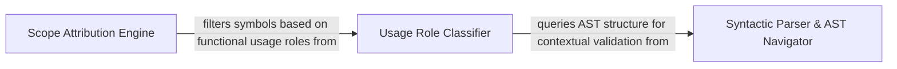

## Details

Performs granular inspection of source files to extract syntactic context and attribute call sites to their parent scopes.

### Syntactic Parser & AST Navigator
Performs the low-level heavy lifting of converting source code into navigable tree structures and provides recursive traversal mechanisms.

**Related Classes/Methods**:

- `static_analyzer.engine.source_inspector.SourceInspector.find_call_sites`:135-152
- `static_analyzer.engine.source_inspector.SourceInspector._walk`:362-365
- `static_analyzer.engine.source_inspector.ParsedSource`:83-85

**Source Files:**

- [`static_analyzer/engine/source_inspector.py`](https://github.com/CodeBoarding/CodeBoarding/blob/main/.codeboardingstatic_analyzer/engine/source_inspector.py)
  - `static_analyzer.engine.source_inspector.ParsedSource` ([L85-L87](https://github.com/CodeBoarding/CodeBoarding/blob/main/.codeboardingstatic_analyzer/engine/source_inspector.py#L85-L87)) - Class
  - `static_analyzer.engine.source_inspector.SourceInspector.find_call_sites` ([L170-L187](https://github.com/CodeBoarding/CodeBoarding/blob/main/.codeboardingstatic_analyzer/engine/source_inspector.py#L170-L187)) - Method
  - `static_analyzer.engine.source_inspector.SourceInspector._parse` ([L198-L212](https://github.com/CodeBoarding/CodeBoarding/blob/main/.codeboardingstatic_analyzer/engine/source_inspector.py#L198-L212)) - Method
  - `static_analyzer.engine.source_inspector.SourceInspector._parser_for` ([L244-L253](https://github.com/CodeBoarding/CodeBoarding/blob/main/.codeboardingstatic_analyzer/engine/source_inspector.py#L244-L253)) - Method
  - `static_analyzer.engine.source_inspector.SourceInspector._call_target_node` ([L255-L271](https://github.com/CodeBoarding/CodeBoarding/blob/main/.codeboardingstatic_analyzer/engine/source_inspector.py#L255-L271)) - Method
  - `static_analyzer.engine.source_inspector.SourceInspector._select_query_node` ([L273-L285](https://github.com/CodeBoarding/CodeBoarding/blob/main/.codeboardingstatic_analyzer/engine/source_inspector.py#L273-L285)) - Method
  - `static_analyzer.engine.source_inspector.SourceInspector._node_is_call_target` ([L287-L294](https://github.com/CodeBoarding/CodeBoarding/blob/main/.codeboardingstatic_analyzer/engine/source_inspector.py#L287-L294)) - Method
  - `static_analyzer.engine.source_inspector.SourceInspector._first_named_child_of_type` ([L384-L388](https://github.com/CodeBoarding/CodeBoarding/blob/main/.codeboardingstatic_analyzer/engine/source_inspector.py#L384-L388)) - Method
  - `static_analyzer.engine.source_inspector.SourceInspector._last_named_child_of_type` ([L390-L395](https://github.com/CodeBoarding/CodeBoarding/blob/main/.codeboardingstatic_analyzer/engine/source_inspector.py#L390-L395)) - Method
  - `static_analyzer.engine.source_inspector.SourceInspector._walk` ([L397-L400](https://github.com/CodeBoarding/CodeBoarding/blob/main/.codeboardingstatic_analyzer/engine/source_inspector.py#L397-L400)) - Method

### Usage Role Classifier
Analyzes the immediate syntactic neighborhood of a code token to determine its functional role, such as definition, function call, or argument.

**Related Classes/Methods**:

- `static_analyzer.engine.source_inspector.SourceUsageIndex`:89-91
- `static_analyzer.engine.source_inspector.SourceInspector._node_is_call_argument`:273-282
- `static_analyzer.engine.source_inspector.SourceInspector._usage_index`:179-207

**Source Files:**

- [`static_analyzer/engine/source_inspector.py`](https://github.com/CodeBoarding/CodeBoarding/blob/main/.codeboardingstatic_analyzer/engine/source_inspector.py)
  - `static_analyzer.engine.source_inspector.SourceUsageIndex` ([L91-L93](https://github.com/CodeBoarding/CodeBoarding/blob/main/.codeboardingstatic_analyzer/engine/source_inspector.py#L91-L93)) - Class
  - `static_analyzer.engine.source_inspector.SourceInspector._usage_index` ([L214-L242](https://github.com/CodeBoarding/CodeBoarding/blob/main/.codeboardingstatic_analyzer/engine/source_inspector.py#L214-L242)) - Method
  - `static_analyzer.engine.source_inspector.SourceInspector._node_is_return_value` ([L297-L306](https://github.com/CodeBoarding/CodeBoarding/blob/main/.codeboardingstatic_analyzer/engine/source_inspector.py#L297-L306)) - Method
  - `static_analyzer.engine.source_inspector.SourceInspector._node_is_call_argument` ([L308-L317](https://github.com/CodeBoarding/CodeBoarding/blob/main/.codeboardingstatic_analyzer/engine/source_inspector.py#L308-L317)) - Method
  - `static_analyzer.engine.source_inspector.SourceInspector._parent_is_call_like` ([L320-L324](https://github.com/CodeBoarding/CodeBoarding/blob/main/.codeboardingstatic_analyzer/engine/source_inspector.py#L320-L324)) - Method

### Scope Attribution Engine
Resolves identified call sites and references to their logical owners within the codebase, mapping physical locations to the symbol table hierarchy.

**Related Classes/Methods**:

- `static_analyzer.engine.symbol_table.SymbolTable.find_containing_symbol`:190-241
- `static_analyzer.engine.symbol_table.SymbolTable.lift_to_callable`:243-265
- `static_analyzer.engine.edge_builder._process_references_for_position`:180-239
- `static_analyzer.engine.source_inspector.SourceInspector.is_invocation`:121-126

**Source Files:**

- [`static_analyzer/engine/edge_builder.py`](https://github.com/CodeBoarding/CodeBoarding/blob/main/.codeboardingstatic_analyzer/engine/edge_builder.py)
  - `static_analyzer.engine.edge_builder._process_references_for_position` ([L180-L257](https://github.com/CodeBoarding/CodeBoarding/blob/main/.codeboardingstatic_analyzer/engine/edge_builder.py#L180-L257)) - Function
- [`static_analyzer/engine/protocols.py`](https://github.com/CodeBoarding/CodeBoarding/blob/main/.codeboardingstatic_analyzer/engine/protocols.py)
  - `static_analyzer.engine.protocols.SymbolNaming.is_class_like` ([L30-L30](https://github.com/CodeBoarding/CodeBoarding/blob/main/.codeboardingstatic_analyzer/engine/protocols.py#L30-L30)) - Method
  - `static_analyzer.engine.protocols.SymbolNaming.is_callable` ([L32-L32](https://github.com/CodeBoarding/CodeBoarding/blob/main/.codeboardingstatic_analyzer/engine/protocols.py#L32-L32)) - Method
  - `static_analyzer.engine.protocols.EdgeBuildAdapter.is_class_like` ([L49-L49](https://github.com/CodeBoarding/CodeBoarding/blob/main/.codeboardingstatic_analyzer/engine/protocols.py#L49-L49)) - Method
- [`static_analyzer/engine/source_inspector.py`](https://github.com/CodeBoarding/CodeBoarding/blob/main/.codeboardingstatic_analyzer/engine/source_inspector.py)
  - `static_analyzer.engine.source_inspector.SourceInspector.is_invocation` ([L123-L128](https://github.com/CodeBoarding/CodeBoarding/blob/main/.codeboardingstatic_analyzer/engine/source_inspector.py#L123-L128)) - Method
  - `static_analyzer.engine.source_inspector.SourceInspector.is_callable_usage` ([L130-L135](https://github.com/CodeBoarding/CodeBoarding/blob/main/.codeboardingstatic_analyzer/engine/source_inspector.py#L130-L135)) - Method
- [`static_analyzer/engine/symbol_table.py`](https://github.com/CodeBoarding/CodeBoarding/blob/main/.codeboardingstatic_analyzer/engine/symbol_table.py)
  - `static_analyzer.engine.symbol_table.SymbolTable.find_containing_symbol` ([L190-L241](https://github.com/CodeBoarding/CodeBoarding/blob/main/.codeboardingstatic_analyzer/engine/symbol_table.py#L190-L241)) - Method
  - `static_analyzer.engine.symbol_table.SymbolTable.lift_to_callable` ([L243-L265](https://github.com/CodeBoarding/CodeBoarding/blob/main/.codeboardingstatic_analyzer/engine/symbol_table.py#L243-L265)) - Method
- [`static_analyzer/incremental_orchestrator.py`](https://github.com/CodeBoarding/CodeBoarding/blob/main/.codeboardingstatic_analyzer/incremental_orchestrator.py)
  - `static_analyzer.incremental_orchestrator._reference_matches_edge_kind` ([L342-L359](https://github.com/CodeBoarding/CodeBoarding/blob/main/.codeboardingstatic_analyzer/incremental_orchestrator.py#L342-L359)) - Function

### [FAQ](https://github.com/CodeBoarding/GeneratedOnBoardings/tree/main?tab=readme-ov-file#faq)