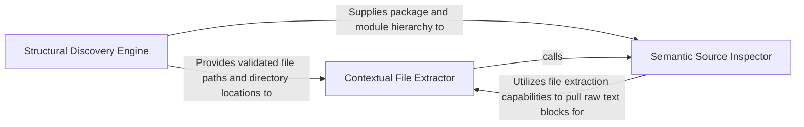

## Details

Fetches raw source code, documentation, and specific line ranges from the filesystem.

### Structural Discovery Engine
Maps the physical and logical organization of the project to provide a map for agents to navigate codebases.

**Related Classes/Methods**: _None_

**Source Files:**

- [`agents/tools/read_file_structure.py`](https://github.com/CodeBoarding/CodeBoarding/blob/main/.codeboardingagents/tools/read_file_structure.py)
  - `agents.tools.read_file_structure.FileStructureTool._run` ([L39-L101](https://github.com/CodeBoarding/CodeBoarding/blob/main/.codeboardingagents/tools/read_file_structure.py#L39-L101)) - Method

### Contextual File Extractor
Performs raw I/O operations to fetch file contents with windowed context to ensure LLM comprehension.

**Related Classes/Methods**:

- `agents.tools.read_file.ReadFileTool`:19-90
- `agents.tools.read_file.ReadFileTool._run`:35-90

**Source Files:**

- [`agents/tools/read_file.py`](https://github.com/CodeBoarding/CodeBoarding/blob/main/.codeboardingagents/tools/read_file.py)
  - `agents.tools.read_file.ReadFileTool._run` ([L35-L90](https://github.com/CodeBoarding/CodeBoarding/blob/main/.codeboardingagents/tools/read_file.py#L35-L90)) - Method

### Semantic Source Inspector
Provides high-level abstractions for retrieving logical code blocks like classes, functions, and docstrings.

**Related Classes/Methods**: _None_

**Source Files:**

- [`agents/tools/read_file.py`](https://github.com/CodeBoarding/CodeBoarding/blob/main/.codeboardingagents/tools/read_file.py)
  - `agents.tools.read_file.ReadFileTool.cached_files` ([L31-L33](https://github.com/CodeBoarding/CodeBoarding/blob/main/.codeboardingagents/tools/read_file.py#L31-L33)) - Method

### [FAQ](https://github.com/CodeBoarding/GeneratedOnBoardings/tree/main?tab=readme-ov-file#faq)