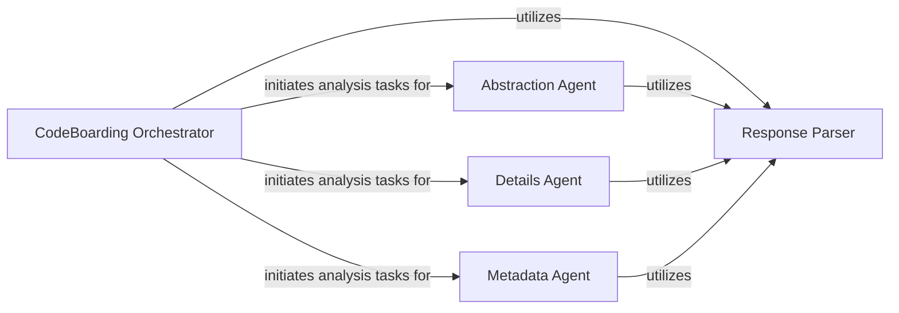

## Details

Collection of distinct agents (Metadata, Abstraction, Details) each focused on a specific phase or type of code analysis, leveraging LLMs to extract domain‑specific insights.

### CodeBoarding Orchestrator
Central control unit that initiates and manages the entire code analysis workflow, classifies files, dispatches tasks to specialized agents, and coordinates the overall process.

**Related Classes/Methods**:

- <a href="https://github.com/CodeBoarding/CodeBoarding/blob/main/.codeboardingagents/agent.py" target="_blank" rel="noopener noreferrer">`agents.agent`</a>

### Abstraction Agent
Generates high-level summaries and conceptual groupings from code, receiving tasks from the Orchestrator and producing abstract representations of code structures and functionalities.

**Related Classes/Methods**:

- <a href="https://github.com/CodeBoarding/CodeBoarding/blob/main/.codeboardingagents/abstraction_agent.py" target="_blank" rel="noopener noreferrer">`agents.abstraction_agent`</a>

### Details Agent
Performs granular analysis of specific code segments or clusters, extracting fine-grained insights and detailed information under the direction of the Orchestrator.

**Related Classes/Methods**:

- <a href="https://github.com/CodeBoarding/CodeBoarding/blob/main/.codeboardingagents/details_agent.py" target="_blank" rel="noopener noreferrer">`agents.details_agent`</a>

### Metadata Agent
Extracts and interprets project-level metadata such as project type, domain, technology stack, and architectural patterns, providing essential contextual information.

**Related Classes/Methods**:

- <a href="https://github.com/CodeBoarding/CodeBoarding/blob/main/.codeboardingagents/meta_agent.py" target="_blank" rel="noopener noreferrer">`agents.meta_agent`</a>

### Response Parser
Utility component that interprets and standardizes structured responses from LLMs or external APIs, transforming raw outputs into usable data formats for the Orchestrator and agents.

**Related Classes/Methods**:

- <a href="https://github.com/CodeBoarding/CodeBoarding/blob/main/.codeboardingagents/agent.py" target="_blank" rel="noopener noreferrer">`agents.agent._parse_response`</a>
- <a href="https://github.com/CodeBoarding/CodeBoarding/blob/main/.codeboardingagents/agent.py" target="_blank" rel="noopener noreferrer">`agents.agent._try_parse`</a>

### [FAQ](https://github.com/CodeBoarding/GeneratedOnBoardings/tree/main?tab=readme-ov-file#faq)