```mermaid
graph LR
    Agent_Core_Orchestration["Agent Core & Orchestration"]
    Architectural_Reasoning_Engine["Architectural Reasoning Engine"]
    Context_Engineering_Static_Bridge["Context Engineering & Static Bridge"]
    Prompt_Knowledge_Management["Prompt & Knowledge Management"]
    Integrity_Evolution_Handler["Integrity & Evolution Handler"]
    Agent_Core_Orchestration -- "Orchestrates context preparation for LLM reasoning" --> Context_Engineering_Static_Bridge
    Agent_Core_Orchestration -- "Enforces structural validation and post-processing repairs" --> Integrity_Evolution_Handler
    Agent_Core_Orchestration -- "Manages the lifecycle of architectural synthesis steps" --> Architectural_Reasoning_Engine
    Context_Engineering_Static_Bridge -- "calls" --> Prompt_Knowledge_Management
    Context_Engineering_Static_Bridge -- "calls" --> Integrity_Evolution_Handler
    Context_Engineering_Static_Bridge -- "Provides structured mental models for synthesis" --> Architectural_Reasoning_Engine
    Prompt_Knowledge_Management -- "Retrieves structural constraints and reasoning templates" --> Architectural_Reasoning_Engine
    Prompt_Knowledge_Management -- "calls" --> Context_Engineering_Static_Bridge
    Prompt_Knowledge_Management -- "Defines the schemas used for structural repair" --> Integrity_Evolution_Handler
    Integrity_Evolution_Handler -- "Refines and corrects synthesized architectural entities" --> Architectural_Reasoning_Engine
    Integrity_Evolution_Handler -- "Updates knowledge state with resolved relationship mappings" --> Prompt_Knowledge_Management
    click Agent_Core_Orchestration href "https://github.com/CodeBoarding/CodeBoarding/blob/main/.codeboarding/Agent_Core_Orchestration.md" "Details"
    click Architectural_Reasoning_Engine href "https://github.com/CodeBoarding/CodeBoarding/blob/main/.codeboarding/Architectural_Reasoning_Engine.md" "Details"
    click Context_Engineering_Static_Bridge href "https://github.com/CodeBoarding/CodeBoarding/blob/main/.codeboarding/Context_Engineering_Static_Bridge.md" "Details"
    click Prompt_Knowledge_Management href "https://github.com/CodeBoarding/CodeBoarding/blob/main/.codeboarding/Prompt_Knowledge_Management.md" "Details"
    click Integrity_Evolution_Handler href "https://github.com/CodeBoarding/CodeBoarding/blob/main/.codeboarding/Integrity_Evolution_Handler.md" "Details"
```

## Details

The primary intelligence layer containing specialized agents that perform distinct architectural tasks such as component identification, API mapping, and incremental updates.

### Agent Core & Orchestration [[Expand]](./Agent_Core_Orchestration.md)
Provides the foundational execution framework for all agents, managing the lifecycle of LLM interactions, including the 'invoke-validate-repair' loop and provider-agnostic communication.

**Related Classes/Methods**: _None_

**Source Files:**

- [`agents/abstraction_agent.py`](https://github.com/CodeBoarding/CodeBoarding/blob/main/.codeboardingagents/abstraction_agent.py)
  - `agents.abstraction_agent.AbstractionAgent.__init__` ([L48-L87](https://github.com/CodeBoarding/CodeBoarding/blob/main/.codeboardingagents/abstraction_agent.py#L48-L87)) - Method
  - `agents.abstraction_agent.AbstractionAgent.step_clusters_grouping` ([L90-L121](https://github.com/CodeBoarding/CodeBoarding/blob/main/.codeboardingagents/abstraction_agent.py#L90-L121)) - Method
  - `agents.abstraction_agent.AbstractionAgent.step_final_analysis` ([L124-L169](https://github.com/CodeBoarding/CodeBoarding/blob/main/.codeboardingagents/abstraction_agent.py#L124-L169)) - Method
  - `agents.abstraction_agent.AbstractionAgent.step_api_surfaces` ([L172-L179](https://github.com/CodeBoarding/CodeBoarding/blob/main/.codeboardingagents/abstraction_agent.py#L172-L179)) - Method
  - `agents.abstraction_agent.AbstractionAgent.step_relation_analysis` ([L182-L216](https://github.com/CodeBoarding/CodeBoarding/blob/main/.codeboardingagents/abstraction_agent.py#L182-L216)) - Method
  - `agents.abstraction_agent.AbstractionAgent.run` ([L218-L247](https://github.com/CodeBoarding/CodeBoarding/blob/main/.codeboardingagents/abstraction_agent.py#L218-L247)) - Method

### Architectural Reasoning Engine [[Expand]](./Architectural_Reasoning_Engine.md)
The primary intelligence layer that performs high-level synthesis, grouping code clusters into logical components, identifying public API surfaces, and conducting the final architectural analysis.

**Related Classes/Methods**: _None_

**Source Files:**

- [`agents/agent_responses.py`](https://github.com/CodeBoarding/CodeBoarding/blob/main/.codeboardingagents/agent_responses.py)
  - `agents.agent_responses.LLMBaseModel` ([L24-L129](https://github.com/CodeBoarding/CodeBoarding/blob/main/.codeboardingagents/agent_responses.py#L24-L129)) - Class
  - `agents.agent_responses.RelationCallSite` ([L179-L183](https://github.com/CodeBoarding/CodeBoarding/blob/main/.codeboardingagents/agent_responses.py#L179-L183)) - Class
  - `agents.agent_responses.RelationEdge` ([L186-L245](https://github.com/CodeBoarding/CodeBoarding/blob/main/.codeboardingagents/agent_responses.py#L186-L245)) - Class
  - `agents.agent_responses.ClustersComponent` ([L389-L437](https://github.com/CodeBoarding/CodeBoarding/blob/main/.codeboardingagents/agent_responses.py#L389-L437)) - Class
  - `agents.agent_responses.ClustersComponent.llm_str` ([L435-L437](https://github.com/CodeBoarding/CodeBoarding/blob/main/.codeboardingagents/agent_responses.py#L435-L437)) - Method
  - `agents.agent_responses.ClusterAnalysis` ([L440-L452](https://github.com/CodeBoarding/CodeBoarding/blob/main/.codeboardingagents/agent_responses.py#L440-L452)) - Class
  - `agents.agent_responses.ClusterAnalysis.llm_str` ([L447-L452](https://github.com/CodeBoarding/CodeBoarding/blob/main/.codeboardingagents/agent_responses.py#L447-L452)) - Method
  - `agents.agent_responses.Component.file_paths` ([L492-L494](https://github.com/CodeBoarding/CodeBoarding/blob/main/.codeboardingagents/agent_responses.py#L492-L494)) - Method
  - `agents.agent_responses.Component.llm_str` ([L496-L506](https://github.com/CodeBoarding/CodeBoarding/blob/main/.codeboardingagents/agent_responses.py#L496-L506)) - Method
  - `agents.agent_responses.AnalysisInsights` ([L509-L534](https://github.com/CodeBoarding/CodeBoarding/blob/main/.codeboardingagents/agent_responses.py#L509-L534)) - Class
  - `agents.agent_responses.AnalysisInsights.llm_str` ([L524-L530](https://github.com/CodeBoarding/CodeBoarding/blob/main/.codeboardingagents/agent_responses.py#L524-L530)) - Method
  - `agents.agent_responses.AnalysisInsights.file_to_component` ([L532-L534](https://github.com/CodeBoarding/CodeBoarding/blob/main/.codeboardingagents/agent_responses.py#L532-L534)) - Method
  - `agents.agent_responses.ComponentArchitecture` ([L537-L550](https://github.com/CodeBoarding/CodeBoarding/blob/main/.codeboardingagents/agent_responses.py#L537-L550)) - Class
  - `agents.agent_responses.ComponentArchitecture.llm_str` ([L545-L550](https://github.com/CodeBoarding/CodeBoarding/blob/main/.codeboardingagents/agent_responses.py#L545-L550)) - Method
  - `agents.agent_responses.ComponentApiSurface` ([L553-L587](https://github.com/CodeBoarding/CodeBoarding/blob/main/.codeboardingagents/agent_responses.py#L553-L587)) - Class
  - `agents.agent_responses.ComponentApiSurfaces` ([L590-L598](https://github.com/CodeBoarding/CodeBoarding/blob/main/.codeboardingagents/agent_responses.py#L590-L598)) - Class
  - `agents.agent_responses.ComponentApiSurfaces.llm_str` ([L595-L598](https://github.com/CodeBoarding/CodeBoarding/blob/main/.codeboardingagents/agent_responses.py#L595-L598)) - Method
  - `agents.agent_responses.ComponentRelations` ([L601-L609](https://github.com/CodeBoarding/CodeBoarding/blob/main/.codeboardingagents/agent_responses.py#L601-L609)) - Class
  - `agents.agent_responses.CFGComponent` ([L685-L701](https://github.com/CodeBoarding/CodeBoarding/blob/main/.codeboardingagents/agent_responses.py#L685-L701)) - Class
  - `agents.agent_responses.CFGAnalysisInsights` ([L704-L716](https://github.com/CodeBoarding/CodeBoarding/blob/main/.codeboardingagents/agent_responses.py#L704-L716)) - Class
  - `agents.agent_responses.ExpandComponent` ([L719-L726](https://github.com/CodeBoarding/CodeBoarding/blob/main/.codeboardingagents/agent_responses.py#L719-L726)) - Class
  - `agents.agent_responses.ExpandComponent.llm_str` ([L725-L726](https://github.com/CodeBoarding/CodeBoarding/blob/main/.codeboardingagents/agent_responses.py#L725-L726)) - Method
  - `agents.agent_responses.ValidationInsights` ([L729-L739](https://github.com/CodeBoarding/CodeBoarding/blob/main/.codeboardingagents/agent_responses.py#L729-L739)) - Class
  - `agents.agent_responses.UpdateAnalysis` ([L742-L751](https://github.com/CodeBoarding/CodeBoarding/blob/main/.codeboardingagents/agent_responses.py#L742-L751)) - Class
  - `agents.agent_responses.MetaAnalysisInsights` ([L754-L780](https://github.com/CodeBoarding/CodeBoarding/blob/main/.codeboardingagents/agent_responses.py#L754-L780)) - Class
  - `agents.agent_responses.FileClassification` ([L783-L790](https://github.com/CodeBoarding/CodeBoarding/blob/main/.codeboardingagents/agent_responses.py#L783-L790)) - Class
  - `agents.agent_responses.ComponentFiles` ([L793-L805](https://github.com/CodeBoarding/CodeBoarding/blob/main/.codeboardingagents/agent_responses.py#L793-L805)) - Class
  - `agents.agent_responses.ComponentFiles.llm_str` ([L800-L805](https://github.com/CodeBoarding/CodeBoarding/blob/main/.codeboardingagents/agent_responses.py#L800-L805)) - Method
  - `agents.agent_responses.ScopeRelations` ([L808-L816](https://github.com/CodeBoarding/CodeBoarding/blob/main/.codeboardingagents/agent_responses.py#L808-L816)) - Class
  - `agents.agent_responses.ScopeOperationAction` ([L819-L823](https://github.com/CodeBoarding/CodeBoarding/blob/main/.codeboardingagents/agent_responses.py#L819-L823)) - Class
  - `agents.agent_responses.ScopedClusterRef` ([L826-L835](https://github.com/CodeBoarding/CodeBoarding/blob/main/.codeboardingagents/agent_responses.py#L826-L835)) - Class
  - `agents.agent_responses.ScopeOperation` ([L838-L868](https://github.com/CodeBoarding/CodeBoarding/blob/main/.codeboardingagents/agent_responses.py#L838-L868)) - Class
  - `agents.agent_responses.ScopeUpdateDecision` ([L871-L879](https://github.com/CodeBoarding/CodeBoarding/blob/main/.codeboardingagents/agent_responses.py#L871-L879)) - Class
  - `agents.agent_responses.FilePath` ([L882-L896](https://github.com/CodeBoarding/CodeBoarding/blob/main/.codeboardingagents/agent_responses.py#L882-L896)) - Class

### Context Engineering & Static Bridge [[Expand]](./Context_Engineering_Static_Bridge.md)
Prepares the mental model for the agents by translating complex static analysis results into LLM-readable context strings.

**Related Classes/Methods**: _None_

**Source Files:**

- [`agents/agent_responses.py`](https://github.com/CodeBoarding/CodeBoarding/blob/main/.codeboardingagents/agent_responses.py)
  - `agents.agent_responses.SourceCodeReference.__str__` ([L163-L171](https://github.com/CodeBoarding/CodeBoarding/blob/main/.codeboardingagents/agent_responses.py#L163-L171)) - Method
  - `agents.agent_responses.assign_component_ids` ([L612-L643](https://github.com/CodeBoarding/CodeBoarding/blob/main/.codeboardingagents/agent_responses.py#L612-L643)) - Function
  - `agents.agent_responses.assign_relation_ids` ([L646-L659](https://github.com/CodeBoarding/CodeBoarding/blob/main/.codeboardingagents/agent_responses.py#L646-L659)) - Function
  - `agents.agent_responses.ValidationInsights.llm_str` ([L738-L739](https://github.com/CodeBoarding/CodeBoarding/blob/main/.codeboardingagents/agent_responses.py#L738-L739)) - Method
  - `agents.agent_responses.UpdateAnalysis.llm_str` ([L750-L751](https://github.com/CodeBoarding/CodeBoarding/blob/main/.codeboardingagents/agent_responses.py#L750-L751)) - Method
  - `agents.agent_responses.FileClassification.llm_str` ([L789-L790](https://github.com/CodeBoarding/CodeBoarding/blob/main/.codeboardingagents/agent_responses.py#L789-L790)) - Method
  - `agents.agent_responses.FilePath.llm_str` ([L895-L896](https://github.com/CodeBoarding/CodeBoarding/blob/main/.codeboardingagents/agent_responses.py#L895-L896)) - Method
- [`agents/details_agent.py`](https://github.com/CodeBoarding/CodeBoarding/blob/main/.codeboardingagents/details_agent.py)
  - `agents.details_agent.DetailsAgent.__init__` ([L51-L94](https://github.com/CodeBoarding/CodeBoarding/blob/main/.codeboardingagents/details_agent.py#L51-L94)) - Method
  - `agents.details_agent.DetailsAgent.step_api_surfaces` ([L229-L236](https://github.com/CodeBoarding/CodeBoarding/blob/main/.codeboardingagents/details_agent.py#L229-L236)) - Method
  - `agents.details_agent.DetailsAgent.run` ([L276-L343](https://github.com/CodeBoarding/CodeBoarding/blob/main/.codeboardingagents/details_agent.py#L276-L343)) - Method

### Prompt & Knowledge Management [[Expand]](./Prompt_Knowledge_Management.md)
Encapsulates the architectural expertise of the system through specialized prompt templates and system messages that guide the LLM's reasoning process.

**Related Classes/Methods**: _None_

**Source Files:**

- [`agents/details_agent.py`](https://github.com/CodeBoarding/CodeBoarding/blob/main/.codeboardingagents/details_agent.py)
  - `agents.details_agent.DetailsAgent.step_clusters_grouping` ([L97-L149](https://github.com/CodeBoarding/CodeBoarding/blob/main/.codeboardingagents/details_agent.py#L97-L149)) - Method
  - `agents.details_agent.DetailsAgent.step_final_analysis` ([L152-L226](https://github.com/CodeBoarding/CodeBoarding/blob/main/.codeboardingagents/details_agent.py#L152-L226)) - Method
  - `agents.details_agent.DetailsAgent.step_relation_analysis` ([L239-L274](https://github.com/CodeBoarding/CodeBoarding/blob/main/.codeboardingagents/details_agent.py#L239-L274)) - Method
- [`agents/file_index_models.py`](https://github.com/CodeBoarding/CodeBoarding/blob/main/.codeboardingagents/file_index_models.py)
  - `agents.file_index_models.FileEntry.merge_method_spans` ([L95-L104](https://github.com/CodeBoarding/CodeBoarding/blob/main/.codeboardingagents/file_index_models.py#L95-L104)) - Method
- [`agents/incremental_agent.py`](https://github.com/CodeBoarding/CodeBoarding/blob/main/.codeboardingagents/incremental_agent.py)
  - `agents.incremental_agent.IncrementalAgent.__init__` ([L54-L86](https://github.com/CodeBoarding/CodeBoarding/blob/main/.codeboardingagents/incremental_agent.py#L54-L86)) - Method
  - `agents.incremental_agent.IncrementalAgent.step_api_surfaces` ([L250-L259](https://github.com/CodeBoarding/CodeBoarding/blob/main/.codeboardingagents/incremental_agent.py#L250-L259)) - Method
  - `agents.incremental_agent.IncrementalAgent.step_relation_analysis` ([L262-L302](https://github.com/CodeBoarding/CodeBoarding/blob/main/.codeboardingagents/incremental_agent.py#L262-L302)) - Method
  - `agents.incremental_agent.IncrementalAgent.generate_scope_relations` ([L305-L326](https://github.com/CodeBoarding/CodeBoarding/blob/main/.codeboardingagents/incremental_agent.py#L305-L326)) - Method
  - `agents.incremental_agent.IncrementalAgent.generate_all_scope_relations` ([L329-L350](https://github.com/CodeBoarding/CodeBoarding/blob/main/.codeboardingagents/incremental_agent.py#L329-L350)) - Method
  - `agents.incremental_agent._cluster_analysis_for_scope` ([L353-L375](https://github.com/CodeBoarding/CodeBoarding/blob/main/.codeboardingagents/incremental_agent.py#L353-L375)) - Function

### Integrity & Evolution Handler [[Expand]](./Integrity_Evolution_Handler.md)
Ensures the reliability and continuity of the architectural model by validating LLM outputs against structural schemas and mapping relationships across incremental analysis runs.

**Related Classes/Methods**: _None_

**Source Files:**

- [`agents/incremental_agent.py`](https://github.com/CodeBoarding/CodeBoarding/blob/main/.codeboardingagents/incremental_agent.py)
  - `agents.incremental_agent._local_graph_cluster_ids` ([L378-L395](https://github.com/CodeBoarding/CodeBoarding/blob/main/.codeboardingagents/incremental_agent.py#L378-L395)) - Function
  - `agents.incremental_agent._log_scope_relations_summary` ([L398-L403](https://github.com/CodeBoarding/CodeBoarding/blob/main/.codeboardingagents/incremental_agent.py#L398-L403)) - Function
- [`agents/relation_edges.py`](https://github.com/CodeBoarding/CodeBoarding/blob/main/.codeboardingagents/relation_edges.py)
  - `agents.relation_edges.index_relation_endpoints` ([L33-L52](https://github.com/CodeBoarding/CodeBoarding/blob/main/.codeboardingagents/relation_edges.py#L33-L52)) - Function
- [`agents/repair.py`](https://github.com/CodeBoarding/CodeBoarding/blob/main/.codeboardingagents/repair.py)
  - `agents.repair.ComponentRepairContext` ([L44-L47](https://github.com/CodeBoarding/CodeBoarding/blob/main/.codeboardingagents/repair.py#L44-L47)) - Class
  - `agents.repair.repair_component_group_names` ([L207-L226](https://github.com/CodeBoarding/CodeBoarding/blob/main/.codeboardingagents/repair.py#L207-L226)) - Function
  - `agents.repair._canonical_group_name` ([L229-L234](https://github.com/CodeBoarding/CodeBoarding/blob/main/.codeboardingagents/repair.py#L229-L234)) - Function
  - `agents.repair._normalize_group_name` ([L237-L240](https://github.com/CodeBoarding/CodeBoarding/blob/main/.codeboardingagents/repair.py#L237-L240)) - Function
  - `agents.repair._fuzzy_match_group_name` ([L243-L255](https://github.com/CodeBoarding/CodeBoarding/blob/main/.codeboardingagents/repair.py#L243-L255)) - Function
  - `agents.repair.repair_key_entities` ([L258-L276](https://github.com/CodeBoarding/CodeBoarding/blob/main/.codeboardingagents/repair.py#L258-L276)) - Function
- [`agents/validation.py`](https://github.com/CodeBoarding/CodeBoarding/blob/main/.codeboardingagents/validation.py)
  - `agents.validation.ValidationContext` ([L44-L60](https://github.com/CodeBoarding/CodeBoarding/blob/main/.codeboardingagents/validation.py#L44-L60)) - Class
  - `agents.validation.ValidationResult` ([L71-L76](https://github.com/CodeBoarding/CodeBoarding/blob/main/.codeboardingagents/validation.py#L71-L76)) - Class
  - `agents.validation._effective_validation_score` ([L154-L158](https://github.com/CodeBoarding/CodeBoarding/blob/main/.codeboardingagents/validation.py#L154-L158)) - Function
  - `agents.validation.score_validation_results` ([L161-L180](https://github.com/CodeBoarding/CodeBoarding/blob/main/.codeboardingagents/validation.py#L161-L180)) - Function
  - `agents.validation.validate_cluster_coverage` ([L183-L247](https://github.com/CodeBoarding/CodeBoarding/blob/main/.codeboardingagents/validation.py#L183-L247)) - Function
  - `agents.validation.validate_existing_component_ids` ([L250-L282](https://github.com/CodeBoarding/CodeBoarding/blob/main/.codeboardingagents/validation.py#L250-L282)) - Function
  - `agents.validation.validate_group_name_coverage` ([L285-L371](https://github.com/CodeBoarding/CodeBoarding/blob/main/.codeboardingagents/validation.py#L285-L371)) - Function
  - `agents.validation.validate_key_entities` ([L374-L390](https://github.com/CodeBoarding/CodeBoarding/blob/main/.codeboardingagents/validation.py#L374-L390)) - Function
  - `agents.validation.validate_relation_component_names` ([L456-L506](https://github.com/CodeBoarding/CodeBoarding/blob/main/.codeboardingagents/validation.py#L456-L506)) - Function
  - `agents.validation.validate_relations` ([L588-L610](https://github.com/CodeBoarding/CodeBoarding/blob/main/.codeboardingagents/validation.py#L588-L610)) - Function
  - `agents.validation.validate_scope_relation_names` ([L641-L667](https://github.com/CodeBoarding/CodeBoarding/blob/main/.codeboardingagents/validation.py#L641-L667)) - Function
- [`monitoring/context.py`](https://github.com/CodeBoarding/CodeBoarding/blob/main/.codeboardingmonitoring/context.py)
  - `monitoring.context.monitor_execution.DummyContext.end_step` ([L36-L37](https://github.com/CodeBoarding/CodeBoarding/blob/main/.codeboardingmonitoring/context.py#L36-L37)) - Method
  - `monitoring.context.monitor_execution.MonitorContext.__init__` ([L74-L75](https://github.com/CodeBoarding/CodeBoarding/blob/main/.codeboardingmonitoring/context.py#L74-L75)) - Method
  - `monitoring.context.trace` ([L131-L173](https://github.com/CodeBoarding/CodeBoarding/blob/main/.codeboardingmonitoring/context.py#L131-L173)) - Function
- [`static_analyzer/cluster_helpers.py`](https://github.com/CodeBoarding/CodeBoarding/blob/main/.codeboardingstatic_analyzer/cluster_helpers.py)
  - `static_analyzer.cluster_helpers.get_all_cluster_ids` ([L480-L493](https://github.com/CodeBoarding/CodeBoarding/blob/main/.codeboardingstatic_analyzer/cluster_helpers.py#L480-L493)) - Function
- [`static_analyzer/reference_resolver.py`](https://github.com/CodeBoarding/CodeBoarding/blob/main/.codeboardingstatic_analyzer/reference_resolver.py)
  - `static_analyzer.reference_resolver.KeyEntityRepair` ([L27-L32](https://github.com/CodeBoarding/CodeBoarding/blob/main/.codeboardingstatic_analyzer/reference_resolver.py#L27-L32)) - Class
  - `static_analyzer.reference_resolver.StaticReferenceResolver.fix_source_code_reference_lines` ([L42-L47](https://github.com/CodeBoarding/CodeBoarding/blob/main/.codeboardingstatic_analyzer/reference_resolver.py#L42-L47)) - Method
  - `static_analyzer.reference_resolver.StaticReferenceResolver.fix_key_entities_refs` ([L49-L66](https://github.com/CodeBoarding/CodeBoarding/blob/main/.codeboardingstatic_analyzer/reference_resolver.py#L49-L66)) - Method
  - `static_analyzer.reference_resolver.StaticReferenceResolver.repair_key_entity_references` ([L68-L109](https://github.com/CodeBoarding/CodeBoarding/blob/main/.codeboardingstatic_analyzer/reference_resolver.py#L68-L109)) - Method
  - `static_analyzer.reference_resolver.StaticReferenceResolver.relative_paths` ([L369-L386](https://github.com/CodeBoarding/CodeBoarding/blob/main/.codeboardingstatic_analyzer/reference_resolver.py#L369-L386)) - Method
  - `static_analyzer.reference_resolver.StaticReferenceResolver._absolute_reference_path` ([L426-L428](https://github.com/CodeBoarding/CodeBoarding/blob/main/.codeboardingstatic_analyzer/reference_resolver.py#L426-L428)) - Method

### [FAQ](https://github.com/CodeBoarding/GeneratedOnBoardings/tree/main?tab=readme-ov-file#faq)