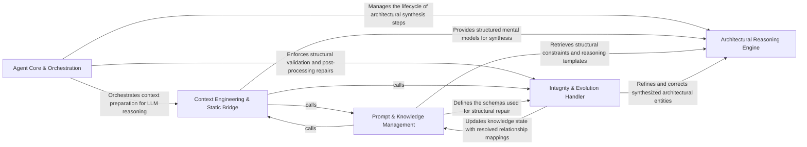

```mermaid
graph LR
    Agent_Core_Orchestration["Agent Core & Orchestration"]
    Architectural_Reasoning_Engine["Architectural Reasoning Engine"]
    Context_Engineering_Static_Bridge["Context Engineering & Static Bridge"]
    Prompt_Knowledge_Management["Prompt & Knowledge Management"]
    Integrity_Evolution_Handler["Integrity & Evolution Handler"]
    Agent_Core_Orchestration -- "Orchestrates context preparation for LLM reasoning" --> Context_Engineering_Static_Bridge
    Agent_Core_Orchestration -- "Enforces structural validation and post-processing repairs" --> Integrity_Evolution_Handler
    Agent_Core_Orchestration -- "Manages the lifecycle of architectural synthesis steps" --> Architectural_Reasoning_Engine
    Context_Engineering_Static_Bridge -- "calls" --> Prompt_Knowledge_Management
    Context_Engineering_Static_Bridge -- "calls" --> Integrity_Evolution_Handler
    Context_Engineering_Static_Bridge -- "Provides structured mental models for synthesis" --> Architectural_Reasoning_Engine
    Prompt_Knowledge_Management -- "Retrieves structural constraints and reasoning templates" --> Architectural_Reasoning_Engine
    Prompt_Knowledge_Management -- "calls" --> Context_Engineering_Static_Bridge
    Prompt_Knowledge_Management -- "Defines the schemas used for structural repair" --> Integrity_Evolution_Handler
    Integrity_Evolution_Handler -- "Refines and corrects synthesized architectural entities" --> Architectural_Reasoning_Engine
    Integrity_Evolution_Handler -- "Updates knowledge state with resolved relationship mappings" --> Prompt_Knowledge_Management
    click Agent_Core_Orchestration href "https://github.com/CodeBoarding/CodeBoarding/blob/main/.codeboarding/Agent_Core_Orchestration.md" "Details"
    click Architectural_Reasoning_Engine href "https://github.com/CodeBoarding/CodeBoarding/blob/main/.codeboarding/Architectural_Reasoning_Engine.md" "Details"
    click Context_Engineering_Static_Bridge href "https://github.com/CodeBoarding/CodeBoarding/blob/main/.codeboarding/Context_Engineering_Static_Bridge.md" "Details"
    click Prompt_Knowledge_Management href "https://github.com/CodeBoarding/CodeBoarding/blob/main/.codeboarding/Prompt_Knowledge_Management.md" "Details"
    click Integrity_Evolution_Handler href "https://github.com/CodeBoarding/CodeBoarding/blob/main/.codeboarding/Integrity_Evolution_Handler.md" "Details"
```

## Details

The primary intelligence layer containing specialized agents that perform distinct architectural tasks such as component identification, API mapping, and incremental updates.

### Agent Core & Orchestration [[Expand]](./Agent_Core_Orchestration.md)
Provides the foundational execution framework for all agents, managing the lifecycle of LLM interactions, including the 'invoke-validate-repair' loop and provider-agnostic communication.

**Related Classes/Methods**: _None_

**Source Files:**

- [`agents/abstraction_agent.py`](https://github.com/CodeBoarding/CodeBoarding/blob/main/.codeboardingagents/abstraction_agent.py)
  - `agents.abstraction_agent.AbstractionAgent.__init__` ([L45-L80](https://github.com/CodeBoarding/CodeBoarding/blob/main/.codeboardingagents/abstraction_agent.py#L45-L80)) - Method
  - `agents.abstraction_agent.AbstractionAgent.step_clusters_grouping` ([L83-L95](https://github.com/CodeBoarding/CodeBoarding/blob/main/.codeboardingagents/abstraction_agent.py#L83-L95)) - Method
  - `agents.abstraction_agent.AbstractionAgent.step_final_analysis` ([L98-L144](https://github.com/CodeBoarding/CodeBoarding/blob/main/.codeboardingagents/abstraction_agent.py#L98-L144)) - Method
  - `agents.abstraction_agent.AbstractionAgent.step_api_surfaces` ([L147-L154](https://github.com/CodeBoarding/CodeBoarding/blob/main/.codeboardingagents/abstraction_agent.py#L147-L154)) - Method
  - `agents.abstraction_agent.AbstractionAgent.step_relation_analysis` ([L157-L191](https://github.com/CodeBoarding/CodeBoarding/blob/main/.codeboardingagents/abstraction_agent.py#L157-L191)) - Method
  - `agents.abstraction_agent.AbstractionAgent.run` ([L193-L230](https://github.com/CodeBoarding/CodeBoarding/blob/main/.codeboardingagents/abstraction_agent.py#L193-L230)) - Method

### Architectural Reasoning Engine [[Expand]](./Architectural_Reasoning_Engine.md)
The primary intelligence layer that performs high-level synthesis, grouping code clusters into logical components, identifying public API surfaces, and conducting the final architectural analysis.

**Related Classes/Methods**: _None_

**Source Files:**

- [`agents/agent_responses.py`](https://github.com/CodeBoarding/CodeBoarding/blob/main/.codeboardingagents/agent_responses.py)
  - `agents.agent_responses.ScopeRelations` ([L0-L0](https://github.com/CodeBoarding/CodeBoarding/blob/main/.codeboardingagents/agent_responses.py#L0-L0)) - Class
  - `agents.agent_responses.LLMBaseModel` ([L24-L129](https://github.com/CodeBoarding/CodeBoarding/blob/main/.codeboardingagents/agent_responses.py#L24-L129)) - Class
  - `agents.agent_responses.RelationCallSite` ([L179-L183](https://github.com/CodeBoarding/CodeBoarding/blob/main/.codeboardingagents/agent_responses.py#L179-L183)) - Class
  - `agents.agent_responses.RelationEdge` ([L186-L245](https://github.com/CodeBoarding/CodeBoarding/blob/main/.codeboardingagents/agent_responses.py#L186-L245)) - Class
  - `agents.agent_responses.ClustersComponent` ([L389-L437](https://github.com/CodeBoarding/CodeBoarding/blob/main/.codeboardingagents/agent_responses.py#L389-L437)) - Class
  - `agents.agent_responses.ClustersComponent.llm_str` ([L435-L437](https://github.com/CodeBoarding/CodeBoarding/blob/main/.codeboardingagents/agent_responses.py#L435-L437)) - Method
  - `agents.agent_responses.ClusterAnalysis` ([L440-L452](https://github.com/CodeBoarding/CodeBoarding/blob/main/.codeboardingagents/agent_responses.py#L440-L452)) - Class
  - `agents.agent_responses.ClusterAnalysis.llm_str` ([L447-L452](https://github.com/CodeBoarding/CodeBoarding/blob/main/.codeboardingagents/agent_responses.py#L447-L452)) - Method
  - `agents.agent_responses.Component.file_paths` ([L492-L494](https://github.com/CodeBoarding/CodeBoarding/blob/main/.codeboardingagents/agent_responses.py#L492-L494)) - Method
  - `agents.agent_responses.Component.llm_str` ([L496-L506](https://github.com/CodeBoarding/CodeBoarding/blob/main/.codeboardingagents/agent_responses.py#L496-L506)) - Method
  - `agents.agent_responses.AnalysisInsights` ([L509-L534](https://github.com/CodeBoarding/CodeBoarding/blob/main/.codeboardingagents/agent_responses.py#L509-L534)) - Class
  - `agents.agent_responses.AnalysisInsights.llm_str` ([L524-L530](https://github.com/CodeBoarding/CodeBoarding/blob/main/.codeboardingagents/agent_responses.py#L524-L530)) - Method
  - `agents.agent_responses.AnalysisInsights.file_to_component` ([L532-L534](https://github.com/CodeBoarding/CodeBoarding/blob/main/.codeboardingagents/agent_responses.py#L532-L534)) - Method
  - `agents.agent_responses.ComponentArchitecture` ([L537-L550](https://github.com/CodeBoarding/CodeBoarding/blob/main/.codeboardingagents/agent_responses.py#L537-L550)) - Class
  - `agents.agent_responses.ComponentArchitecture.llm_str` ([L545-L550](https://github.com/CodeBoarding/CodeBoarding/blob/main/.codeboardingagents/agent_responses.py#L545-L550)) - Method
  - `agents.agent_responses.ComponentApiSurface` ([L553-L587](https://github.com/CodeBoarding/CodeBoarding/blob/main/.codeboardingagents/agent_responses.py#L553-L587)) - Class
  - `agents.agent_responses.ComponentApiSurfaces` ([L590-L598](https://github.com/CodeBoarding/CodeBoarding/blob/main/.codeboardingagents/agent_responses.py#L590-L598)) - Class
  - `agents.agent_responses.ComponentApiSurfaces.llm_str` ([L595-L598](https://github.com/CodeBoarding/CodeBoarding/blob/main/.codeboardingagents/agent_responses.py#L595-L598)) - Method
  - `agents.agent_responses.ComponentRelations` ([L601-L609](https://github.com/CodeBoarding/CodeBoarding/blob/main/.codeboardingagents/agent_responses.py#L601-L609)) - Class
  - `agents.agent_responses.CFGComponent` ([L700-L716](https://github.com/CodeBoarding/CodeBoarding/blob/main/.codeboardingagents/agent_responses.py#L700-L716)) - Class
  - `agents.agent_responses.CFGAnalysisInsights` ([L719-L731](https://github.com/CodeBoarding/CodeBoarding/blob/main/.codeboardingagents/agent_responses.py#L719-L731)) - Class
  - `agents.agent_responses.ExpandComponent` ([L734-L741](https://github.com/CodeBoarding/CodeBoarding/blob/main/.codeboardingagents/agent_responses.py#L734-L741)) - Class
  - `agents.agent_responses.ExpandComponent.llm_str` ([L740-L741](https://github.com/CodeBoarding/CodeBoarding/blob/main/.codeboardingagents/agent_responses.py#L740-L741)) - Method
  - `agents.agent_responses.ValidationInsights` ([L744-L754](https://github.com/CodeBoarding/CodeBoarding/blob/main/.codeboardingagents/agent_responses.py#L744-L754)) - Class
  - `agents.agent_responses.UpdateAnalysis` ([L757-L766](https://github.com/CodeBoarding/CodeBoarding/blob/main/.codeboardingagents/agent_responses.py#L757-L766)) - Class
  - `agents.agent_responses.MetaAnalysisInsights` ([L769-L795](https://github.com/CodeBoarding/CodeBoarding/blob/main/.codeboardingagents/agent_responses.py#L769-L795)) - Class
  - `agents.agent_responses.FileClassification` ([L798-L805](https://github.com/CodeBoarding/CodeBoarding/blob/main/.codeboardingagents/agent_responses.py#L798-L805)) - Class
  - `agents.agent_responses.ComponentFiles` ([L808-L820](https://github.com/CodeBoarding/CodeBoarding/blob/main/.codeboardingagents/agent_responses.py#L808-L820)) - Class
  - `agents.agent_responses.ComponentFiles.llm_str` ([L815-L820](https://github.com/CodeBoarding/CodeBoarding/blob/main/.codeboardingagents/agent_responses.py#L815-L820)) - Method
  - `agents.agent_responses.ScopeOperationAction` ([L823-L827](https://github.com/CodeBoarding/CodeBoarding/blob/main/.codeboardingagents/agent_responses.py#L823-L827)) - Class
  - `agents.agent_responses.ScopedClusterRef` ([L830-L839](https://github.com/CodeBoarding/CodeBoarding/blob/main/.codeboardingagents/agent_responses.py#L830-L839)) - Class
  - `agents.agent_responses.ScopeOperation` ([L842-L872](https://github.com/CodeBoarding/CodeBoarding/blob/main/.codeboardingagents/agent_responses.py#L842-L872)) - Class
  - `agents.agent_responses.ScopeUpdateDecision` ([L875-L883](https://github.com/CodeBoarding/CodeBoarding/blob/main/.codeboardingagents/agent_responses.py#L875-L883)) - Class
  - `agents.agent_responses.FilePath` ([L886-L900](https://github.com/CodeBoarding/CodeBoarding/blob/main/.codeboardingagents/agent_responses.py#L886-L900)) - Class

### Context Engineering & Static Bridge [[Expand]](./Context_Engineering_Static_Bridge.md)
Prepares the mental model for the agents by translating complex static analysis results into LLM-readable context strings.

**Related Classes/Methods**: _None_

**Source Files:**

- [`agents/agent_responses.py`](https://github.com/CodeBoarding/CodeBoarding/blob/main/.codeboardingagents/agent_responses.py)
  - `agents.agent_responses.SourceCodeReference.__str__` ([L163-L171](https://github.com/CodeBoarding/CodeBoarding/blob/main/.codeboardingagents/agent_responses.py#L163-L171)) - Method
  - `agents.agent_responses.assign_component_ids` ([L612-L643](https://github.com/CodeBoarding/CodeBoarding/blob/main/.codeboardingagents/agent_responses.py#L612-L643)) - Function
  - `agents.agent_responses.assign_relation_ids` ([L646-L674](https://github.com/CodeBoarding/CodeBoarding/blob/main/.codeboardingagents/agent_responses.py#L646-L674)) - Function
  - `agents.agent_responses.ValidationInsights.llm_str` ([L753-L754](https://github.com/CodeBoarding/CodeBoarding/blob/main/.codeboardingagents/agent_responses.py#L753-L754)) - Method
  - `agents.agent_responses.UpdateAnalysis.llm_str` ([L765-L766](https://github.com/CodeBoarding/CodeBoarding/blob/main/.codeboardingagents/agent_responses.py#L765-L766)) - Method
  - `agents.agent_responses.FileClassification.llm_str` ([L804-L805](https://github.com/CodeBoarding/CodeBoarding/blob/main/.codeboardingagents/agent_responses.py#L804-L805)) - Method
  - `agents.agent_responses.FilePath.llm_str` ([L899-L900](https://github.com/CodeBoarding/CodeBoarding/blob/main/.codeboardingagents/agent_responses.py#L899-L900)) - Method
- [`agents/details_agent.py`](https://github.com/CodeBoarding/CodeBoarding/blob/main/.codeboardingagents/details_agent.py)
  - `agents.details_agent.DetailsAgent.__init__` ([L46-L84](https://github.com/CodeBoarding/CodeBoarding/blob/main/.codeboardingagents/details_agent.py#L46-L84)) - Method
  - `agents.details_agent.DetailsAgent.step_api_surfaces` ([L186-L193](https://github.com/CodeBoarding/CodeBoarding/blob/main/.codeboardingagents/details_agent.py#L186-L193)) - Method
  - `agents.details_agent.DetailsAgent.run` ([L233-L300](https://github.com/CodeBoarding/CodeBoarding/blob/main/.codeboardingagents/details_agent.py#L233-L300)) - Method

### Prompt & Knowledge Management [[Expand]](./Prompt_Knowledge_Management.md)
Encapsulates the architectural expertise of the system through specialized prompt templates and system messages that guide the LLM's reasoning process.

**Related Classes/Methods**: _None_

**Source Files:**

- [`agents/details_agent.py`](https://github.com/CodeBoarding/CodeBoarding/blob/main/.codeboardingagents/details_agent.py)
  - `agents.details_agent.DetailsAgent.step_clusters_grouping` ([L87-L105](https://github.com/CodeBoarding/CodeBoarding/blob/main/.codeboardingagents/details_agent.py#L87-L105)) - Method
  - `agents.details_agent.DetailsAgent.step_final_analysis` ([L108-L183](https://github.com/CodeBoarding/CodeBoarding/blob/main/.codeboardingagents/details_agent.py#L108-L183)) - Method
  - `agents.details_agent.DetailsAgent.step_relation_analysis` ([L196-L231](https://github.com/CodeBoarding/CodeBoarding/blob/main/.codeboardingagents/details_agent.py#L196-L231)) - Method
- [`agents/file_index_models.py`](https://github.com/CodeBoarding/CodeBoarding/blob/main/.codeboardingagents/file_index_models.py)
  - `agents.file_index_models.FileEntry.merge_method_spans` ([L105-L114](https://github.com/CodeBoarding/CodeBoarding/blob/main/.codeboardingagents/file_index_models.py#L105-L114)) - Method
- [`agents/incremental_agent.py`](https://github.com/CodeBoarding/CodeBoarding/blob/main/.codeboardingagents/incremental_agent.py)
  - `agents.incremental_agent.IncrementalAgent.__init__` ([L58-L94](https://github.com/CodeBoarding/CodeBoarding/blob/main/.codeboardingagents/incremental_agent.py#L58-L94)) - Method
  - `agents.incremental_agent.IncrementalAgent.step_api_surfaces` ([L303-L312](https://github.com/CodeBoarding/CodeBoarding/blob/main/.codeboardingagents/incremental_agent.py#L303-L312)) - Method
  - `agents.incremental_agent.IncrementalAgent.step_relation_analysis` ([L315-L352](https://github.com/CodeBoarding/CodeBoarding/blob/main/.codeboardingagents/incremental_agent.py#L315-L352)) - Method
  - `agents.incremental_agent.IncrementalAgent.generate_scope_relations` ([L366-L422](https://github.com/CodeBoarding/CodeBoarding/blob/main/.codeboardingagents/incremental_agent.py#L366-L422)) - Method
  - `agents.incremental_agent.IncrementalAgent.generate_all_scope_relations` ([L425-L458](https://github.com/CodeBoarding/CodeBoarding/blob/main/.codeboardingagents/incremental_agent.py#L425-L458)) - Method
  - `agents.incremental_agent._cluster_analysis_for_scope` ([L511-L533](https://github.com/CodeBoarding/CodeBoarding/blob/main/.codeboardingagents/incremental_agent.py#L511-L533)) - Function

### Integrity & Evolution Handler [[Expand]](./Integrity_Evolution_Handler.md)
Ensures the reliability and continuity of the architectural model by validating LLM outputs against structural schemas and mapping relationships across incremental analysis runs.

**Related Classes/Methods**: _None_

**Source Files:**

- [`agents/incremental_agent.py`](https://github.com/CodeBoarding/CodeBoarding/blob/main/.codeboardingagents/incremental_agent.py)
  - `agents.incremental_agent._local_graph_cluster_ids` ([L536-L553](https://github.com/CodeBoarding/CodeBoarding/blob/main/.codeboardingagents/incremental_agent.py#L536-L553)) - Function
  - `agents.incremental_agent._log_scope_relations_summary` ([L570-L575](https://github.com/CodeBoarding/CodeBoarding/blob/main/.codeboardingagents/incremental_agent.py#L570-L575)) - Function
- [`agents/relation_edges.py`](https://github.com/CodeBoarding/CodeBoarding/blob/main/.codeboardingagents/relation_edges.py)
  - `agents.relation_edges.index_relation_endpoints` ([L33-L52](https://github.com/CodeBoarding/CodeBoarding/blob/main/.codeboardingagents/relation_edges.py#L33-L52)) - Function
- [`agents/repair.py`](https://github.com/CodeBoarding/CodeBoarding/blob/main/.codeboardingagents/repair.py)
  - `agents.repair.ComponentRepairContext` ([L21-L24](https://github.com/CodeBoarding/CodeBoarding/blob/main/.codeboardingagents/repair.py#L21-L24)) - Class
  - `agents.repair.repair_component_group_names` ([L27-L46](https://github.com/CodeBoarding/CodeBoarding/blob/main/.codeboardingagents/repair.py#L27-L46)) - Function
  - `agents.repair._canonical_group_name` ([L49-L54](https://github.com/CodeBoarding/CodeBoarding/blob/main/.codeboardingagents/repair.py#L49-L54)) - Function
  - `agents.repair._normalize_group_name` ([L57-L60](https://github.com/CodeBoarding/CodeBoarding/blob/main/.codeboardingagents/repair.py#L57-L60)) - Function
  - `agents.repair._fuzzy_match_group_name` ([L63-L75](https://github.com/CodeBoarding/CodeBoarding/blob/main/.codeboardingagents/repair.py#L63-L75)) - Function
  - `agents.repair.repair_key_entities` ([L78-L101](https://github.com/CodeBoarding/CodeBoarding/blob/main/.codeboardingagents/repair.py#L78-L101)) - Function
- [`agents/validation.py`](https://github.com/CodeBoarding/CodeBoarding/blob/main/.codeboardingagents/validation.py)
  - `agents.validation.validate_existing_component_ids` ([L0-L0](https://github.com/CodeBoarding/CodeBoarding/blob/main/.codeboardingagents/validation.py#L0-L0)) - Function
  - `agents.validation.validate_scope_relation_names` ([L0-L0](https://github.com/CodeBoarding/CodeBoarding/blob/main/.codeboardingagents/validation.py#L0-L0)) - Function
  - `agents.validation.ValidationContext` ([L38-L53](https://github.com/CodeBoarding/CodeBoarding/blob/main/.codeboardingagents/validation.py#L38-L53)) - Class
  - `agents.validation.ValidationResult` ([L57-L62](https://github.com/CodeBoarding/CodeBoarding/blob/main/.codeboardingagents/validation.py#L57-L62)) - Class
  - `agents.validation._effective_validation_score` ([L73-L77](https://github.com/CodeBoarding/CodeBoarding/blob/main/.codeboardingagents/validation.py#L73-L77)) - Function
  - `agents.validation.score_validation_results` ([L80-L99](https://github.com/CodeBoarding/CodeBoarding/blob/main/.codeboardingagents/validation.py#L80-L99)) - Function
  - `agents.validation.validate_group_name_coverage` ([L102-L188](https://github.com/CodeBoarding/CodeBoarding/blob/main/.codeboardingagents/validation.py#L102-L188)) - Function
  - `agents.validation.validate_cluster_coverage` ([L183-L247](https://github.com/CodeBoarding/CodeBoarding/blob/main/.codeboardingagents/validation.py#L183-L247)) - Function
  - `agents.validation.validate_key_entities` ([L191-L207](https://github.com/CodeBoarding/CodeBoarding/blob/main/.codeboardingagents/validation.py#L191-L207)) - Function
  - `agents.validation.validate_relation_component_names` ([L273-L323](https://github.com/CodeBoarding/CodeBoarding/blob/main/.codeboardingagents/validation.py#L273-L323)) - Function
  - `agents.validation.validate_relations` ([L405-L427](https://github.com/CodeBoarding/CodeBoarding/blob/main/.codeboardingagents/validation.py#L405-L427)) - Function
- [`monitoring/context.py`](https://github.com/CodeBoarding/CodeBoarding/blob/main/.codeboardingmonitoring/context.py)
  - `monitoring.context.monitor_execution.DummyContext.end_step` ([L36-L37](https://github.com/CodeBoarding/CodeBoarding/blob/main/.codeboardingmonitoring/context.py#L36-L37)) - Method
  - `monitoring.context.monitor_execution.MonitorContext.__init__` ([L74-L75](https://github.com/CodeBoarding/CodeBoarding/blob/main/.codeboardingmonitoring/context.py#L74-L75)) - Method
  - `monitoring.context.trace` ([L131-L173](https://github.com/CodeBoarding/CodeBoarding/blob/main/.codeboardingmonitoring/context.py#L131-L173)) - Function
- [`static_analyzer/cluster_helpers.py`](https://github.com/CodeBoarding/CodeBoarding/blob/main/.codeboardingstatic_analyzer/cluster_helpers.py)
  - `static_analyzer.cluster_helpers.get_all_cluster_ids` ([L757-L770](https://github.com/CodeBoarding/CodeBoarding/blob/main/.codeboardingstatic_analyzer/cluster_helpers.py#L757-L770)) - Function
- [`static_analyzer/reference_resolver.py`](https://github.com/CodeBoarding/CodeBoarding/blob/main/.codeboardingstatic_analyzer/reference_resolver.py)
  - `static_analyzer.reference_resolver.KeyEntityRepair` ([L27-L32](https://github.com/CodeBoarding/CodeBoarding/blob/main/.codeboardingstatic_analyzer/reference_resolver.py#L27-L32)) - Class
  - `static_analyzer.reference_resolver.StaticReferenceResolver.fix_source_code_reference_lines` ([L42-L47](https://github.com/CodeBoarding/CodeBoarding/blob/main/.codeboardingstatic_analyzer/reference_resolver.py#L42-L47)) - Method
  - `static_analyzer.reference_resolver.StaticReferenceResolver.fix_key_entities_refs` ([L49-L66](https://github.com/CodeBoarding/CodeBoarding/blob/main/.codeboardingstatic_analyzer/reference_resolver.py#L49-L66)) - Method
  - `static_analyzer.reference_resolver.StaticReferenceResolver.repair_key_entity_references` ([L68-L109](https://github.com/CodeBoarding/CodeBoarding/blob/main/.codeboardingstatic_analyzer/reference_resolver.py#L68-L109)) - Method
  - `static_analyzer.reference_resolver.StaticReferenceResolver.relative_paths` ([L369-L386](https://github.com/CodeBoarding/CodeBoarding/blob/main/.codeboardingstatic_analyzer/reference_resolver.py#L369-L386)) - Method
  - `static_analyzer.reference_resolver.StaticReferenceResolver._absolute_reference_path` ([L426-L428](https://github.com/CodeBoarding/CodeBoarding/blob/main/.codeboardingstatic_analyzer/reference_resolver.py#L426-L428)) - Method

### [FAQ](https://github.com/CodeBoarding/GeneratedOnBoardings/tree/main?tab=readme-ov-file#faq)