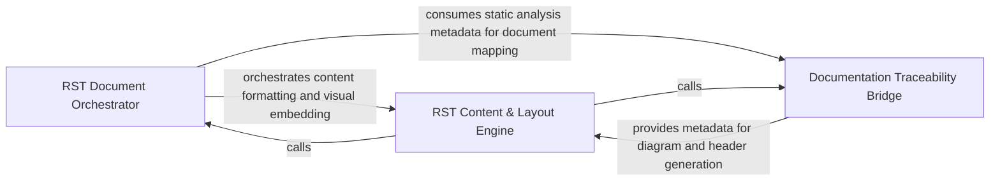

## Details

Specialized generator for the Python-centric Sphinx documentation ecosystem, implementing RST syntax and directive-based diagram embedding.

### RST Document Orchestrator
Acts as the central controller for the generation process, managing file system operations and orchestrating the assembly of individual documentation pages into a cohesive Sphinx project structure.

**Related Classes/Methods**: _None_

**Source Files:**

- [`output_generators/sphinx.py`](https://github.com/CodeBoarding/CodeBoarding/blob/main/.codeboardingoutput_generators/sphinx.py)
  - `output_generators.sphinx.component_header` ([L186-L197](https://github.com/CodeBoarding/CodeBoarding/blob/main/.codeboardingoutput_generators/sphinx.py#L186-L197)) - Function

### RST Content & Layout Engine
Handles the fine-grained formatting of RST content, merging structural component headers with visual Mermaid.js diagrams and maintaining section hierarchies.

**Related Classes/Methods**: _None_

**Source Files:**

- [`output_generators/sphinx.py`](https://github.com/CodeBoarding/CodeBoarding/blob/main/.codeboardingoutput_generators/sphinx.py)
  - `output_generators.sphinx.generate_rst` ([L46-L155](https://github.com/CodeBoarding/CodeBoarding/blob/main/.codeboardingoutput_generators/sphinx.py#L46-L155)) - Function
  - `output_generators.sphinx.generate_rst_file` ([L158-L183](https://github.com/CodeBoarding/CodeBoarding/blob/main/.codeboardingoutput_generators/sphinx.py#L158-L183)) - Function

### Documentation Traceability Bridge
Ensures high-fidelity links between generated documentation and source code by integrating static analysis metadata into the RST output.

**Related Classes/Methods**: _None_

**Source Files:**

- [`output_generators/sphinx.py`](https://github.com/CodeBoarding/CodeBoarding/blob/main/.codeboardingoutput_generators/sphinx.py)
  - `output_generators.sphinx.generated_mermaid_str` ([L8-L43](https://github.com/CodeBoarding/CodeBoarding/blob/main/.codeboardingoutput_generators/sphinx.py#L8-L43)) - Function

### [FAQ](https://github.com/CodeBoarding/GeneratedOnBoardings/tree/main?tab=readme-ov-file#faq)