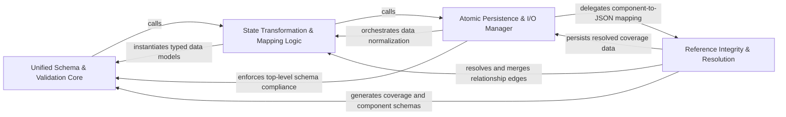

## Details

Handles the mapping of internal analysis objects into the standardized UnifiedAnalysisJson format, ensuring data integrity and schema-compliant output.

### Unified Schema & Validation Core
Defines the structural contract and data models that represent the entire project's architecture, ensuring adherence to a strict, typed specification.

**Related Classes/Methods**: _None_

**Source Files:**

- [`agents/relation_edges.py`](https://github.com/CodeBoarding/CodeBoarding/blob/main/.codeboardingagents/relation_edges.py)
  - `agents.relation_edges.merge_relations_by_pair` ([L26-L30](https://github.com/CodeBoarding/CodeBoarding/blob/main/.codeboardingagents/relation_edges.py#L26-L30)) - Function
- [`diagram_analysis/analysis_json.py`](https://github.com/CodeBoarding/CodeBoarding/blob/main/.codeboardingdiagram_analysis/analysis_json.py)
  - `diagram_analysis.analysis_json.RelationEdgeJson` ([L23-L27](https://github.com/CodeBoarding/CodeBoarding/blob/main/.codeboardingdiagram_analysis/analysis_json.py#L23-L27)) - Class
  - `diagram_analysis.analysis_json.RelationJson` ([L30-L43](https://github.com/CodeBoarding/CodeBoarding/blob/main/.codeboardingdiagram_analysis/analysis_json.py#L30-L43)) - Class
  - `diagram_analysis.analysis_json.ComponentJson` ([L46-L70](https://github.com/CodeBoarding/CodeBoarding/blob/main/.codeboardingdiagram_analysis/analysis_json.py#L46-L70)) - Class
  - `diagram_analysis.analysis_json.NotAnalyzedFile` ([L73-L75](https://github.com/CodeBoarding/CodeBoarding/blob/main/.codeboardingdiagram_analysis/analysis_json.py#L73-L75)) - Class
  - `diagram_analysis.analysis_json.FileCoverageSummary` ([L78-L84](https://github.com/CodeBoarding/CodeBoarding/blob/main/.codeboardingdiagram_analysis/analysis_json.py#L78-L84)) - Class
  - `diagram_analysis.analysis_json.FileCoverageReport` ([L87-L92](https://github.com/CodeBoarding/CodeBoarding/blob/main/.codeboardingdiagram_analysis/analysis_json.py#L87-L92)) - Class
  - `diagram_analysis.analysis_json.AnalysisMetadata` ([L95-L108](https://github.com/CodeBoarding/CodeBoarding/blob/main/.codeboardingdiagram_analysis/analysis_json.py#L95-L108)) - Class
  - `diagram_analysis.analysis_json.MethodIndexEntry` ([L111-L120](https://github.com/CodeBoarding/CodeBoarding/blob/main/.codeboardingdiagram_analysis/analysis_json.py#L111-L120)) - Class
  - `diagram_analysis.analysis_json.ComponentFileMethodGroupJson` ([L123-L128](https://github.com/CodeBoarding/CodeBoarding/blob/main/.codeboardingdiagram_analysis/analysis_json.py#L123-L128)) - Class
  - `diagram_analysis.analysis_json.FileEntryJson` ([L131-L144](https://github.com/CodeBoarding/CodeBoarding/blob/main/.codeboardingdiagram_analysis/analysis_json.py#L131-L144)) - Class
  - `diagram_analysis.analysis_json.UnifiedAnalysisJson` ([L147-L161](https://github.com/CodeBoarding/CodeBoarding/blob/main/.codeboardingdiagram_analysis/analysis_json.py#L147-L161)) - Class
  - `diagram_analysis.analysis_json._build_files_index_from_analysis` ([L164-L177](https://github.com/CodeBoarding/CodeBoarding/blob/main/.codeboardingdiagram_analysis/analysis_json.py#L164-L177)) - Function
  - `diagram_analysis.analysis_json._build_file_entry_json_from_files` ([L241-L249](https://github.com/CodeBoarding/CodeBoarding/blob/main/.codeboardingdiagram_analysis/analysis_json.py#L241-L249)) - Function

### State Transformation & Mapping Logic
Provides functional logic to translate raw, heterogeneous data structures into the standardized UnifiedAnalysisJson format, handling normalization and merging.

**Related Classes/Methods**: _None_

**Source Files:**

- [`diagram_analysis/analysis_json.py`](https://github.com/CodeBoarding/CodeBoarding/blob/main/.codeboardingdiagram_analysis/analysis_json.py)
  - `diagram_analysis.analysis_json._method_key` ([L180-L182](https://github.com/CodeBoarding/CodeBoarding/blob/main/.codeboardingdiagram_analysis/analysis_json.py#L180-L182)) - Function
  - `diagram_analysis.analysis_json._relation_edge_to_json` ([L190-L196](https://github.com/CodeBoarding/CodeBoarding/blob/main/.codeboardingdiagram_analysis/analysis_json.py#L190-L196)) - Function
  - `diagram_analysis.analysis_json._build_methods_index_from_files` ([L226-L238](https://github.com/CodeBoarding/CodeBoarding/blob/main/.codeboardingdiagram_analysis/analysis_json.py#L226-L238)) - Function
  - `diagram_analysis.analysis_json._compute_depth_level` ([L376-L417](https://github.com/CodeBoarding/CodeBoarding/blob/main/.codeboardingdiagram_analysis/analysis_json.py#L376-L417)) - Function
  - `diagram_analysis.analysis_json._compute_depth_level.get_depth` ([L387-L397](https://github.com/CodeBoarding/CodeBoarding/blob/main/.codeboardingdiagram_analysis/analysis_json.py#L387-L397)) - Function

### Reference Integrity & Resolution
Maintains validity of pointers between serialized state and physical source code, handling line number updates and QName resolution.

**Related Classes/Methods**: _None_

**Source Files:**

- [`diagram_analysis/analysis_json.py`](https://github.com/CodeBoarding/CodeBoarding/blob/main/.codeboardingdiagram_analysis/analysis_json.py)
  - `diagram_analysis.analysis_json.from_component_to_json_component` ([L302-L344](https://github.com/CodeBoarding/CodeBoarding/blob/main/.codeboardingdiagram_analysis/analysis_json.py#L302-L344)) - Function
- [`diagram_analysis/diagram_generator.py`](https://github.com/CodeBoarding/CodeBoarding/blob/main/.codeboardingdiagram_analysis/diagram_generator.py)
  - `diagram_analysis.diagram_generator.DiagramGenerator._write_file_coverage` ([L226-L242](https://github.com/CodeBoarding/CodeBoarding/blob/main/.codeboardingdiagram_analysis/diagram_generator.py#L226-L242)) - Method
  - `diagram_analysis.diagram_generator.DiagramGenerator._build_file_coverage_summary` ([L657-L666](https://github.com/CodeBoarding/CodeBoarding/blob/main/.codeboardingdiagram_analysis/diagram_generator.py#L657-L666)) - Method
- [`diagram_analysis/io_utils.py`](https://github.com/CodeBoarding/CodeBoarding/blob/main/.codeboardingdiagram_analysis/io_utils.py)
  - `diagram_analysis.io_utils._AnalysisFileStore.__init__` ([L55-L61](https://github.com/CodeBoarding/CodeBoarding/blob/main/.codeboardingdiagram_analysis/io_utils.py#L55-L61)) - Method
  - `diagram_analysis.io_utils._AnalysisFileStore._write_with_lock_held` ([L189-L251](https://github.com/CodeBoarding/CodeBoarding/blob/main/.codeboardingdiagram_analysis/io_utils.py#L189-L251)) - Method
  - `diagram_analysis.io_utils.write_text_atomic` ([L307-L318](https://github.com/CodeBoarding/CodeBoarding/blob/main/.codeboardingdiagram_analysis/io_utils.py#L307-L318)) - Function

### Atomic Persistence & I/O Manager
Manages the physical lifecycle of the analysis state on disk using thread-safe and process-safe mechanisms.

**Related Classes/Methods**: _None_

**Source Files:**

- [`diagram_analysis/analysis_json.py`](https://github.com/CodeBoarding/CodeBoarding/blob/main/.codeboardingdiagram_analysis/analysis_json.py)
  - `diagram_analysis.analysis_json._source_reference_method_key` ([L185-L187](https://github.com/CodeBoarding/CodeBoarding/blob/main/.codeboardingdiagram_analysis/analysis_json.py#L185-L187)) - Function
  - `diagram_analysis.analysis_json._to_component_file_method_refs` ([L199-L211](https://github.com/CodeBoarding/CodeBoarding/blob/main/.codeboardingdiagram_analysis/analysis_json.py#L199-L211)) - Function
  - `diagram_analysis.analysis_json._relation_to_json` ([L287-L299](https://github.com/CodeBoarding/CodeBoarding/blob/main/.codeboardingdiagram_analysis/analysis_json.py#L287-L299)) - Function
  - `diagram_analysis.analysis_json.from_analysis_to_json` ([L347-L373](https://github.com/CodeBoarding/CodeBoarding/blob/main/.codeboardingdiagram_analysis/analysis_json.py#L347-L373)) - Function
  - `diagram_analysis.analysis_json.build_unified_analysis_json` ([L420-L466](https://github.com/CodeBoarding/CodeBoarding/blob/main/.codeboardingdiagram_analysis/analysis_json.py#L420-L466)) - Function

### [FAQ](https://github.com/CodeBoarding/GeneratedOnBoardings/tree/main?tab=readme-ov-file#faq)