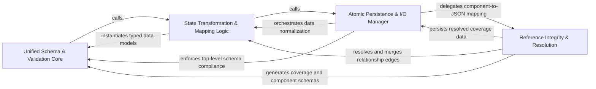

```mermaid
graph LR
    Unified_Schema_Validation_Core["Unified Schema & Validation Core"]
    State_Transformation_Mapping_Logic["State Transformation & Mapping Logic"]
    Reference_Integrity_Resolution["Reference Integrity & Resolution"]
    Atomic_Persistence_I_O_Manager["Atomic Persistence & I/O Manager"]
    Unified_Schema_Validation_Core -- "calls" --> State_Transformation_Mapping_Logic
    State_Transformation_Mapping_Logic -- "instantiates typed data models" --> Unified_Schema_Validation_Core
    State_Transformation_Mapping_Logic -- "calls" --> Atomic_Persistence_I_O_Manager
    Reference_Integrity_Resolution -- "generates coverage and component schemas" --> Unified_Schema_Validation_Core
    Reference_Integrity_Resolution -- "resolves and merges relationship edges" --> State_Transformation_Mapping_Logic
    Reference_Integrity_Resolution -- "persists resolved coverage data" --> Atomic_Persistence_I_O_Manager
    Atomic_Persistence_I_O_Manager -- "enforces top-level schema compliance" --> Unified_Schema_Validation_Core
    Atomic_Persistence_I_O_Manager -- "orchestrates data normalization" --> State_Transformation_Mapping_Logic
    Atomic_Persistence_I_O_Manager -- "delegates component-to-JSON mapping" --> Reference_Integrity_Resolution
```

## Details

Handles the mapping of internal analysis objects into the standardized UnifiedAnalysisJson format, ensuring data integrity and schema-compliant output.

### Unified Schema & Validation Core
Defines the structural contract and data models that represent the entire project's architecture, ensuring adherence to a strict, typed specification.

**Related Classes/Methods**: _None_

**Source Files:**

- [`agents/relation_edges.py`](https://github.com/CodeBoarding/CodeBoarding/blob/main/.codeboardingagents/relation_edges.py)
  - `agents.relation_edges.merge_relations_by_pair` ([L26-L30](https://github.com/CodeBoarding/CodeBoarding/blob/main/.codeboardingagents/relation_edges.py#L26-L30)) - Function
- [`diagram_analysis/analysis_json.py`](https://github.com/CodeBoarding/CodeBoarding/blob/main/.codeboardingdiagram_analysis/analysis_json.py)
  - `diagram_analysis.analysis_json.RelationEdgeJson` ([L23-L27](https://github.com/CodeBoarding/CodeBoarding/blob/main/.codeboardingdiagram_analysis/analysis_json.py#L23-L27)) - Class
  - `diagram_analysis.analysis_json.RelationJson` ([L30-L43](https://github.com/CodeBoarding/CodeBoarding/blob/main/.codeboardingdiagram_analysis/analysis_json.py#L30-L43)) - Class
  - `diagram_analysis.analysis_json.ComponentJson` ([L46-L70](https://github.com/CodeBoarding/CodeBoarding/blob/main/.codeboardingdiagram_analysis/analysis_json.py#L46-L70)) - Class
  - `diagram_analysis.analysis_json.NotAnalyzedFile` ([L73-L75](https://github.com/CodeBoarding/CodeBoarding/blob/main/.codeboardingdiagram_analysis/analysis_json.py#L73-L75)) - Class
  - `diagram_analysis.analysis_json.FileCoverageSummary` ([L78-L84](https://github.com/CodeBoarding/CodeBoarding/blob/main/.codeboardingdiagram_analysis/analysis_json.py#L78-L84)) - Class
  - `diagram_analysis.analysis_json.FileCoverageReport` ([L87-L92](https://github.com/CodeBoarding/CodeBoarding/blob/main/.codeboardingdiagram_analysis/analysis_json.py#L87-L92)) - Class
  - `diagram_analysis.analysis_json.AnalysisMetadata` ([L95-L113](https://github.com/CodeBoarding/CodeBoarding/blob/main/.codeboardingdiagram_analysis/analysis_json.py#L95-L113)) - Class
  - `diagram_analysis.analysis_json.MethodIndexEntry` ([L116-L125](https://github.com/CodeBoarding/CodeBoarding/blob/main/.codeboardingdiagram_analysis/analysis_json.py#L116-L125)) - Class
  - `diagram_analysis.analysis_json.ComponentFileMethodGroupJson` ([L128-L133](https://github.com/CodeBoarding/CodeBoarding/blob/main/.codeboardingdiagram_analysis/analysis_json.py#L128-L133)) - Class
  - `diagram_analysis.analysis_json.FileEntryJson` ([L136-L153](https://github.com/CodeBoarding/CodeBoarding/blob/main/.codeboardingdiagram_analysis/analysis_json.py#L136-L153)) - Class
  - `diagram_analysis.analysis_json.UnifiedAnalysisJson` ([L156-L170](https://github.com/CodeBoarding/CodeBoarding/blob/main/.codeboardingdiagram_analysis/analysis_json.py#L156-L170)) - Class
  - `diagram_analysis.analysis_json._build_files_index_from_analysis` ([L173-L186](https://github.com/CodeBoarding/CodeBoarding/blob/main/.codeboardingdiagram_analysis/analysis_json.py#L173-L186)) - Function
  - `diagram_analysis.analysis_json._build_file_entry_json_from_files` ([L267-L276](https://github.com/CodeBoarding/CodeBoarding/blob/main/.codeboardingdiagram_analysis/analysis_json.py#L267-L276)) - Function

### State Transformation & Mapping Logic
Provides functional logic to translate raw, heterogeneous data structures into the standardized UnifiedAnalysisJson format, handling normalization and merging.

**Related Classes/Methods**: _None_

**Source Files:**

- [`diagram_analysis/analysis_json.py`](https://github.com/CodeBoarding/CodeBoarding/blob/main/.codeboardingdiagram_analysis/analysis_json.py)
  - `diagram_analysis.analysis_json._method_key` ([L189-L191](https://github.com/CodeBoarding/CodeBoarding/blob/main/.codeboardingdiagram_analysis/analysis_json.py#L189-L191)) - Function
  - `diagram_analysis.analysis_json._relation_edge_to_json` ([L216-L222](https://github.com/CodeBoarding/CodeBoarding/blob/main/.codeboardingdiagram_analysis/analysis_json.py#L216-L222)) - Function
  - `diagram_analysis.analysis_json._build_methods_index_from_files` ([L252-L264](https://github.com/CodeBoarding/CodeBoarding/blob/main/.codeboardingdiagram_analysis/analysis_json.py#L252-L264)) - Function
  - `diagram_analysis.analysis_json._compute_depth_level` ([L415-L456](https://github.com/CodeBoarding/CodeBoarding/blob/main/.codeboardingdiagram_analysis/analysis_json.py#L415-L456)) - Function
  - `diagram_analysis.analysis_json._compute_depth_level.get_depth` ([L426-L436](https://github.com/CodeBoarding/CodeBoarding/blob/main/.codeboardingdiagram_analysis/analysis_json.py#L426-L436)) - Function

### Reference Integrity & Resolution
Maintains validity of pointers between serialized state and physical source code, handling line number updates and QName resolution.

**Related Classes/Methods**: _None_

**Source Files:**

- [`diagram_analysis/analysis_json.py`](https://github.com/CodeBoarding/CodeBoarding/blob/main/.codeboardingdiagram_analysis/analysis_json.py)
  - `diagram_analysis.analysis_json.from_component_to_json_component` ([L329-L383](https://github.com/CodeBoarding/CodeBoarding/blob/main/.codeboardingdiagram_analysis/analysis_json.py#L329-L383)) - Function
- [`diagram_analysis/diagram_generator.py`](https://github.com/CodeBoarding/CodeBoarding/blob/main/.codeboardingdiagram_analysis/diagram_generator.py)
  - `diagram_analysis.diagram_generator.DiagramGenerator._write_file_coverage` ([L722-L738](https://github.com/CodeBoarding/CodeBoarding/blob/main/.codeboardingdiagram_analysis/diagram_generator.py#L722-L738)) - Method
  - `diagram_analysis.diagram_generator.DiagramGenerator._build_file_coverage_summary` ([L1190-L1199](https://github.com/CodeBoarding/CodeBoarding/blob/main/.codeboardingdiagram_analysis/diagram_generator.py#L1190-L1199)) - Method
- [`diagram_analysis/io_utils.py`](https://github.com/CodeBoarding/CodeBoarding/blob/main/.codeboardingdiagram_analysis/io_utils.py)
  - `diagram_analysis.io_utils._AnalysisFileStore.__init__` ([L56-L62](https://github.com/CodeBoarding/CodeBoarding/blob/main/.codeboardingdiagram_analysis/io_utils.py#L56-L62)) - Method
  - `diagram_analysis.io_utils._AnalysisFileStore._write_with_lock_held` ([L196-L295](https://github.com/CodeBoarding/CodeBoarding/blob/main/.codeboardingdiagram_analysis/io_utils.py#L196-L295)) - Method
  - `diagram_analysis.io_utils.write_text_atomic` ([L351-L362](https://github.com/CodeBoarding/CodeBoarding/blob/main/.codeboardingdiagram_analysis/io_utils.py#L351-L362)) - Function

### Atomic Persistence & I/O Manager
Manages the physical lifecycle of the analysis state on disk using thread-safe and process-safe mechanisms.

**Related Classes/Methods**: _None_

**Source Files:**

- [`diagram_analysis/analysis_json.py`](https://github.com/CodeBoarding/CodeBoarding/blob/main/.codeboardingdiagram_analysis/analysis_json.py)
  - `diagram_analysis.analysis_json._source_reference_method_key` ([L194-L196](https://github.com/CodeBoarding/CodeBoarding/blob/main/.codeboardingdiagram_analysis/analysis_json.py#L194-L196)) - Function
  - `diagram_analysis.analysis_json._to_component_file_method_refs` ([L225-L237](https://github.com/CodeBoarding/CodeBoarding/blob/main/.codeboardingdiagram_analysis/analysis_json.py#L225-L237)) - Function
  - `diagram_analysis.analysis_json._relation_to_json` ([L314-L326](https://github.com/CodeBoarding/CodeBoarding/blob/main/.codeboardingdiagram_analysis/analysis_json.py#L314-L326)) - Function
  - `diagram_analysis.analysis_json.from_analysis_to_json` ([L386-L412](https://github.com/CodeBoarding/CodeBoarding/blob/main/.codeboardingdiagram_analysis/analysis_json.py#L386-L412)) - Function
  - `diagram_analysis.analysis_json.build_unified_analysis_json` ([L459-L510](https://github.com/CodeBoarding/CodeBoarding/blob/main/.codeboardingdiagram_analysis/analysis_json.py#L459-L510)) - Function

### [FAQ](https://github.com/CodeBoarding/GeneratedOnBoardings/tree/main?tab=readme-ov-file#faq)