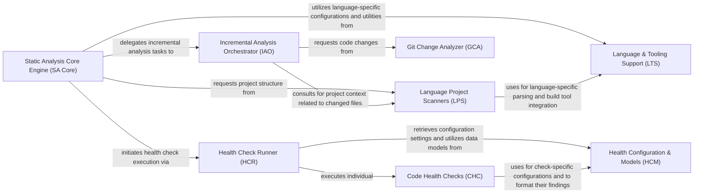

## Details

Orchestrates the entire static analysis process, coordinating code retrieval, call graph construction, quality checks, and aggregation of findings.

### Static Analysis Core Engine (SA Core)
Orchestrates the overall static analysis process, serving as the central hub for initiating analysis, managing language-specific scanners, and integrating with incremental analysis. It provides core static analysis configurations and constants.

**Related Classes/Methods**:

- <a href="https://github.com/CodeBoarding/CodeBoarding/blob/main/.codeboardingstatic_analyzer/constants.py" target="_blank" rel="noopener noreferrer">`static_analyzer.constants`</a>
- <a href="https://github.com/CodeBoarding/CodeBoarding/blob/main/.codeboardingstatic_analyzer/__init__.py" target="_blank" rel="noopener noreferrer">`static_analyzer.__init__.StaticAnalyzer`</a>
- <a href="https://github.com/CodeBoarding/CodeBoarding/blob/main/.codeboardingstatic_analyzer/scanner.py" target="_blank" rel="noopener noreferrer">`static_analyzer.scanner.ProjectScanner`</a>

### Incremental Analysis Orchestrator (IAO)
Optimizes static analysis by performing incremental updates. It manages caching of analysis results, detects code changes, and intelligently re-analyzes only affected parts of the codebase, also handling mapping and merging of cluster results.

**Related Classes/Methods**:

- <a href="https://github.com/CodeBoarding/CodeBoarding/blob/main/.codeboardingstatic_analyzer/incremental_orchestrator.py" target="_blank" rel="noopener noreferrer">`static_analyzer.incremental_orchestrator`</a>
- <a href="https://github.com/CodeBoarding/CodeBoarding/blob/main/.codeboardingstatic_analyzer/cluster_helpers.py" target="_blank" rel="noopener noreferrer">`static_analyzer.cluster_helpers`</a>

### Language Project Scanners (LPS)
Specializes in understanding project structure and build configurations for different languages (Java, TypeScript). It identifies relevant source files and project settings.

**Related Classes/Methods**:

- <a href="https://github.com/CodeBoarding/CodeBoarding/blob/main/.codeboardingstatic_analyzer/java_config_scanner.py" target="_blank" rel="noopener noreferrer">`static_analyzer.java_config_scanner`</a>
- <a href="https://github.com/CodeBoarding/CodeBoarding/blob/main/.codeboardingstatic_analyzer/typescript_config_scanner.py" target="_blank" rel="noopener noreferrer">`static_analyzer.typescript_config_scanner`</a>

### Language & Tooling Support (LTS)
Provides foundational support for various programming languages, defining language properties, managing LSP server configurations, and offering language-specific utilities such as JDK detection and command creation.

**Related Classes/Methods**:

- <a href="https://github.com/CodeBoarding/CodeBoarding/blob/main/.codeboardingstatic_analyzer/programming_language.py" target="_blank" rel="noopener noreferrer">`static_analyzer.programming_language`</a>
- <a href="https://github.com/CodeBoarding/CodeBoarding/blob/main/.codeboardingstatic_analyzer/java_utils.py" target="_blank" rel="noopener noreferrer">`static_analyzer.java_utils`</a>

### Git Change Analyzer (GCA)
Interacts with the Git version control system to identify code changes between commits or uncommitted modifications. It supplies the necessary input for incremental analysis to focus on modified files.

**Related Classes/Methods**:

- <a href="https://github.com/CodeBoarding/CodeBoarding/blob/main/.codeboardingstatic_analyzer/git_diff_analyzer.py" target="_blank" rel="noopener noreferrer">`static_analyzer.git_diff_analyzer`</a>

### Health Check Runner (HCR)
Central component for executing and managing code health checks. It orchestrates the running of individual checks, aggregates their findings, and applies project-defined exclusion patterns to filter results.

**Related Classes/Methods**:

- <a href="https://github.com/CodeBoarding/CodeBoarding/blob/main/.codeboardinghealth/runner.py" target="_blank" rel="noopener noreferrer">`health.runner`</a>

### Code Health Checks (CHC)
Collection of specialized modules, each implementing a specific code quality or architectural health check (unused code, God classes, cohesion, inheritance, coupling, instability, function size, circular dependencies).

**Related Classes/Methods**:

- <a href="https://github.com/CodeBoarding/CodeBoarding/blob/main/.codeboardinghealth/checks/__init__.py" target="_blank" rel="noopener noreferrer">`health.checks`</a>

### Health Configuration & Models (HCM)
Manages configuration settings for all health checks, including thresholds and ignore rules, and defines data structures (models) used to represent health findings, summaries, and overall reports.

**Related Classes/Methods**:

- <a href="https://github.com/CodeBoarding/CodeBoarding/blob/main/.codeboardinghealth/models.py" target="_blank" rel="noopener noreferrer">`health.models`</a>
- <a href="https://github.com/CodeBoarding/CodeBoarding/blob/main/.codeboardinghealth/config.py" target="_blank" rel="noopener noreferrer">`health.config`</a>
- <a href="https://github.com/CodeBoarding/CodeBoarding/blob/main/.codeboardinghealth/constants.py" target="_blank" rel="noopener noreferrer">`health.constants`</a>

### [FAQ](https://github.com/CodeBoarding/GeneratedOnBoardings/tree/main?tab=readme-ov-file#faq)