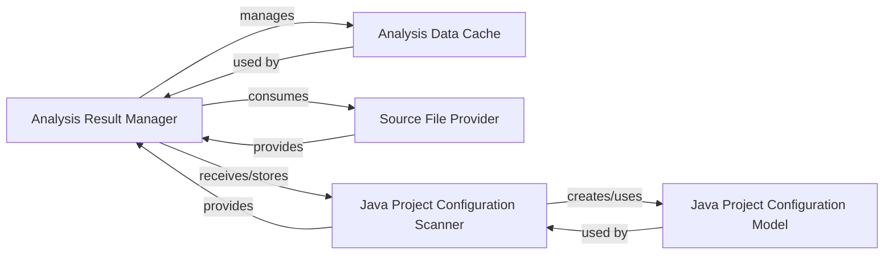

## Details

Acts as a data repository for all outputs generated during static analysis, storing call graphs, code structures, and analyzer findings.

### Analysis Result Manager
Acts as the central repository and orchestrator for all static analysis outcomes, managing artifacts such as CFGs, class hierarchies, package dependencies, code references, and source file information. It coordinates the overall analysis data flow.

**Related Classes/Methods**:

- <a href="https://github.com/CodeBoarding/CodeBoarding/blob/main/.codeboardingstatic_analyzer/analysis_result.py" target="_blank" rel="noopener noreferrer">`static_analyzer.analysis_result.StaticAnalysisResults`</a>

### Analysis Data Cache
Provides a caching mechanism for static analysis results, storing and retrieving previously computed data to avoid redundant computation.

**Related Classes/Methods**:

- <a href="https://github.com/CodeBoarding/CodeBoarding/blob/main/.codeboardingstatic_analyzer/analysis_result.py" target="_blank" rel="noopener noreferrer">`static_analyzer.analysis_result.AnalysisCache`</a>

### Source File Provider
Supplies utilities to discover and retrieve source files within a project, feeding file lists to the Analysis Result Manager for further processing.

**Related Classes/Methods**:

- <a href="https://github.com/CodeBoarding/CodeBoarding/blob/main/.codeboardingstatic_analyzer/analysis_result.py" target="_blank" rel="noopener noreferrer">`static_analyzer.analysis_result.get_all_source_files`</a>
- <a href="https://github.com/CodeBoarding/CodeBoarding/blob/main/.codeboardingstatic_analyzer/analysis_result.py" target="_blank" rel="noopener noreferrer">`static_analyzer.analysis_result.get_source_files`</a>

### Java Project Configuration Scanner
Scans and parses Java project configuration files (e.g., Maven pom.xml, Gradle build.gradle, Eclipse .project) to understand project structure, dependencies, and build settings.

**Related Classes/Methods**:

- <a href="https://github.com/CodeBoarding/CodeBoarding/blob/main/.codeboardingstatic_analyzer/java_config_scanner.py" target="_blank" rel="noopener noreferrer">`static_analyzer.java_config_scanner.JavaConfigScanner`</a>

### Java Project Configuration Model
A data model encapsulating parsed configuration details of a single Java project, providing structured access to information like dependencies, source directories, and build specifics.

**Related Classes/Methods**:

- <a href="https://github.com/CodeBoarding/CodeBoarding/blob/main/.codeboardingstatic_analyzer/java_config_scanner.py" target="_blank" rel="noopener noreferrer">`static_analyzer.java_config_scanner.JavaProjectConfig`</a>

### [FAQ](https://github.com/CodeBoarding/GeneratedOnBoardings/tree/main?tab=readme-ov-file#faq)