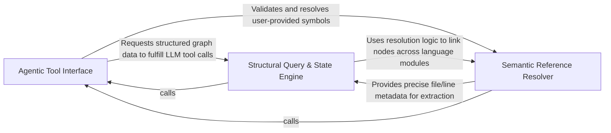

## Details

Provides structured access to static analysis results, translating graph structures into formats consumable by LLM tools.

### Agentic Tool Interface [[Expand]](./Agentic_Tool_Interface.md)
Implements the LLM-as-a-Controller pattern by exposing static analysis capabilities as discrete tools and translating natural language intent into structured graph queries.

**Related Classes/Methods**:

- `agents.tools.read_cfg.GetCFGTool`:8-61
- `agents.tools.read_structure.CodeStructureTool`:14-49
- `static_analyzer.graph.CallGraph.llm_str`:732-753

**Source Files:**

- [`agents/tools/base.py`](https://github.com/CodeBoarding/CodeBoarding/blob/main/.codeboardingagents/tools/base.py)
  - `agents.tools.base.BaseRepoTool.Config` ([L65-L66](https://github.com/CodeBoarding/CodeBoarding/blob/main/.codeboardingagents/tools/base.py#L65-L66)) - Class
  - `agents.tools.base.BaseRepoTool.static_analysis` ([L77-L78](https://github.com/CodeBoarding/CodeBoarding/blob/main/.codeboardingagents/tools/base.py#L77-L78)) - Method
- [`agents/tools/get_method_invocations.py`](https://github.com/CodeBoarding/CodeBoarding/blob/main/.codeboardingagents/tools/get_method_invocations.py)
  - `agents.tools.get_method_invocations.MethodInvocationsTool._run` ([L25-L47](https://github.com/CodeBoarding/CodeBoarding/blob/main/.codeboardingagents/tools/get_method_invocations.py#L25-L47)) - Method
- [`agents/tools/read_cfg.py`](https://github.com/CodeBoarding/CodeBoarding/blob/main/.codeboardingagents/tools/read_cfg.py)
  - `agents.tools.read_cfg.GetCFGTool._run` ([L18-L37](https://github.com/CodeBoarding/CodeBoarding/blob/main/.codeboardingagents/tools/read_cfg.py#L18-L37)) - Method
  - `agents.tools.read_cfg.GetCFGTool.component_cfg` ([L39-L61](https://github.com/CodeBoarding/CodeBoarding/blob/main/.codeboardingagents/tools/read_cfg.py#L39-L61)) - Method
- [`agents/tools/read_packages.py`](https://github.com/CodeBoarding/CodeBoarding/blob/main/.codeboardingagents/tools/read_packages.py)
  - `agents.tools.read_packages.NoRootPackageFoundError.__init__` ([L21-L23](https://github.com/CodeBoarding/CodeBoarding/blob/main/.codeboardingagents/tools/read_packages.py#L21-L23)) - Method
  - `agents.tools.read_packages.PackageRelationsTool._run` ([L38-L60](https://github.com/CodeBoarding/CodeBoarding/blob/main/.codeboardingagents/tools/read_packages.py#L38-L60)) - Method
- [`agents/tools/read_structure.py`](https://github.com/CodeBoarding/CodeBoarding/blob/main/.codeboardingagents/tools/read_structure.py)
  - `agents.tools.read_structure.CodeStructureTool._run` ([L26-L49](https://github.com/CodeBoarding/CodeBoarding/blob/main/.codeboardingagents/tools/read_structure.py#L26-L49)) - Method
- [`static_analyzer/analysis_result.py`](https://github.com/CodeBoarding/CodeBoarding/blob/main/.codeboardingstatic_analyzer/analysis_result.py)
  - `static_analyzer.analysis_result.StaticAnalysisResults.get_languages` ([L272-L274](https://github.com/CodeBoarding/CodeBoarding/blob/main/.codeboardingstatic_analyzer/analysis_result.py#L272-L274)) - Method
- [`static_analyzer/graph.py`](https://github.com/CodeBoarding/CodeBoarding/blob/main/.codeboardingstatic_analyzer/graph.py)
  - `static_analyzer.graph.CallGraph.llm_str` ([L732-L753](https://github.com/CodeBoarding/CodeBoarding/blob/main/.codeboardingstatic_analyzer/graph.py#L732-L753)) - Method
  - `static_analyzer.graph.CallGraph._llm_str_class_level` ([L782-L827](https://github.com/CodeBoarding/CodeBoarding/blob/main/.codeboardingstatic_analyzer/graph.py#L782-L827)) - Method

### Semantic Reference Resolver [[Expand]](./Semantic_Reference_Resolver.md)
Manages the normalization and resolution of Qualified Names across different programming languages, mapping agent references to physical file coordinates.

**Related Classes/Methods**:

- `static_analyzer.analysis_result.StaticAnalysisResults.resolve_across_languages`:276-288
- `static_analyzer.analysis_result.StaticAnalysisResults.get_reference`:229-251
- `agents.tools.read_source.CodeReferenceReader`:25-85

**Source Files:**

- [`agents/tools/read_source.py`](https://github.com/CodeBoarding/CodeBoarding/blob/main/.codeboardingagents/tools/read_source.py)
  - `agents.tools.read_source.CodeReferenceReader._run` ([L37-L72](https://github.com/CodeBoarding/CodeBoarding/blob/main/.codeboardingagents/tools/read_source.py#L37-L72)) - Method
  - `agents.tools.read_source.CodeReferenceReader.read_file` ([L75-L85](https://github.com/CodeBoarding/CodeBoarding/blob/main/.codeboardingagents/tools/read_source.py#L75-L85)) - Method
- [`static_analyzer/analysis_result.py`](https://github.com/CodeBoarding/CodeBoarding/blob/main/.codeboardingstatic_analyzer/analysis_result.py)
  - `static_analyzer.analysis_result._strip_java_generics` ([L80-L131](https://github.com/CodeBoarding/CodeBoarding/blob/main/.codeboardingstatic_analyzer/analysis_result.py#L80-L131)) - Function
  - `static_analyzer.analysis_result._strip_java_generics._replace_in_parens` ([L114-L120](https://github.com/CodeBoarding/CodeBoarding/blob/main/.codeboardingstatic_analyzer/analysis_result.py#L114-L120)) - Function
  - `static_analyzer.analysis_result._strip_java_generics._replace_in_parens._subst` ([L117-L118](https://github.com/CodeBoarding/CodeBoarding/blob/main/.codeboardingstatic_analyzer/analysis_result.py#L117-L118)) - Function
  - `static_analyzer.analysis_result._reference_key` ([L134-L162](https://github.com/CodeBoarding/CodeBoarding/blob/main/.codeboardingstatic_analyzer/analysis_result.py#L134-L162)) - Function
  - `static_analyzer.analysis_result.StaticAnalysisResults.get_reference` ([L229-L251](https://github.com/CodeBoarding/CodeBoarding/blob/main/.codeboardingstatic_analyzer/analysis_result.py#L229-L251)) - Method
  - `static_analyzer.analysis_result.StaticAnalysisResults.get_loose_reference` ([L253-L270](https://github.com/CodeBoarding/CodeBoarding/blob/main/.codeboardingstatic_analyzer/analysis_result.py#L253-L270)) - Method
  - `static_analyzer.analysis_result.StaticAnalysisResults.resolve_across_languages` ([L276-L288](https://github.com/CodeBoarding/CodeBoarding/blob/main/.codeboardingstatic_analyzer/analysis_result.py#L276-L288)) - Method

### Structural Query & State Engine [[Expand]](./Structural_Query_State_Engine.md)
The core data access layer that retrieves Control Flow Graphs and class hierarchies, supporting incremental analysis through snapshots and deltas.

**Related Classes/Methods**:

- `static_analyzer.analysis_result.StaticAnalysisResults.get_cfg`:204-209
- `diagram_analysis.cluster_snapshot.snapshot_from_static_analysis`:40-59
- `diagram_analysis.cluster_delta.compute_cluster_delta`:69-90
- `static_analyzer.analysis_result.StaticAnalysisResults.get_hierarchy`:211-220

**Source Files:**

- [`diagram_analysis/cluster_delta.py`](https://github.com/CodeBoarding/CodeBoarding/blob/main/.codeboardingdiagram_analysis/cluster_delta.py)
  - `diagram_analysis.cluster_delta.ClusterDelta` ([L46-L66](https://github.com/CodeBoarding/CodeBoarding/blob/main/.codeboardingdiagram_analysis/cluster_delta.py#L46-L66)) - Class
  - `diagram_analysis.cluster_delta.compute_cluster_delta` ([L69-L90](https://github.com/CodeBoarding/CodeBoarding/blob/main/.codeboardingdiagram_analysis/cluster_delta.py#L69-L90)) - Function
  - `diagram_analysis.cluster_delta._changeset_to_path_set` ([L93-L100](https://github.com/CodeBoarding/CodeBoarding/blob/main/.codeboardingdiagram_analysis/cluster_delta.py#L93-L100)) - Function
- [`diagram_analysis/cluster_snapshot.py`](https://github.com/CodeBoarding/CodeBoarding/blob/main/.codeboardingdiagram_analysis/cluster_snapshot.py)
  - `diagram_analysis.cluster_snapshot.ClusterSnapshotEntry` ([L22-L26](https://github.com/CodeBoarding/CodeBoarding/blob/main/.codeboardingdiagram_analysis/cluster_snapshot.py#L22-L26)) - Class
  - `diagram_analysis.cluster_snapshot.ClusterSnapshot` ([L30-L37](https://github.com/CodeBoarding/CodeBoarding/blob/main/.codeboardingdiagram_analysis/cluster_snapshot.py#L30-L37)) - Class
  - `diagram_analysis.cluster_snapshot.ClusterSnapshot.get_language` ([L33-L34](https://github.com/CodeBoarding/CodeBoarding/blob/main/.codeboardingdiagram_analysis/cluster_snapshot.py#L33-L34)) - Method
  - `diagram_analysis.cluster_snapshot.snapshot_from_static_analysis` ([L40-L59](https://github.com/CodeBoarding/CodeBoarding/blob/main/.codeboardingdiagram_analysis/cluster_snapshot.py#L40-L59)) - Function
  - `diagram_analysis.cluster_snapshot._entries_from_cfg_cache` ([L62-L83](https://github.com/CodeBoarding/CodeBoarding/blob/main/.codeboardingdiagram_analysis/cluster_snapshot.py#L62-L83)) - Function
  - `diagram_analysis.cluster_snapshot.snapshot_from_cluster_results` ([L86-L101](https://github.com/CodeBoarding/CodeBoarding/blob/main/.codeboardingdiagram_analysis/cluster_snapshot.py#L86-L101)) - Function
- [`static_analyzer/__init__.py`](https://github.com/CodeBoarding/CodeBoarding/blob/main/.codeboardingstatic_analyzer/__init__.py)
  - `static_analyzer.__init__.StaticAnalyzer._extract_language_dict` ([L641-L664](https://github.com/CodeBoarding/CodeBoarding/blob/main/.codeboardingstatic_analyzer/__init__.py#L641-L664)) - Method
- [`static_analyzer/analysis_result.py`](https://github.com/CodeBoarding/CodeBoarding/blob/main/.codeboardingstatic_analyzer/analysis_result.py)
  - `static_analyzer.analysis_result.StaticAnalysisResults._get_bucket` ([L180-L182](https://github.com/CodeBoarding/CodeBoarding/blob/main/.codeboardingstatic_analyzer/analysis_result.py#L180-L182)) - Method
  - `static_analyzer.analysis_result.StaticAnalysisResults.get_cfg` ([L204-L209](https://github.com/CodeBoarding/CodeBoarding/blob/main/.codeboardingstatic_analyzer/analysis_result.py#L204-L209)) - Method
  - `static_analyzer.analysis_result.StaticAnalysisResults.get_hierarchy` ([L211-L220](https://github.com/CodeBoarding/CodeBoarding/blob/main/.codeboardingstatic_analyzer/analysis_result.py#L211-L220)) - Method
  - `static_analyzer.analysis_result.StaticAnalysisResults.get_package_dependencies` ([L222-L227](https://github.com/CodeBoarding/CodeBoarding/blob/main/.codeboardingstatic_analyzer/analysis_result.py#L222-L227)) - Method
  - `static_analyzer.analysis_result.StaticAnalysisResults.iter_reference_nodes` ([L290-L299](https://github.com/CodeBoarding/CodeBoarding/blob/main/.codeboardingstatic_analyzer/analysis_result.py#L290-L299)) - Method

### [FAQ](https://github.com/CodeBoarding/GeneratedOnBoardings/tree/main?tab=readme-ov-file#faq)