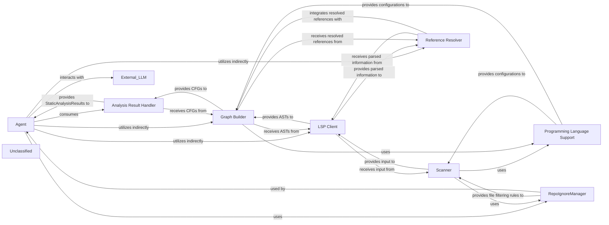

## Details

The system's core functionality revolves around the Agent component, which orchestrates code analysis and interaction. The process begins with the Scanner performing lexical analysis on files, with its scope refined by the RepoIgnoreManager. The LSP Client then provides detailed parsed information, including ASTs, which are used by the Reference Resolver to link symbolic references. Both ASTs and resolved references are fed into the Graph Builder to construct Control Flow Graphs. The Programming Language Support component provides essential language-specific configurations throughout these stages. All generated analysis data is managed by the Analysis Result Handler, which then provides StaticAnalysisResults to the Agent. The Agent utilizes these results, along with a CodeBoardingToolkit (which interacts with the LSP Client, Reference Resolver, and Graph Builder indirectly), and an external LLM to process prompts, perform actions, and generate intelligent responses, effectively driving the code understanding and interaction workflow.

### Agent [[Expand]](./Agent.md)
The `Agent` component, specifically `CodeBoardingAgent`, acts as the central orchestrator. It leverages static analysis results and a toolkit of specialized tools to interact with the codebase, process information using an LLM, and generate responses. It manages the overall workflow, including prompt processing, tool invocation, and response parsing.

**Related Classes/Methods**:

- <a href="https://github.com/CodeBoarding/CodeBoarding/blob/main/.codeboardingagents/agent.py#L36-L341" target="_blank" rel="noopener noreferrer">`agents.agent.CodeBoardingAgent`:36-341</a>

### Scanner
The `Scanner` initiates the process with lexical analysis, potentially on a filtered set of files determined by the `RepoIgnoreManager`.

**Related Classes/Methods**:

- <a href="https://github.com/CodeBoarding/CodeBoarding/blob/main/.codeboardingstatic_analyzer/__init__.py" target="_blank" rel="noopener noreferrer">`Scanner`</a>

### LSP Client
The `LSP Client` then provides rich parsed information, including Abstract Syntax Trees (ASTs), by interacting with external Language Servers.

**Related Classes/Methods**:

- <a href="https://github.com/CodeBoarding/CodeBoarding/blob/main/.codeboardingstatic_analyzer/lsp_client/client.py#L58-L1105" target="_blank" rel="noopener noreferrer">`LSPClient`:58-1105</a>

### Reference Resolver
This parsed data is crucial for the `Reference Resolver` to identify and link symbolic references within the code.

**Related Classes/Methods**:

- <a href="https://github.com/CodeBoarding/CodeBoarding/blob/main/.codeboardingstatic_analyzer/reference_resolve_mixin.py#L15-L151" target="_blank" rel="noopener noreferrer">`ReferenceResolver`:15-151</a>

### Graph Builder
Both the ASTs from the `LSP Client` and the resolved references from the `Reference Resolver` feed into the `Graph Builder`, which constructs Control Flow Graphs (CFGs).

**Related Classes/Methods**:

- `GraphBuilder`

### Programming Language Support
Throughout this process, the `Programming Language Support` component provides language-specific configurations and rules, ensuring accurate analysis.

**Related Classes/Methods**:

- `ProgrammingLanguageSupport`

### Analysis Result Handler
The `Analysis Result Handler` manages and stores the various outputs, such as CFGs and other static analysis results, making them accessible for further processing or consumption.

**Related Classes/Methods**:

- `AnalysisResultHandler`

### RepoIgnoreManager
The `RepoIgnoreManager` handles the logic for ignoring files and directories based on project-specific configurations, influencing the scope of analysis for other components.

**Related Classes/Methods**:

- <a href="https://github.com/CodeBoarding/CodeBoarding/blob/main/.codeboardingrepo_utils/ignore.py#L8-L107" target="_blank" rel="noopener noreferrer">`repo_utils.ignore.RepoIgnoreManager`:8-107</a>

### Unclassified
Component for all unclassified files and utility functions (Utility functions/External Libraries/Dependencies)

**Related Classes/Methods**: _None_

### [FAQ](https://github.com/CodeBoarding/GeneratedOnBoardings/tree/main?tab=readme-ov-file#faq)
