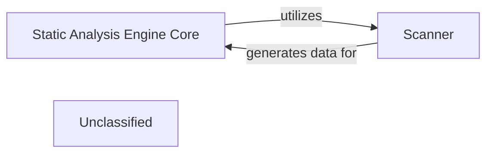

## Details

This system describes the core functionality of a Static Analysis Engine, a distinct subsystem responsible for in-depth static analysis of source code. Its main purpose is to process raw source code, parse it into foundational structural data, and prepare this data for further interpretation. The central flow involves an orchestrating core component that delegates initial parsing to a scanner, which then provides the processed data back to the core.

### Static Analysis Engine Core
This component acts as the orchestrator for the entire static analysis process within the subsystem. It manages the input of source code, coordinates the execution of internal analysis modules, and prepares the extracted structural information (CFGs, ASTs) for downstream components. It ensures the coherent flow of data from raw code to structured analysis output.

**Related Classes/Methods**:

- <a href="https://github.com/CodeBoarding/CodeBoarding/blob/main/.codeboardingstatic_analyzer/__init__.py" target="_blank" rel="noopener noreferrer">`static_analyzer`</a>

### Scanner
The `Scanner` is a fundamental component within the `Static Analysis Engine` responsible for the initial pass over the source code. Its primary function is to read and parse the raw code, identifying language constructs, tokens, and basic syntactic elements. This process forms the foundation upon which more complex structures like Abstract Syntax Trees (ASTs) and Control Flow Graphs (CFGs) are built.

**Related Classes/Methods**:

- <a href="https://github.com/CodeBoarding/CodeBoarding/blob/main/.codeboardingstatic_analyzer/scanner.py" target="_blank" rel="noopener noreferrer">`static_analyzer.scanner.Scanner`</a>

### Unclassified
Component for all unclassified files and utility functions (Utility functions/External Libraries/Dependencies)

**Related Classes/Methods**: _None_

### [FAQ](https://github.com/CodeBoarding/GeneratedOnBoardings/tree/main?tab=readme-ov-file#faq)
