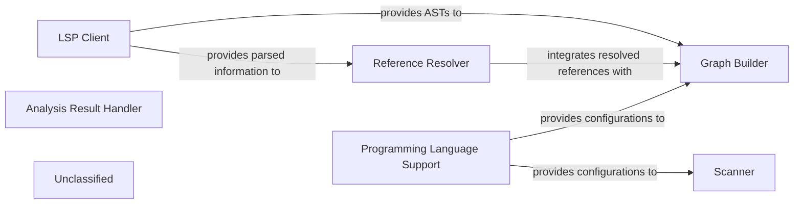

## Details

The static analysis subsystem is designed around a modular pipeline that transforms raw source code into structured graph representations. The `Scanner` initiates the process with lexical analysis, followed by the `LSP Client` which leverages external language servers to provide rich parsed data, including Abstract Syntax Trees (ASTs). The `Reference Resolver` then identifies and resolves symbolic links within this parsed information. Both the ASTs and resolved references are consumed by the `Graph Builder` to construct Control Flow Graphs (CFGs), forming the core analytical output. `Programming Language Support` underpins these operations by supplying language-specific configurations and rules. The `Analysis Result Handler` serves as the interface for managing and storing the diverse outputs of this analysis. The `Unclassified` component houses supporting utilities, such as `repo_utils/ignore.py`, which can influence the initial file processing scope for components like the `Scanner` and `LSP Client`, without altering their fundamental responsibilities. This architecture prioritizes clear separation of concerns and leverages external language services for robust parsing capabilities.

### Scanner
The `Scanner` initiates the process with lexical analysis, potentially on a filtered set of files determined by utility modules.

**Related Classes/Methods**:

- <a href="https://github.com/CodeBoarding/CodeBoarding/blob/main/.codeboardingstatic_analyzer/__init__.py" target="_blank" rel="noopener noreferrer">`Scanner`</a>

### LSP Client
The `LSP Client` then provides rich parsed information, including Abstract Syntax Trees (ASTs), by interacting with external Language Servers.

**Related Classes/Methods**:

- <a href="https://github.com/CodeBoarding/CodeBoarding/blob/main/.codeboardingstatic_analyzer/lsp_client/client.py#L58-L1105" target="_blank" rel="noopener noreferrer">`LSPClient`:58-1105</a>

### Reference Resolver
This parsed data is crucial for the `Reference Resolver` to identify and link symbolic references within the code.

**Related Classes/Methods**:

- <a href="https://github.com/CodeBoarding/CodeBoarding/blob/main/.codeboardingstatic_analyzer/reference_resolve_mixin.py#L15-L151" target="_blank" rel="noopener noreferrer">`ReferenceResolver`:15-151</a>

### Graph Builder
Both the ASTs from the `LSP Client` and the resolved references from the `Reference Resolver` feed into the `Graph Builder`, which constructs Control Flow Graphs (CFGs).

**Related Classes/Methods**:

- `GraphBuilder`

### Programming Language Support
Throughout this process, the `Programming Language Support` component provides language-specific configurations and rules, ensuring accurate analysis.

**Related Classes/Methods**:

- `ProgrammingLanguageSupport`

### Analysis Result Handler
Finally, the `Analysis Result Handler` manages and stores the various outputs, making them accessible for further processing or consumption.

**Related Classes/Methods**:

- `AnalysisResultHandler`

### Unclassified
The `Unclassified` component houses supporting utilities, such as `repo_utils/ignore.py`, which can influence the initial file processing scope for components like the `Scanner` and `LSP Client`, without altering their fundamental responsibilities.

**Related Classes/Methods**:

- <a href="https://github.com/CodeBoarding/CodeBoarding/blob/main/.codeboardingrepo_utils/ignore.py" target="_blank" rel="noopener noreferrer">`repo_utils.ignore`</a>

### Unclassified
Component for all unclassified files and utility functions (Utility functions/External Libraries/Dependencies)

**Related Classes/Methods**: _None_

### [FAQ](https://github.com/CodeBoarding/GeneratedOnBoardings/tree/main?tab=readme-ov-file#faq)
