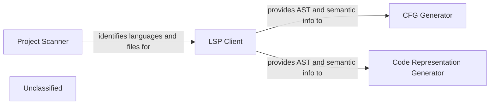

## Details

The static analysis subsystem of `CodeBoarding` is responsible for processing source code to extract various structural and semantic representations. This subsystem is composed of four main components: the `Project Scanner`, which identifies the programming languages and files within a repository; the `LSP Client`, which communicates with external Language Servers to obtain detailed semantic information, including Abstract Syntax Trees (ASTs); the `CFG Generator`, which constructs Control Flow Graphs from the ASTs; and the `Code Representation Generator`, which extracts additional structural representations like symbol tables and dependency graphs. These components work in concert to transform raw source code into a rich set of data structures suitable for further analysis and interpretation.

### Project Scanner
This component is the initial entry point for source code analysis. It scans the repository to identify the programming languages present and their associated files, preparing the groundwork for deeper analysis.

**Related Classes/Methods**:

- <a href="https://github.com/CodeBoarding/CodeBoarding/blob/main/.codeboardingstatic_analyzer/scanner.py" target="_blank" rel="noopener noreferrer">`static_analyzer.scanner.ProjectScanner`</a>

### LSP Client
Acts as a client for the Language Server Protocol (LSP), enabling communication with external Language Servers. This allows the static analysis engine to retrieve rich, semantic code information (e.g., definitions, references, type information, diagnostics, and Abstract Syntax Trees) that might not be easily derivable from static analysis alone, thereby augmenting the analysis process.

**Related Classes/Methods**:

- <a href="https://github.com/CodeBoarding/CodeBoarding/blob/main/.codeboardingstatic_analyzer/lsp_client/client.py" target="_blank" rel="noopener noreferrer">`static_analyzer.lsp_client.client.LSPClient`</a>

### CFG Generator
Analyzes the Abstract Syntax Tree (AST) and other semantic information to identify all possible execution paths within the code. It then constructs a Control Flow Graph (CFG), which is a graphical representation of all paths that might be traversed through a program during its execution. This component likely leverages graph data structures and algorithms.

**Related Classes/Methods**:

- <a href="https://github.com/CodeBoarding/CodeBoarding/blob/main/.codeboardingstatic_analyzer/graph.py" target="_blank" rel="noopener noreferrer">`static_analyzer.graph.ControlFlowGraph`</a>

### Code Representation Generator
This component extends the analysis beyond ASTs and CFGs by extracting other valuable structural representations from the code's semantic information. This includes generating symbol tables (mapping identifiers to their properties), call graphs (showing function/method invocation relationships), and dependency graphs (illustrating module or component dependencies).

**Related Classes/Methods**:

- <a href="https://github.com/CodeBoarding/CodeBoarding/blob/main/.codeboardingstatic_analyzer/analysis_result.py" target="_blank" rel="noopener noreferrer">`static_analyzer.analysis_result.AnalysisResult`</a>

### Unclassified
Component for all unclassified files and utility functions (Utility functions/External Libraries/Dependencies)

**Related Classes/Methods**: _None_

### [FAQ](https://github.com/CodeBoarding/GeneratedOnBoardings/tree/main?tab=readme-ov-file#faq)
