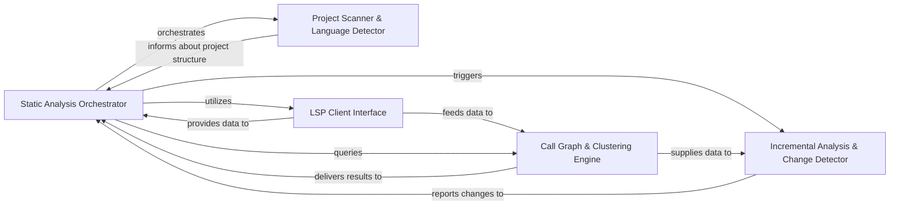

## Details

Performs deep static analysis of the codebase using Language Server Protocols (LSPs) to extract symbols, build call graphs, and identify logical code clusters. It handles communication with various language servers and provides the foundational structural analysis of the code.

### Static Analysis Orchestrator
Coordinates the entire static analysis workflow. It initializes and manages language server clients, orchestrates the collection of analysis data, resolves code references to ensure accuracy, and provides a central point for accessing analysis results. It acts as the main entry point for initiating and managing the analysis process.

**Related Classes/Methods**:

- <a href="https://github.com/CodeBoarding/CodeBoarding/blob/main/.codeboardingstatic_analyzer/incremental_orchestrator.py" target="_blank" rel="noopener noreferrer">`static_analyzer.incremental_orchestrator.IncrementalAnalysisOrchestrator`</a>

### Project Scanner & Language Detector
Scans the project directory to discover all relevant source files, identify the programming languages used, and locate language-specific configuration files (e.g., tsconfig.json for TypeScript projects). This initial scan provides the necessary context for subsequent analysis steps.

**Related Classes/Methods**:

- <a href="https://github.com/CodeBoarding/CodeBoarding/blob/main/.codeboardingstatic_analyzer/scanner.py" target="_blank" rel="noopener noreferrer">`static_analyzer.scanner.ProjectScanner`</a>
- <a href="https://github.com/CodeBoarding/CodeBoarding/blob/main/.codeboardingstatic_analyzer/java_config_scanner.py" target="_blank" rel="noopener noreferrer">`static_analyzer.java_config_scanner.JavaConfigScanner`</a>
- <a href="https://github.com/CodeBoarding/CodeBoarding/blob/main/.codeboardingstatic_analyzer/typescript_config_scanner.py" target="_blank" rel="noopener noreferrer">`static_analyzer.typescript_config_scanner.TypeScriptConfigScanner`</a>

### LSP Client Interface
Provides a standardized interface for communicating with various Language Servers (e.g., JDTLS for Java, TypeScript Language Server). It handles language-specific initialization, sends requests for symbol information, call hierarchies, and diagnostics, and processes the responses. This component abstracts away the complexities of LSP for different languages.

**Related Classes/Methods**:

- <a href="https://github.com/CodeBoarding/CodeBoarding/blob/main/.codeboardingstatic_analyzer/lsp_client/client.py" target="_blank" rel="noopener noreferrer">`static_analyzer.lsp_client.LSPClient`</a>
- <a href="https://github.com/CodeBoarding/CodeBoarding/blob/main/.codeboardingstatic_analyzer/lsp_client/typescript_client.py" target="_blank" rel="noopener noreferrer">`static_analyzer.lsp_client.TypeScriptClient`</a>
- <a href="https://github.com/CodeBoarding/CodeBoarding/blob/main/.codeboardingstatic_analyzer/lsp_client/java_client.py" target="_blank" rel="noopener noreferrer">`static_analyzer.lsp_client.JavaClient`</a>

### Call Graph & Clustering Engine
Constructs a detailed call graph representing the relationships between functions and methods in the codebase. It then applies clustering algorithms to this graph to identify logical components or modules within the code, providing a higher-level structural view. Helper functions assist in managing and retrieving cluster-related data.

**Related Classes/Methods**:

- <a href="https://github.com/CodeBoarding/CodeBoarding/blob/main/.codeboardingstatic_analyzer/graph.py" target="_blank" rel="noopener noreferrer">`static_analyzer.graph.CallGraph`</a>
- <a href="https://github.com/CodeBoarding/CodeBoarding/blob/main/.codeboardingstatic_analyzer/graph.py" target="_blank" rel="noopener noreferrer">`static_analyzer.graph.ClusterResult`</a>
- <a href="https://github.com/CodeBoarding/CodeBoarding/blob/main/.codeboardingstatic_analyzer/cluster_helpers.py" target="_blank" rel="noopener noreferrer">`static_analyzer.cluster_helpers.build_all_cluster_results`</a>
- <a href="https://github.com/CodeBoarding/CodeBoarding/blob/main/.codeboardingstatic_analyzer/cluster_helpers.py" target="_blank" rel="noopener noreferrer">`static_analyzer.cluster_helpers.get_all_cluster_ids`</a>
- <a href="https://github.com/CodeBoarding/CodeBoarding/blob/main/.codeboardingstatic_analyzer/cluster_helpers.py" target="_blank" rel="noopener noreferrer">`static_analyzer.cluster_helpers.get_files_for_cluster_ids`</a>

### Incremental Analysis & Change Detector
Optimizes the analysis process by detecting code changes (using Git) and performing incremental updates. It compares new and old cluster structures to classify changes (e.g., added, removed, modified clusters) and intelligently re-analyzes only affected parts of the codebase, significantly improving efficiency for large projects.

**Related Classes/Methods**:

- <a href="https://github.com/CodeBoarding/CodeBoarding/blob/main/.codeboardingstatic_analyzer/cluster_change_analyzer.py" target="_blank" rel="noopener noreferrer">`static_analyzer.cluster_change_analyzer.ClusterChangeAnalyzer`</a>
- <a href="https://github.com/CodeBoarding/CodeBoarding/blob/main/.codeboardingstatic_analyzer/git_diff_analyzer.py" target="_blank" rel="noopener noreferrer">`static_analyzer.git_diff_analyzer.GitDiffAnalyzer`</a>

### [FAQ](https://github.com/CodeBoarding/GeneratedOnBoardings/tree/main?tab=readme-ov-file#faq)
