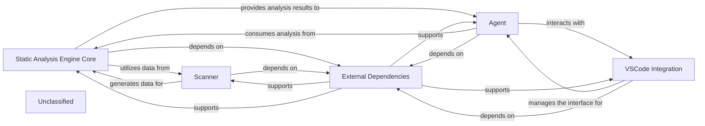

## Details

The system's architecture is centered around a robust static analysis pipeline. The Scanner initiates the process by parsing source code, leveraging enhanced language definitions to generate fundamental data. This data is then consumed by the Static Analysis Engine Core, which performs deeper analysis and produces structured outputs. An Agent component utilizes these analytical services to execute higher-level tasks and seamlessly integrates with the VSCode environment through the VSCode Integration component, managing IDE-specific interactions and configurations. All these core components rely on a set of External Dependencies for their functionality, ensuring a modular and extensible design. The main flow involves the Scanner feeding parsed data to the Static Analysis Engine Core, which then processes it and provides insights to the Agent. The Agent, in turn, coordinates with the VSCode Integration for IDE interactions, with all components underpinned by External Dependencies.

### Static Analysis Engine Core
Orchestrates the static analysis process, performing deeper analysis and providing structured outputs. It now incorporates enhanced language definition and processing capabilities.

**Related Classes/Methods**:

- `StaticAnalysisEngineCore`

### Scanner
Responsible for the initial parsing of source code, generating fundamental data. Its scanning logic has been adapted to accommodate new or modified language definitions.

**Related Classes/Methods**:

- <a href="https://github.com/CodeBoarding/CodeBoarding/blob/main/.codeboardingstatic_analyzer/__init__.py" target="_blank" rel="noopener noreferrer">`Scanner`</a>

### Agent
Interacts with the Static Analysis Engine Core, utilizing its analytical services to perform specific, higher-level tasks, and coordinates with the VSCode Integration for IDE-specific operations.

**Related Classes/Methods**:

- <a href="https://github.com/CodeBoarding/CodeBoarding/blob/main/.codeboardingagents/diff_analyzer.py#L21-L149" target="_blank" rel="noopener noreferrer">`Agent`:21-149</a>

### VSCode Integration
Manages all interactions, configurations, and communication specific to the VSCode environment, acting as an interface between the core system and the IDE.

**Related Classes/Methods**:

- `VSCodeIntegration`:1-10

### External Dependencies
Encompasses all external libraries, frameworks, and third-party packages that the project relies on, managed through packaging configurations.

**Related Classes/Methods**:

- `ExternalDependencies`

### Unclassified
Component for all unclassified files and utility functions (Utility functions/External Libraries/Dependencies)

**Related Classes/Methods**: _None_

### [FAQ](https://github.com/CodeBoarding/GeneratedOnBoardings/tree/main?tab=readme-ov-file#faq)
