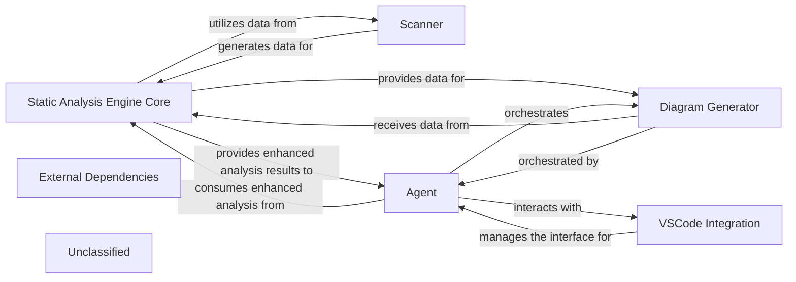

## Details

The system's architecture is centered around the `Static Analysis Engine Core`, which performs deep code analysis, leveraging data from the `Scanner` for initial parsing. The `Agent` acts as the primary orchestrator, consuming enhanced analysis results from the `Static Analysis Engine Core` to perform higher-level tasks, understand project context, and refine its outputs. A new `Diagram Generator` component, orchestrated by the `Agent` and fed data by the `Static Analysis Engine Core`, provides visual representations of the analysis. The `VSCode Integration` manages the interface with the IDE, facilitating seamless interaction for the `Agent`. All these core components rely on `External Dependencies` for foundational support. This updated architecture reflects a significant evolution in the system's analytical depth, agent intelligence, and output capabilities, particularly with the introduction of diagram generation.

### Static Analysis Engine Core
Orchestrates the static analysis process, performing deeper analysis and providing structured outputs. It now incorporates enhanced language definition and processing capabilities through its refined LSP client, allowing for deeper and more accurate static analysis. Its analysis outputs may also have evolved in structure, impacting how the Agent consumes these results.

**Related Classes/Methods**:

- `StaticAnalysisEngineCore`

### Scanner
Responsible for the initial parsing of source code, generating fundamental data. Its scanning logic has been adapted to accommodate new or modified language definitions.

**Related Classes/Methods**:

- <a href="https://github.com/CodeBoarding/CodeBoarding/blob/main/.codeboardingstatic_analyzer/__init__.py" target="_blank" rel="noopener noreferrer">`Scanner`</a>

### Agent
Interacts with the Static Analysis Engine Core, utilizing its analytical services to perform specific, higher-level tasks. The Agent has undergone substantial enhancements, particularly in its ability to gather and process information, understand project context more deeply, and refine how it formulates and communicates its outputs. It also coordinates with the VSCode Integration for IDE-specific operations and can orchestrate diagram generation.

**Related Classes/Methods**:

- <a href="https://github.com/CodeBoarding/CodeBoarding/blob/main/.codeboardingagents/diff_analyzer.py#L21-L149" target="_blank" rel="noopener noreferrer">`Agent`:21-149</a>

### VSCode Integration
Manages all interactions, configurations, and communication specific to the VSCode environment, acting as an interface between the core system and the IDE.

**Related Classes/Methods**:

- `VSCodeIntegration`:1-10

### Diagram Generator
A new functional block responsible for generating diagrams. This component likely derives data from the Static Analysis Engine Core's analysis results and is orchestrated by the Agent to produce visual representations.

**Related Classes/Methods**:

- <a href="https://github.com/CodeBoarding/CodeBoarding/blob/main/.codeboardingdiagram_analysis/diagram_generator.py" target="_blank" rel="noopener noreferrer">`DiagramGenerator`</a>

### External Dependencies
Encompasses all external libraries, frameworks, and third-party packages that the project relies on, managed through packaging configurations.

**Related Classes/Methods**:

- `ExternalDependencies`

### Unclassified
Component for all unclassified files and utility functions (Utility functions/External Libraries/Dependencies)

**Related Classes/Methods**: _None_

### [FAQ](https://github.com/CodeBoarding/GeneratedOnBoardings/tree/main?tab=readme-ov-file#faq)
