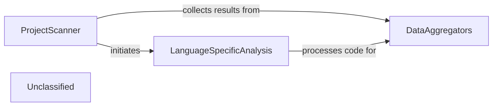

## Details

The static analysis subsystem is centered around the ProjectScanner, which serves as the primary entry point for initiating code analysis. The ProjectScanner is responsible for identifying the programming languages present in a repository and preparing the codebase for deeper inspection. It delegates the actual file traversal and initial language identification to external tools. Following this, the LanguageSpecificAnalysis component, represented by LSPClient and its specialized implementations, takes over to perform detailed parsing, AST generation, CFG construction, and metric extraction for each identified language. Finally, the DataAggregators, exemplified by AnalysisResult, collect and consolidate all the generated analysis data into a coherent and structured report, making it ready for further consumption or visualization. This architecture emphasizes a clear separation of concerns, with the ProjectScanner orchestrating the overall flow and LanguageSpecificAnalysis handling the intricate details of code understanding, all culminating in a unified output from DataAggregators.

### ProjectScanner
The orchestrator of the entire static analysis process. It initiates scanning, manages the flow of files, invokes language-specific parsing, and coordinates the collection of analysis results. It acts as the primary interface for the subsystem.

**Related Classes/Methods**:

- <a href="https://github.com/CodeBoarding/CodeBoarding/blob/main/.codeboardingstatic_analyzer/scanner.py" target="_blank" rel="noopener noreferrer">`static_analyzer.scanner.ProjectScanner`</a>

### LanguageSpecificAnalysis
This component represents the collective functionality for language-specific processing, including parsing source code into Abstract Syntax Trees (ASTs), generating Control Flow Graphs (CFGs), and extracting various code metrics. It leverages Language Server Protocol (LSP) clients for detailed language understanding.

**Related Classes/Methods**:

- <a href="https://github.com/CodeBoarding/CodeBoarding/blob/main/.codeboardingstatic_analyzer/lsp_client/client.py" target="_blank" rel="noopener noreferrer">`static_analyzer.lsp_client.client.LSPClient`</a>

### DataAggregators
Gathers and consolidates the diverse outputs from the language-specific analysis (ASTs, CFGs, metrics) into a unified, structured analysis report. This component ensures a consistent data format for downstream processing.

**Related Classes/Methods**:

- <a href="https://github.com/CodeBoarding/CodeBoarding/blob/main/.codeboardingstatic_analyzer/analysis_result.py" target="_blank" rel="noopener noreferrer">`static_analyzer.analysis_result.AnalysisResult`</a>

### Unclassified
Component for all unclassified files and utility functions (Utility functions/External Libraries/Dependencies)

**Related Classes/Methods**: _None_

### [FAQ](https://github.com/CodeBoarding/GeneratedOnBoardings/tree/main?tab=readme-ov-file#faq)
