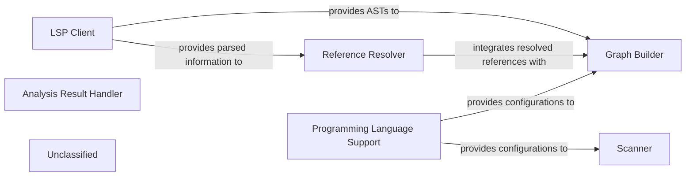

## Details

The static analysis subsystem is designed to transform raw source code into structured Control Flow Graphs (CFGs) for subsequent architectural analysis. At its core, the `LSP Client` leverages external Language Servers to acquire comprehensive parsed information, including Abstract Syntax Trees (ASTs) and symbolic references, thereby centralizing complex parsing. This parsed information is then utilized by the `Reference Resolver` to accurately identify and resolve all symbolic connections within the codebase. For the generation of CFGs, the `Graph Builder` critically depends on the ASTs supplied by the `LSP Client` and the resolved references from the `Reference Resolver`. The `Scanner` performs lexical analysis, primarily for configuration files, under the guidance of `Programming Language Support`, which also provides essential language-specific configurations to both the `Scanner` and the `Graph Builder`. All resulting analysis artifacts, including the generated CFGs, are managed and made accessible through the `Analysis Result Handler`. This integrated approach ensures a robust and language-aware pipeline for deep code understanding.

### Scanner
Performs lexical analysis, breaking down source code into a stream of tokens. It handles language-specific tokenization, with specialized handling for configuration files (e.g., TypeScript).

**Related Classes/Methods**:

- <a href="https://github.com/CodeBoarding/CodeBoarding/blob/main/.codeboardingstatic_analyzer/scanner.py" target="_blank" rel="noopener noreferrer">`scanner`</a>
- <a href="https://github.com/CodeBoarding/CodeBoarding/blob/main/.codeboardingstatic_analyzer/typescript_config_scanner.py" target="_blank" rel="noopener noreferrer">`typescript_config_scanner`</a>

### LSP Client
Facilitates communication with Language Servers (e.g., TypeScript Language Server) to obtain rich parsed information, including Abstract Syntax Trees (ASTs), symbol tables, and references. This component offloads complex parsing logic to external language services, providing the primary source of ASTs for graph generation.

**Related Classes/Methods**:

- <a href="https://github.com/CodeBoarding/CodeBoarding/blob/main/.codeboardingstatic_analyzer/lsp_client/client.py" target="_blank" rel="noopener noreferrer">`client`</a>
- <a href="https://github.com/CodeBoarding/CodeBoarding/blob/main/.codeboardingstatic_analyzer/lsp_client/typescript_client.py" target="_blank" rel="noopener noreferrer">`typescript_client`</a>

### Reference Resolver
Resolves symbolic references within the code, utilizing parsed information from the LSP Client to ensure all connections between code elements are correctly identified. This is crucial for accurate graph generation and component identification.

**Related Classes/Methods**:

- <a href="https://github.com/CodeBoarding/CodeBoarding/blob/main/.codeboardingstatic_analyzer/reference_resolve_mixin.py" target="_blank" rel="noopener noreferrer">`reference_resolve_mixin`</a>

### Graph Builder
Generates Control Flow Graphs (CFGs) from the ASTs provided by the LSP Client and the resolved references from the Reference Resolver. This is a critical step in understanding program execution flow and preparing the code for architectural clustering.

**Related Classes/Methods**:

- <a href="https://github.com/CodeBoarding/CodeBoarding/blob/main/.codeboardingstatic_analyzer/graph.py" target="_blank" rel="noopener noreferrer">`graph`</a>

### Programming Language Support
Manages language-specific configurations, rules, and utilities, enabling the static analysis engine to support multiple programming languages effectively. It provides the necessary context for tokenization, parsing, and graph generation.

**Related Classes/Methods**:

- <a href="https://github.com/CodeBoarding/CodeBoarding/blob/main/.codeboardingstatic_analyzer/programming_language.py" target="_blank" rel="noopener noreferrer">`programming_language`</a>

### Analysis Result Handler
Defines and manages the data structures used to store the various outputs of the static analysis process, including ASTs, CFGs, and the final clustered component representations. It acts as the interface for consuming analysis results.

**Related Classes/Methods**:

- <a href="https://github.com/CodeBoarding/CodeBoarding/blob/main/.codeboardingstatic_analyzer/analysis_result.py" target="_blank" rel="noopener noreferrer">`analysis_result`</a>

### Unclassified
Component for all unclassified files and utility functions (Utility functions/External Libraries/Dependencies)

**Related Classes/Methods**: _None_

### [FAQ](https://github.com/CodeBoarding/GeneratedOnBoardings/tree/main?tab=readme-ov-file#faq)
