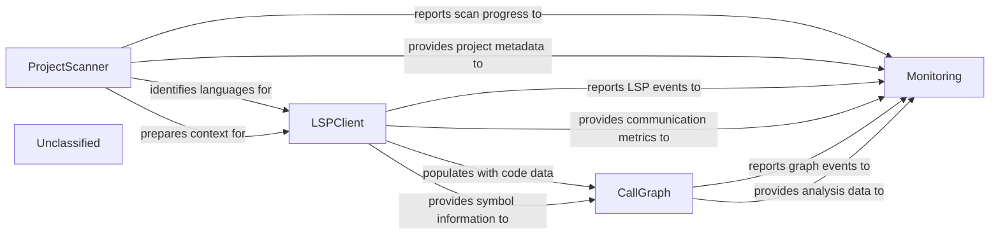

## Details

The system's core functionality revolves around static code analysis, orchestrated through a sequence of specialized components. The ProjectScanner initiates the process by identifying project languages and basic statistics. This information then guides the LSPClient to interact with Language Servers, extracting detailed code symbols and relationships. The CallGraph component consumes this data to construct a comprehensive control flow graph of the codebase, representing code entities and their interdependencies. A newly introduced Monitoring subsystem is deeply integrated into the application's main execution flow, observing and collecting operational metrics and events from these core components to provide insights into system performance and behavior.

### ProjectScanner
Scans the project to identify programming languages, gather code statistics (lines of code, percentages), and extract file suffixes. It acts as the initial language detector and high-level metadata extractor.

**Related Classes/Methods**:

- <a href="https://github.com/CodeBoarding/CodeBoarding/blob/main/.codeboardingstatic_analyzer/scanner.py" target="_blank" rel="noopener noreferrer">`ProjectScanner`</a>

### LSPClient
Manages communication with Language Servers (LSPs) for various programming languages. It initiates LSP server processes, sends JSON-RPC requests for detailed code information (symbols, call hierarchy), and processes responses to extract data like symbols, call relationships, and class hierarchies.

**Related Classes/Methods**:

- <a href="https://github.com/CodeBoarding/CodeBoarding/blob/main/.codeboardingstatic_analyzer/lsp_client/client.py" target="_blank" rel="noopener noreferrer">`LSPClient`</a>

### CallGraph
Constructs and maintains the control flow graph (CFG) of the codebase. It stores code elements as `Node` objects and their interdependencies as `Edge` objects, providing functionalities to analyze and summarize these relationships.

**Related Classes/Methods**:

- <a href="https://github.com/CodeBoarding/CodeBoarding/blob/main/.codeboardingstatic_analyzer/graph.py" target="_blank" rel="noopener noreferrer">`CallGraph`</a>
- <a href="https://github.com/CodeBoarding/CodeBoarding/blob/main/.codeboardingstatic_analyzer/graph.py" target="_blank" rel="noopener noreferrer">`Node`</a>
- <a href="https://github.com/CodeBoarding/CodeBoarding/blob/main/.codeboardingstatic_analyzer/graph.py" target="_blank" rel="noopener noreferrer">`Edge`</a>

### Monitoring
Manages the collection, processing, and reporting of system metrics, events, and operational data. It provides mechanisms for callbacks, context management, path tracking, statistics aggregation, and data writing, integrating into the application's core execution flow to observe system operations.

**Related Classes/Methods**:

- <a href="https://github.com/CodeBoarding/CodeBoarding/blob/main/.codeboardingmonitoring/callbacks.py" target="_blank" rel="noopener noreferrer">`monitoring.callbacks`</a>

### Unclassified
Component for all unclassified files and utility functions (Utility functions/External Libraries/Dependencies)

**Related Classes/Methods**: _None_

### [FAQ](https://github.com/CodeBoarding/GeneratedOnBoardings/tree/main?tab=readme-ov-file#faq)
