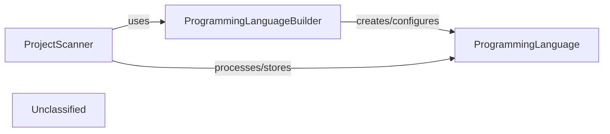

## Details

The static analysis subsystem is centered around the ProjectScanner, which acts as the primary orchestrator. The ProjectScanner is responsible for initiating the code scanning process, leveraging external tools like Tokei to gather raw code statistics and identify programming languages. It then delegates the construction of detailed ProgrammingLanguage objects to the ProgrammingLanguageBuilder, which encapsulates language-specific properties and configurations. Finally, the ProjectScanner collects and manages these ProgrammingLanguage objects, representing the detected languages and their associated metrics within the codebase. This clear separation of concerns ensures that scanning, language object creation, and data encapsulation are handled by distinct, focused components.

### ProjectScanner
The central component responsible for orchestrating the static analysis process. It scans the code repository, identifies programming languages, gathers code statistics using external tools (e.g., Tokei), and extracts unique file suffixes. It then uses the ProgrammingLanguageBuilder to prepare language-specific data for further processing.

**Related Classes/Methods**:

- <a href="https://github.com/CodeBoarding/CodeBoarding/blob/main/.codeboardingstatic_analyzer/scanner.py#L12-L84" target="_blank" rel="noopener noreferrer">`static_analyzer.scanner.ProjectScanner`:12-84</a>

### ProgrammingLanguageBuilder
Responsible for constructing and configuring ProgrammingLanguage objects based on the data gathered by the ProjectScanner. It ensures that language-specific properties, such as associated LSP servers, are correctly initialized.

**Related Classes/Methods**:

- <a href="https://github.com/CodeBoarding/CodeBoarding/blob/main/.codeboardingstatic_analyzer/programming_language.py#L58-L122" target="_blank" rel="noopener noreferrer">`static_analyzer.programming_language.ProgrammingLanguageBuilder`:58-122</a>

### ProgrammingLanguage
Represents a detected programming language within the codebase. It encapsulates properties such as the language name, associated file suffixes, collected code statistics (e.g., lines of code), and configuration for its Language Server Protocol (LSP) server.

**Related Classes/Methods**:

- <a href="https://github.com/CodeBoarding/CodeBoarding/blob/main/.codeboardingstatic_analyzer/programming_language.py#L6-L55" target="_blank" rel="noopener noreferrer">`static_analyzer.programming_language.ProgrammingLanguage`:6-55</a>

### Unclassified
Component for all unclassified files and utility functions (Utility functions/External Libraries/Dependencies)

**Related Classes/Methods**: _None_

### [FAQ](https://github.com/CodeBoarding/GeneratedOnBoardings/tree/main?tab=readme-ov-file#faq)
