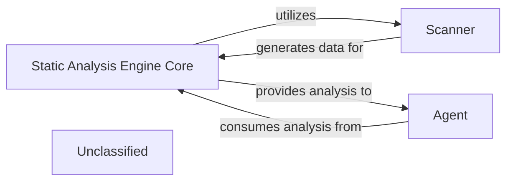

## Details

The system is structured around a Static Analysis Engine Core that orchestrates the static analysis process. The Scanner component is responsible for the initial parsing of source code, generating fundamental data that feeds into the Static Analysis Engine Core. The Static Analysis Engine Core then processes this data, performing deeper analysis and providing structured outputs. A newly identified Agent component interacts with the Static Analysis Engine Core, utilizing its analytical services to perform specific, higher-level tasks. This architecture allows for a modular approach where the core analysis engine can be leveraged by various agents for different purposes.

### Static Analysis Engine Core
Orchestrates the static analysis process, performing deeper analysis and providing structured outputs.

**Related Classes/Methods**:

- `AnalysisEngine.analyze`:1-10

### Scanner
Responsible for the initial parsing of source code, generating fundamental data.

**Related Classes/Methods**:

### Agent
Interacts with the Static Analysis Engine Core, utilizing its analytical services to perform specific, higher-level tasks.

**Related Classes/Methods**:

- <a href="https://github.com/CodeBoarding/CodeBoarding/blob/main/.codeboardingagents/abstraction_agent.py#L183-L187" target="_blank" rel="noopener noreferrer">`AnalysisAgent.execute`:183-187</a>

### Unclassified
Component for all unclassified files and utility functions (Utility functions/External Libraries/Dependencies)

**Related Classes/Methods**: _None_

### [FAQ](https://github.com/CodeBoarding/GeneratedOnBoardings/tree/main?tab=readme-ov-file#faq)
