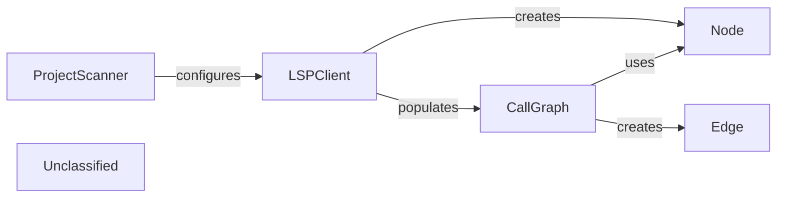

## Details

The Static Analysis Engine subsystem is responsible for performing in-depth static analysis of a codebase to extract structural and control flow information. It begins by scanning the project to identify programming languages and gather high-level metadata. Subsequently, it leverages Language Servers (LSPs) to obtain detailed code information, which is then used to construct and maintain a call graph representing the codebase's entities and their interdependencies. The primary purpose is to generate a comprehensive understanding of the code's structure and relationships, forming the basis for further analysis and documentation.

### ProjectScanner
Scans the project to identify programming languages, gather code statistics (lines of code, percentages), and extract file suffixes. It acts as the initial language detector and high-level metadata extractor.

**Related Classes/Methods**:

- <a href="https://github.com/CodeBoarding/CodeBoarding/blob/main/.codeboardingstatic_analyzer/scanner.py" target="_blank" rel="noopener noreferrer">`ProjectScanner`</a>

### LSPClient
Manages communication with Language Servers (LSPs) for various programming languages. It initiates LSP server processes, sends JSON-RPC requests for detailed code information (symbols, call hierarchy), and processes responses to extract data like symbols, call relationships, and class hierarchies.

**Related Classes/Methods**:

- <a href="https://github.com/CodeBoarding/CodeBoarding/blob/main/.codeboardingstatic_analyzer/lsp_client/client.py" target="_blank" rel="noopener noreferrer">`LSPClient`</a>

### CallGraph
Constructs and maintains the control flow graph (CFG) of the codebase. It stores code elements as `Node` objects and their interdependencies as `Edge` objects. It also provides functionalities to analyze and summarize these relationships, including generating clustered representations.

**Related Classes/Methods**:

- <a href="https://github.com/CodeBoarding/CodeBoarding/blob/main/.codeboardingstatic_analyzer/graph.py" target="_blank" rel="noopener noreferrer">`CallGraph`</a>

### Node
Represents a distinct code entity within the `CallGraph`, such as a class, function, or method. It encapsulates metadata like the fully qualified name, file path, and line number range.

**Related Classes/Methods**:

- <a href="https://github.com/CodeBoarding/CodeBoarding/blob/main/.codeboardingstatic_analyzer/graph.py" target="_blank" rel="noopener noreferrer">`Node`</a>

### Edge
Represents a directed relationship or dependency between two `Node` objects in the `CallGraph`, typically indicating a method call or other structural connection.

**Related Classes/Methods**:

- <a href="https://github.com/CodeBoarding/CodeBoarding/blob/main/.codeboardingstatic_analyzer/graph.py" target="_blank" rel="noopener noreferrer">`Edge`</a>

### Unclassified
Component for all unclassified files and utility functions (Utility functions/External Libraries/Dependencies)

**Related Classes/Methods**: _None_

### [FAQ](https://github.com/CodeBoarding/GeneratedOnBoardings/tree/main?tab=readme-ov-file#faq)
