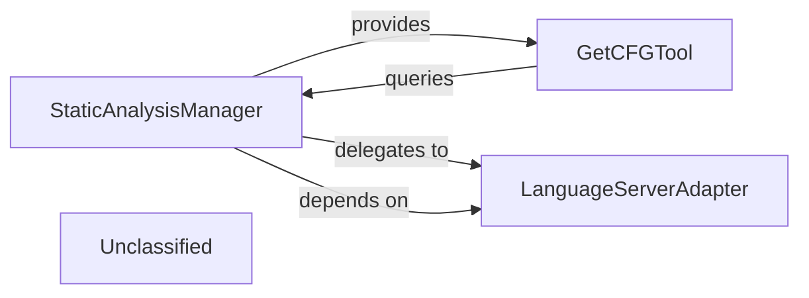

## Details

The Static Analysis Engine subsystem is a critical part of the "Code Analysis and Documentation Generation Tool," focusing on extracting deep structural, control flow, and semantic information from source code. It operates as a modular unit, providing essential data to other components of the larger system.

### StaticAnalysisManager
This is the orchestrator of the entire static analysis process within the subsystem. It coordinates the analysis workflow, manages the interaction with language-specific parsers, and is responsible for storing and providing the generated analysis data, such as Control Flow Graphs (CFGs). It embodies the "Orchestration Engine" pattern for this specific domain.

**Related Classes/Methods**:

- <a href="https://github.com/CodeBoarding/CodeBoarding/blob/main/.codeboardingstatic_analyzer/scanner.py#L13-L85" target="_blank" rel="noopener noreferrer">`StaticAnalysisManager`:13-85</a>

### GetCFGTool
This component acts as the primary interface for other parts of the system to access the static analysis results, specifically Control Flow Graphs. It queries the `StaticAnalysisManager` to retrieve CFG data, filters it for component-specific information, and formats it for external consumption. It serves as an internal "API Service" for analysis data.

**Related Classes/Methods**:

- <a href="https://github.com/CodeBoarding/CodeBoarding/blob/main/.codeboardingagents/tools/read_cfg.py" target="_blank" rel="noopener noreferrer">`GetCFGTool`</a>

### LanguageServerAdapter
This component is responsible for abstracting and managing interactions with various external Language Servers. It handles language-specific parsing and analysis tasks, translating requests from the `StaticAnalysisManager` into calls to the appropriate language tools and processing their responses. This aligns with the "External Service Integration" pattern.

**Related Classes/Methods**:

- <a href="https://github.com/CodeBoarding/CodeBoarding/blob/main/.codeboardingstatic_analyzer/lsp_client/client.py#L59-L94" target="_blank" rel="noopener noreferrer">`LanguageServerAdapter`:59-94</a>

### Unclassified
Component for all unclassified files and utility functions (Utility functions/External Libraries/Dependencies)

**Related Classes/Methods**: _None_

### [FAQ](https://github.com/CodeBoarding/GeneratedOnBoardings/tree/main?tab=readme-ov-file#faq)
