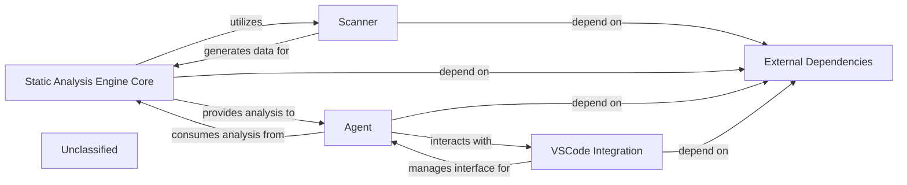

## Details

The system's architecture is centered around a `Static Analysis Engine Core` that orchestrates in-depth code analysis, building upon the initial parsing performed by the `Scanner`. An `Agent` component leverages these analytical capabilities to execute higher-level tasks. A dedicated `VSCode Integration` component facilitates seamless interaction with the VSCode environment, providing a specialized interface for the `Agent`. The entire system's functionality is supported by `External Dependencies`, which are managed through project packaging.

### Static Analysis Engine Core
Orchestrates the static analysis process, performing deeper analysis and providing structured outputs.

**Related Classes/Methods**:

- `AnalysisEngine.analyze`:1-10

### Scanner
Responsible for the initial parsing of source code, generating fundamental data.

**Related Classes/Methods**:

- <a href="https://github.com/CodeBoarding/CodeBoarding/blob/main/.codeboarding." target="_blank" rel="noopener noreferrer">`SourceScanner.scan`</a>

### Agent
Interacts with the Static Analysis Engine Core, utilizing its analytical services to perform specific, higher-level tasks, and coordinates with the VSCode Integration for IDE-specific operations.

**Related Classes/Methods**:

- <a href="https://github.com/CodeBoarding/CodeBoarding/blob/main/.codeboardingagents/abstraction_agent.py#L183-L187" target="_blank" rel="noopener noreferrer">`AnalysisAgent.execute`:183-187</a>

### VSCode Integration
Manages all interactions, configurations, and communication specific to the VSCode environment, acting as an interface between the core system and the IDE.

**Related Classes/Methods**:

- `VSCodeIntegration`:1-10

### External Dependencies
Encompasses all external libraries, frameworks, and third-party packages that the project relies on, managed through packaging configurations.

**Related Classes/Methods**:

- `ExternalDependencies`

### Unclassified
Component for all unclassified files and utility functions (Utility functions/External Libraries/Dependencies)

**Related Classes/Methods**: _None_

### [FAQ](https://github.com/CodeBoarding/GeneratedOnBoardings/tree/main?tab=readme-ov-file#faq)
