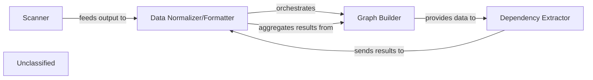

## Details

The static analysis subsystem is designed to process a codebase, extract structural and relational information, and present it in a standardized format. The ProjectScanner initiates the process by identifying programming languages and basic code statistics. This information is then used to set up language-specific analysis clients. The core of the analysis involves building call graphs and extracting dependencies, primarily handled by the CallGraph component. Finally, the StaticAnalyzer orchestrates these steps, aggregates the results, and normalizes them into a structured StaticAnalysisResults object, making the data ready for consumption by other systems, such as an LLM Prompt Factory.

### Scanner
This component is responsible for the initial ingestion and high-level analysis of the codebase. It utilizes external tools (like Tokei) to identify programming languages present in the repository, along with their code statistics and file suffixes. This provides a foundational understanding of the project's technological landscape.

**Related Classes/Methods**:

- <a href="https://github.com/CodeBoarding/CodeBoarding/blob/main/.codeboardingstatic_analyzer/scanner.py" target="_blank" rel="noopener noreferrer">`static_analyzer/scanner.py:ProjectScanner.scan`</a>

### Graph Builder
This component constructs various graph representations of the codebase, primarily focusing on call graphs. It defines the structure for nodes and edges within these graphs and provides mechanisms to build and manipulate them, often leveraging graph libraries for complex analysis.

**Related Classes/Methods**:

- <a href="https://github.com/CodeBoarding/CodeBoarding/blob/main/.codeboardingstatic_analyzer/graph.py" target="_blank" rel="noopener noreferrer">`static_analyzer/graph.py:CallGraph`</a>
- <a href="https://github.com/CodeBoarding/CodeBoarding/blob/main/.codeboardingstatic_analyzer/graph.py" target="_blank" rel="noopener noreferrer">`static_analyzer/graph.py:Node`</a>
- <a href="https://github.com/CodeBoarding/CodeBoarding/blob/main/.codeboardingstatic_analyzer/graph.py" target="_blank" rel="noopener noreferrer">`static_analyzer/graph.py:Edge`</a>

### Dependency Extractor
Working in conjunction with the Graph Builder, this component identifies and maps explicit and implicit dependencies between different code entities. It leverages the constructed call graphs to determine relationships between functions, methods, and classes, providing insights into the codebase's interconnections.

**Related Classes/Methods**:

- <a href="https://github.com/CodeBoarding/CodeBoarding/blob/main/.codeboardingstatic_analyzer/graph.py" target="_blank" rel="noopener noreferrer">`static_analyzer/graph.py:CallGraph.add_edge`</a>
- <a href="https://github.com/CodeBoarding/CodeBoarding/blob/main/.codeboardingstatic_analyzer/graph.py" target="_blank" rel="noopener noreferrer">`static_analyzer/graph.py:CallGraph.to_networkx`</a>

### Data Normalizer/Formatter
This central orchestration component aggregates, validates, and transforms the raw outputs from the Scanner, Graph Builder, and Dependency Extractor into a standardized, structured format. It manages the lifecycle of LSP clients for language-specific analysis and consolidates all analysis results into a StaticAnalysisResults object, preparing the data for downstream consumption.

**Related Classes/Methods**:

- <a href="https://github.com/CodeBoarding/CodeBoarding/blob/main/.codeboardingstatic_analyzer/__init__.py" target="_blank" rel="noopener noreferrer">`static_analyzer/__init__.py:StaticAnalyzer`</a>
- <a href="https://github.com/CodeBoarding/CodeBoarding/blob/main/.codeboardingstatic_analyzer/__init__.py" target="_blank" rel="noopener noreferrer">`static_analyzer/__init__.py:create_clients`</a>

### Unclassified
Component for all unclassified files and utility functions (Utility functions/External Libraries/Dependencies)

**Related Classes/Methods**: _None_

### [FAQ](https://github.com/CodeBoarding/GeneratedOnBoardings/tree/main?tab=readme-ov-file#faq)
