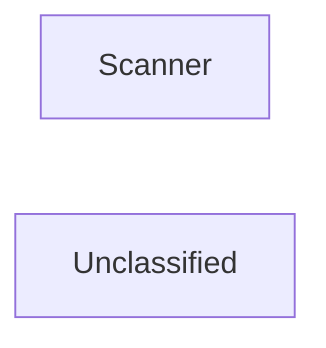

## Details

The static analysis subsystem is designed around two core components: the `Static Analysis Engine (Orchestrator)` and the `Scanner`. The `Static Analysis Engine` acts as the central coordinator, managing the overall flow of static analysis tasks. It initiates the process by utilizing the `Scanner` component. The `Scanner`, implemented by the `ProjectScanner` class in `static_analyzer/scanner.py`, is responsible for the initial codebase assessment, identifying programming languages and their key metrics. The results from the `Scanner` are then provided back to the `Static Analysis Engine`, which uses this information to guide subsequent, more detailed analysis phases. This clear separation of concerns ensures that the initial code discovery is distinct from the overarching orchestration of the analysis process.

### Scanner
The Scanner is a core internal component responsible for the initial parsing of source code. It extracts fundamental structural elements, tokenizes the input, and prepares the code for deeper analysis, serving as the first step in generating ASTs and CFGs.

**Related Classes/Methods**:

- <a href="https://github.com/CodeBoarding/CodeBoarding/blob/main/.codeboardingstatic_analyzer/scanner.py" target="_blank" rel="noopener noreferrer">`static_analyzer.scanner.ProjectScanner`</a>

### Unclassified
Component for all unclassified files and utility functions (Utility functions/External Libraries/Dependencies)

**Related Classes/Methods**: _None_

### [FAQ](https://github.com/CodeBoarding/GeneratedOnBoardings/tree/main?tab=readme-ov-file#faq)
