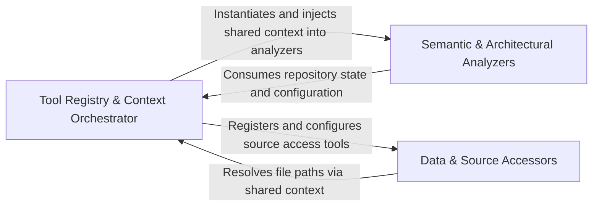

## Details

A unified interface that exposes static analysis results like CFGs and file structures as actionable tools for the agent.

### Tool Registry & Context Orchestrator
Acts as the central management layer for the toolkit, responsible for initializing the repository context and exposing a unified registry of tools to the agent.

**Related Classes/Methods**:

- `agents.tools.toolkit.CodeBoardingToolkit`:21-128
- `agents.tools.base.RepoContext`:13-61
- `agents.agent.CodeBoardingAgent.__init__`:63-86

**Source Files:**

- [`agents/agent.py`](https://github.com/CodeBoarding/CodeBoarding/blob/main/.codeboardingagents/agent.py)
  - `agents.agent.RepairValidationResult` ([L39-L40](https://github.com/CodeBoarding/CodeBoarding/blob/main/.codeboardingagents/agent.py#L39-L40)) - Class
  - `agents.agent.CodeBoardingAgent` ([L62-L492](https://github.com/CodeBoarding/CodeBoarding/blob/main/.codeboardingagents/agent.py#L62-L492)) - Class
  - `agents.agent.CodeBoardingAgent.__init__` ([L63-L86](https://github.com/CodeBoarding/CodeBoarding/blob/main/.codeboardingagents/agent.py#L63-L86)) - Method
  - `agents.agent.CodeBoardingAgent.external_deps_tool` ([L125-L126](https://github.com/CodeBoarding/CodeBoarding/blob/main/.codeboardingagents/agent.py#L125-L126)) - Method
- [`agents/tools/base.py`](https://github.com/CodeBoarding/CodeBoarding/blob/main/.codeboardingagents/tools/base.py)
  - `agents.tools.base.RepoContext` ([L13-L61](https://github.com/CodeBoarding/CodeBoarding/blob/main/.codeboardingagents/tools/base.py#L13-L61)) - Class
- [`agents/tools/get_external_deps.py`](https://github.com/CodeBoarding/CodeBoarding/blob/main/.codeboardingagents/tools/get_external_deps.py)
  - `agents.tools.get_external_deps.ExternalDepsTool` ([L15-L47](https://github.com/CodeBoarding/CodeBoarding/blob/main/.codeboardingagents/tools/get_external_deps.py#L15-L47)) - Class
- [`agents/tools/list_git_changes.py`](https://github.com/CodeBoarding/CodeBoarding/blob/main/.codeboardingagents/tools/list_git_changes.py)
  - `agents.tools.list_git_changes.ListGitChangesTool` ([L10-L27](https://github.com/CodeBoarding/CodeBoarding/blob/main/.codeboardingagents/tools/list_git_changes.py#L10-L27)) - Class
  - `agents.tools.list_git_changes.ListGitChangesTool._run` ([L16-L27](https://github.com/CodeBoarding/CodeBoarding/blob/main/.codeboardingagents/tools/list_git_changes.py#L16-L27)) - Method
- [`agents/tools/toolkit.py`](https://github.com/CodeBoarding/CodeBoarding/blob/main/.codeboardingagents/tools/toolkit.py)
  - `agents.tools.toolkit.CodeBoardingToolkit` ([L21-L128](https://github.com/CodeBoarding/CodeBoarding/blob/main/.codeboardingagents/tools/toolkit.py#L21-L128)) - Class
  - `agents.tools.toolkit.CodeBoardingToolkit.__init__` ([L27-L29](https://github.com/CodeBoarding/CodeBoarding/blob/main/.codeboardingagents/tools/toolkit.py#L27-L29)) - Method
  - `agents.tools.toolkit.CodeBoardingToolkit.external_deps` ([L86-L89](https://github.com/CodeBoarding/CodeBoarding/blob/main/.codeboardingagents/tools/toolkit.py#L86-L89)) - Method
  - `agents.tools.toolkit.CodeBoardingToolkit.list_git_changes` ([L92-L95](https://github.com/CodeBoarding/CodeBoarding/blob/main/.codeboardingagents/tools/toolkit.py#L92-L95)) - Method
  - `agents.tools.toolkit.CodeBoardingToolkit.get_agent_tools` ([L97-L108](https://github.com/CodeBoarding/CodeBoarding/blob/main/.codeboardingagents/tools/toolkit.py#L97-L108)) - Method
  - `agents.tools.toolkit.CodeBoardingToolkit.get_all_tools` ([L110-L128](https://github.com/CodeBoarding/CodeBoarding/blob/main/.codeboardingagents/tools/toolkit.py#L110-L128)) - Method

### Semantic & Architectural Analyzers
Provides high-level analytical tools that interpret the codebase's logic and structure, handling queries regarding class hierarchies, package dependencies, and control flow.

**Related Classes/Methods**:

- `agents.tools.read_cfg.GetCFGTool`:8-61
- `agents.tools.read_structure.CodeStructureTool`:14-49
- `agents.tools.read_packages.PackageRelationsTool`:26-60
- `agents.tools.component_bridge_edges.ComponentBridgeEdgesTool`:20-84

**Source Files:**

- [`agents/agent.py`](https://github.com/CodeBoarding/CodeBoarding/blob/main/.codeboardingagents/agent.py)
  - `agents.agent.CodeBoardingAgent.read_packages_tool` ([L93-L94](https://github.com/CodeBoarding/CodeBoarding/blob/main/.codeboardingagents/agent.py#L93-L94)) - Method
  - `agents.agent.CodeBoardingAgent.read_structure_tool` ([L97-L98](https://github.com/CodeBoarding/CodeBoarding/blob/main/.codeboardingagents/agent.py#L97-L98)) - Method
  - `agents.agent.CodeBoardingAgent.read_cfg_tool` ([L105-L106](https://github.com/CodeBoarding/CodeBoarding/blob/main/.codeboardingagents/agent.py#L105-L106)) - Method
  - `agents.agent.CodeBoardingAgent.read_method_invocations_tool` ([L109-L110](https://github.com/CodeBoarding/CodeBoarding/blob/main/.codeboardingagents/agent.py#L109-L110)) - Method
  - `agents.agent.CodeBoardingAgent.component_bridge_edges_tool` ([L113-L114](https://github.com/CodeBoarding/CodeBoarding/blob/main/.codeboardingagents/agent.py#L113-L114)) - Method
- [`agents/tools/component_bridge_edges.py`](https://github.com/CodeBoarding/CodeBoarding/blob/main/.codeboardingagents/tools/component_bridge_edges.py)
  - `agents.tools.component_bridge_edges.ComponentBridgeEdgesTool` ([L20-L84](https://github.com/CodeBoarding/CodeBoarding/blob/main/.codeboardingagents/tools/component_bridge_edges.py#L20-L84)) - Class
- [`agents/tools/get_method_invocations.py`](https://github.com/CodeBoarding/CodeBoarding/blob/main/.codeboardingagents/tools/get_method_invocations.py)
  - `agents.tools.get_method_invocations.MethodInvocationsTool` ([L14-L47](https://github.com/CodeBoarding/CodeBoarding/blob/main/.codeboardingagents/tools/get_method_invocations.py#L14-L47)) - Class
- [`agents/tools/read_cfg.py`](https://github.com/CodeBoarding/CodeBoarding/blob/main/.codeboardingagents/tools/read_cfg.py)
  - `agents.tools.read_cfg.GetCFGTool` ([L8-L61](https://github.com/CodeBoarding/CodeBoarding/blob/main/.codeboardingagents/tools/read_cfg.py#L8-L61)) - Class
- [`agents/tools/read_packages.py`](https://github.com/CodeBoarding/CodeBoarding/blob/main/.codeboardingagents/tools/read_packages.py)
  - `agents.tools.read_packages.PackageRelationsTool` ([L26-L60](https://github.com/CodeBoarding/CodeBoarding/blob/main/.codeboardingagents/tools/read_packages.py#L26-L60)) - Class
- [`agents/tools/read_structure.py`](https://github.com/CodeBoarding/CodeBoarding/blob/main/.codeboardingagents/tools/read_structure.py)
  - `agents.tools.read_structure.CodeStructureTool` ([L14-L49](https://github.com/CodeBoarding/CodeBoarding/blob/main/.codeboardingagents/tools/read_structure.py#L14-L49)) - Class
- [`agents/tools/toolkit.py`](https://github.com/CodeBoarding/CodeBoarding/blob/main/.codeboardingagents/tools/toolkit.py)
  - `agents.tools.toolkit.CodeBoardingToolkit.read_packages` ([L38-L41](https://github.com/CodeBoarding/CodeBoarding/blob/main/.codeboardingagents/tools/toolkit.py#L38-L41)) - Method
  - `agents.tools.toolkit.CodeBoardingToolkit.read_structure` ([L44-L47](https://github.com/CodeBoarding/CodeBoarding/blob/main/.codeboardingagents/tools/toolkit.py#L44-L47)) - Method
  - `agents.tools.toolkit.CodeBoardingToolkit.read_cfg` ([L56-L59](https://github.com/CodeBoarding/CodeBoarding/blob/main/.codeboardingagents/tools/toolkit.py#L56-L59)) - Method
  - `agents.tools.toolkit.CodeBoardingToolkit.read_method_invocations` ([L62-L65](https://github.com/CodeBoarding/CodeBoarding/blob/main/.codeboardingagents/tools/toolkit.py#L62-L65)) - Method
  - `agents.tools.toolkit.CodeBoardingToolkit.component_bridge_edges` ([L68-L71](https://github.com/CodeBoarding/CodeBoarding/blob/main/.codeboardingagents/tools/toolkit.py#L68-L71)) - Method

### Data & Source Accessors
Manages direct access to the physical and logical artifacts of the repository, providing tools for reading raw file content, navigating directory trees, and extracting code references.

**Related Classes/Methods**:

- `agents.tools.read_source.CodeReferenceReader`:25-85
- `agents.tools.read_file_structure.FileStructureTool`:22-101
- `agents.tools.read_file.ReadFileTool`:19-90
- `agents.tools.read_docs.ReadDocsTool`:22-132

**Source Files:**

- [`agents/agent.py`](https://github.com/CodeBoarding/CodeBoarding/blob/main/.codeboardingagents/agent.py)
  - `agents.agent.CodeBoardingAgent.read_source_reference` ([L89-L90](https://github.com/CodeBoarding/CodeBoarding/blob/main/.codeboardingagents/agent.py#L89-L90)) - Method
  - `agents.agent.CodeBoardingAgent.read_file_structure` ([L101-L102](https://github.com/CodeBoarding/CodeBoarding/blob/main/.codeboardingagents/agent.py#L101-L102)) - Method
  - `agents.agent.CodeBoardingAgent.read_file_tool` ([L117-L118](https://github.com/CodeBoarding/CodeBoarding/blob/main/.codeboardingagents/agent.py#L117-L118)) - Method
  - `agents.agent.CodeBoardingAgent.read_docs` ([L121-L122](https://github.com/CodeBoarding/CodeBoarding/blob/main/.codeboardingagents/agent.py#L121-L122)) - Method
- [`agents/tools/read_docs.py`](https://github.com/CodeBoarding/CodeBoarding/blob/main/.codeboardingagents/tools/read_docs.py)
  - `agents.tools.read_docs.ReadDocsTool` ([L22-L132](https://github.com/CodeBoarding/CodeBoarding/blob/main/.codeboardingagents/tools/read_docs.py#L22-L132)) - Class
- [`agents/tools/read_file.py`](https://github.com/CodeBoarding/CodeBoarding/blob/main/.codeboardingagents/tools/read_file.py)
  - `agents.tools.read_file.ReadFileTool` ([L19-L90](https://github.com/CodeBoarding/CodeBoarding/blob/main/.codeboardingagents/tools/read_file.py#L19-L90)) - Class
- [`agents/tools/read_file_structure.py`](https://github.com/CodeBoarding/CodeBoarding/blob/main/.codeboardingagents/tools/read_file_structure.py)
  - `agents.tools.read_file_structure.FileStructureTool` ([L22-L101](https://github.com/CodeBoarding/CodeBoarding/blob/main/.codeboardingagents/tools/read_file_structure.py#L22-L101)) - Class
- [`agents/tools/read_source.py`](https://github.com/CodeBoarding/CodeBoarding/blob/main/.codeboardingagents/tools/read_source.py)
  - `agents.tools.read_source.CodeReferenceReader` ([L25-L85](https://github.com/CodeBoarding/CodeBoarding/blob/main/.codeboardingagents/tools/read_source.py#L25-L85)) - Class
- [`agents/tools/toolkit.py`](https://github.com/CodeBoarding/CodeBoarding/blob/main/.codeboardingagents/tools/toolkit.py)
  - `agents.tools.toolkit.CodeBoardingToolkit.read_source_reference` ([L32-L35](https://github.com/CodeBoarding/CodeBoarding/blob/main/.codeboardingagents/tools/toolkit.py#L32-L35)) - Method
  - `agents.tools.toolkit.CodeBoardingToolkit.read_file_structure` ([L50-L53](https://github.com/CodeBoarding/CodeBoarding/blob/main/.codeboardingagents/tools/toolkit.py#L50-L53)) - Method
  - `agents.tools.toolkit.CodeBoardingToolkit.read_file` ([L74-L77](https://github.com/CodeBoarding/CodeBoarding/blob/main/.codeboardingagents/tools/toolkit.py#L74-L77)) - Method
  - `agents.tools.toolkit.CodeBoardingToolkit.read_docs` ([L80-L83](https://github.com/CodeBoarding/CodeBoarding/blob/main/.codeboardingagents/tools/toolkit.py#L80-L83)) - Method

### [FAQ](https://github.com/CodeBoarding/GeneratedOnBoardings/tree/main?tab=readme-ov-file#faq)