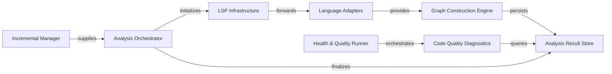

## Details

Performs deep structural and behavioral analysis of the codebase across multiple programming languages. It extracts information like call graphs, code structure, and identifies code quality issues, including unused code.

### Analysis Orchestrator
Coordinates project scanning, language detection, and the overall analysis lifecycle, acting as the entry point for the subsystem.

**Related Classes/Methods**:

- <a href="https://github.com/CodeBoarding/CodeBoarding/blob/main/.codeboardingstatic_analyzer/java_config_scanner.py" target="_blank" rel="noopener noreferrer">`static_analyzer.java_config_scanner.AnalysisOrchestrator`</a>

### LSP Infrastructure
Provides the JSON-RPC transport layer and symbol resolution logic to communicate with external Language Servers.

**Related Classes/Methods**:

- <a href="https://github.com/CodeBoarding/CodeBoarding/blob/main/.codeboardingstatic_analyzer/java_config_scanner.py" target="_blank" rel="noopener noreferrer">`static_analyzer.java_config_scanner.LSPInfrastructure`</a>

### Incremental Manager
Optimizes performance by using Git diffs to perform delta-analysis, updating only changed fragments of the graph.

**Related Classes/Methods**:

- <a href="https://github.com/CodeBoarding/CodeBoarding/blob/main/.codeboardingstatic_analyzer/java_config_scanner.py" target="_blank" rel="noopener noreferrer">`static_analyzer.java_config_scanner.IncrementalManager`</a>

### Language Adapters
Language‑specific bridges (Java, TypeScript, etc.) that handle environment discovery and map LSP data to domain models.

**Related Classes/Methods**:

- <a href="https://github.com/CodeBoarding/CodeBoarding/blob/main/.codeboardingstatic_analyzer/java_config_scanner.py" target="_blank" rel="noopener noreferrer">`static_analyzer.java_config_scanner.LanguageAdapters`</a>

### Graph Construction Engine
Transforms raw symbol and call data into a unified Call Graph and performs architectural clustering.

**Related Classes/Methods**:

- <a href="https://github.com/CodeBoarding/CodeBoarding/blob/main/.codeboardingstatic_analyzer/java_config_scanner.py" target="_blank" rel="noopener noreferrer">`static_analyzer.java_config_scanner.GraphConstructionEngine`</a>

### Analysis Result Store
Central DTO and persistence layer containing the extracted CFG, class hierarchies, and package dependencies.

**Related Classes/Methods**:

- <a href="https://github.com/CodeBoarding/CodeBoarding/blob/main/.codeboardingstatic_analyzer/java_config_scanner.py" target="_blank" rel="noopener noreferrer">`static_analyzer.java_config_scanner.AnalysisResultStore`</a>

### Health & Quality Runner
Orchestrates the execution of diagnostic checks and aggregates findings into a repository‑wide health score.

**Related Classes/Methods**:

- <a href="https://github.com/CodeBoarding/CodeBoarding/blob/main/.codeboardingstatic_analyzer/java_config_scanner.py" target="_blank" rel="noopener noreferrer">`static_analyzer.java_config_scanner.HealthQualityRunner`</a>

### Code Quality Diagnostics
Suite of specialized checkers (e.g., UnusedCodeAnalyzer, God Class) that evaluate the graph for structural issues.

**Related Classes/Methods**:

- <a href="https://github.com/CodeBoarding/CodeBoarding/blob/main/.codeboardingstatic_analyzer/java_config_scanner.py" target="_blank" rel="noopener noreferrer">`static_analyzer.java_config_scanner.CodeQualityDiagnostics`</a>

### [FAQ](https://github.com/CodeBoarding/GeneratedOnBoardings/tree/main?tab=readme-ov-file#faq)