```mermaid
graph LR
    Static_Analysis_Facade["Static Analysis Facade"]
    Project_Discovery_Engine["Project Discovery Engine"]
    LSP_Communication_Framework["LSP Communication Framework"]
    Semantic_Graph_Engine["Semantic Graph Engine"]
    Code_Health_Quality_Suite["Code Health & Quality Suite"]
    Incremental_Analysis_Controller["Incremental Analysis Controller"]
    Static_Analysis_Facade -- "triggers" --> Project_Discovery_Engine
    Static_Analysis_Facade -- "initializes" --> LSP_Communication_Framework
    Project_Discovery_Engine -- "provides configuration to" --> LSP_Communication_Framework
    LSP_Communication_Framework -- "streams symbols to" --> Semantic_Graph_Engine
    Semantic_Graph_Engine -- "builds call graph for" --> Code_Health_Quality_Suite
    Incremental_Analysis_Controller -- "filters workload for" --> Static_Analysis_Facade
```

## Details

Performs deep structural and behavioral analysis of the codebase across multiple programming languages. It extracts information like call graphs, code structure, and identifies code quality issues, including unused code.

### Static Analysis Facade
Primary entry point orchestrating discovery, LSP initialization, and the analysis pipeline, returning results to callers.

**Related Classes/Methods**:

- `static_analyzer.java_config_scanner.StaticAnalyzer`

### Project Discovery Engine
Scans the filesystem to detect programming languages, build tools, and project roots, providing configuration for later stages.

**Related Classes/Methods**:

- `static_analyzer.java_config_scanner.RepositoryScanner`
- `static_analyzer.java_config_scanner.LanguageDetector`

### LSP Communication Framework
Manages asynchronous LSP client lifecycles and JSON‑RPC communication to retrieve symbols and diagnostics from language servers.

**Related Classes/Methods**:

- `static_analyzer.java_config_scanner.LSPClient`
- `static_analyzer.java_config_scanner.SymbolTranslator`

### Semantic Graph Engine
Builds a directed call graph from LSP symbols, resolves cross‑file references, and clusters related entities using community detection.

**Related Classes/Methods**:

- `static_analyzer.java_config_scanner.CallGraphBuilder`
- `static_analyzer.java_config_scanner.ReferenceResolverMixin`

### Code Health & Quality Suite
Runs structural checks (unused code, God class, coupling, etc.) against the semantic graph and LSP diagnostics, producing a health report.

**Related Classes/Methods**:

- `static_analyzer.java_config_scanner.UnusedCodeAnalyzer`
- `static_analyzer.java_config_scanner.HealthRunner`

### Incremental Analysis Controller
Uses Git diffs and a cache to limit re‑analysis to modified files, directing the Facade to process only necessary parts.

**Related Classes/Methods**:

- `static_analyzer.java_config_scanner.GitDiffAnalyzer`
- `static_analyzer.java_config_scanner.AnalysisCache`

### [FAQ](https://github.com/CodeBoarding/GeneratedOnBoardings/tree/main?tab=readme-ov-file#faq)