```mermaid
graph LR
    Static_Analysis_Façade["Static Analysis Façade"]
    Discovery_Environment_Manager["Discovery & Environment Manager"]
    LSP_Orchestration_Engine["LSP Orchestration Engine"]
    Semantic_Reference_Resolver["Semantic Reference Resolver"]
    Architectural_Modeling_Engine["Architectural Modeling Engine"]
    Static_Quality_Check_Suite["Static Quality Check Suite"]
    Health_Quality_Orchestrator["Health & Quality Orchestrator"]
    Incremental_Analysis_Manager["Incremental Analysis Manager"]
    Static_Analysis_Façade -- "Requests a filtered list of files and environment parameters to define the analysis scope." --> Discovery_Environment_Manager
    Discovery_Environment_Manager -- "Provides configuration metadata and file paths required to bootstrap language‑specific servers." --> LSP_Orchestration_Engine
    LSP_Orchestration_Engine -- "Streams raw symbol data and location references for cross‑file linking." --> Semantic_Reference_Resolver
    Semantic_Reference_Resolver -- "Supplies resolved symbol edges to populate the structural CallGraph." --> Architectural_Modeling_Engine
    Architectural_Modeling_Engine -- "Provides the complete graph topology for executing depth‑first searches and metric calculations." --> Static_Quality_Check_Suite
    Static_Quality_Check_Suite -- "Forwards detected quality issues and unused code findings to be standardized into health reports." --> Health_Quality_Orchestrator
    Static_Analysis_Façade -- "Queries for previous analysis states to determine which modules require re‑processing." --> Incremental_Analysis_Manager
    Incremental_Analysis_Manager -- "Uses Git diff data to invalidate specific cache entries in the state store." --> Discovery_Environment_Manager
```

## Details

Performs deep structural and behavioral analysis of the codebase across multiple programming languages. It extracts information like call graphs, code structure, and identifies code quality issues, including unused code.

### Static Analysis Façade
Primary entry point; coordinates discovery, extraction, and modeling phases while persisting unified metadata.

**Related Classes/Methods**:

- <a href="https://github.com/CodeBoarding/CodeBoarding/blob/main/.codeboardingstatic_analyzer/__init__.py#L109-L294" target="_blank" rel="noopener noreferrer">`StaticAnalyzer`:109-294</a>
- <a href="https://github.com/CodeBoarding/CodeBoarding/blob/main/.codeboardingstatic_analyzer/analysis_result.py#L53-L269" target="_blank" rel="noopener noreferrer">`StaticAnalysisResults`:53-269</a>

### Discovery & Environment Manager
Scans the repository to identify project structures (Maven/Gradle) and filters files based on Git changes.

**Related Classes/Methods**:

- <a href="https://github.com/CodeBoarding/CodeBoarding/blob/main/.codeboardingstatic_analyzer/scanner.py#L13-L95" target="_blank" rel="noopener noreferrer">`ProjectScanner`:13-95</a>
- <a href="https://github.com/CodeBoarding/CodeBoarding/blob/main/.codeboardingstatic_analyzer/java_config_scanner.py#L33-L218" target="_blank" rel="noopener noreferrer">`JavaConfigScanner`:33-218</a>
- <a href="https://github.com/CodeBoarding/CodeBoarding/blob/main/.codeboardingstatic_analyzer/git_diff_analyzer.py#L16-L224" target="_blank" rel="noopener noreferrer">`GitDiffAnalyzer`:16-224</a>

### LSP Orchestration Engine
Manages the lifecycle of language servers; handles JSON‑RPC communication and aggregates raw symbol diagnostics.

**Related Classes/Methods**:

- <a href="https://github.com/CodeBoarding/CodeBoarding/blob/main/.codeboardingstatic_analyzer/lsp_client/client.py#L64-L1642" target="_blank" rel="noopener noreferrer">`LSPClient`:64-1642</a>
- <a href="https://github.com/CodeBoarding/CodeBoarding/blob/main/.codeboardingstatic_analyzer/lsp_client/java_client.py#L26-L517" target="_blank" rel="noopener noreferrer">`JavaClient`:26-517</a>
- <a href="https://github.com/CodeBoarding/CodeBoarding/blob/main/.codeboardingstatic_analyzer/lsp_client/typescript_client.py#L10-L235" target="_blank" rel="noopener noreferrer">`TypeScriptClient`:10-235</a>

### Semantic Reference Resolver
Resolves ambiguous symbols and links call sites to definitions across module boundaries to create a unified symbol map.

**Related Classes/Methods**:

- <a href="https://github.com/CodeBoarding/CodeBoarding/blob/main/.codeboardingstatic_analyzer/reference_resolve_mixin.py#L13-L166" target="_blank" rel="noopener noreferrer">`ReferenceResolverMixin`:13-166</a>

### Architectural Modeling Engine
Constructs the global CallGraph and applies community detection (Louvain/Leiden) for high‑level module discovery.

**Related Classes/Methods**:

- <a href="https://github.com/CodeBoarding/CodeBoarding/blob/main/.codeboardingstatic_analyzer/cluster_helpers.py" target="_blank" rel="noopener noreferrer">`CallGraphBuilder`</a>
- <a href="https://github.com/CodeBoarding/CodeBoarding/blob/main/.codeboardingstatic_analyzer/cluster_helpers.py" target="_blank" rel="noopener noreferrer">`AdaptiveClusteringEngine`</a>

### Static Quality Check Suite
Implements structural analysis routines to detect "God Classes," unused code, and topological imbalances.

**Related Classes/Methods**:

- <a href="https://github.com/CodeBoarding/CodeBoarding/blob/main/.codeboardinghealth/checks/__init__.py" target="_blank" rel="noopener noreferrer">`UnusedCodeAnalyzer`</a>
- <a href="https://github.com/CodeBoarding/CodeBoarding/blob/main/.codeboardinghealth/checks/__init__.py" target="_blank" rel="noopener noreferrer">`CohesionMetrics`</a>
- <a href="https://github.com/CodeBoarding/CodeBoarding/blob/main/.codeboardinghealth/checks/__init__.py" target="_blank" rel="noopener noreferrer">`CouplingMetrics`</a>

### Health & Quality Orchestrator
Drives the diagnostic pipeline; configures and executes specific health checks based on the architectural model.

**Related Classes/Methods**:

- <a href="https://github.com/CodeBoarding/CodeBoarding/blob/main/.codeboardinghealth/__init__.py" target="_blank" rel="noopener noreferrer">`HealthRunner`</a>
- <a href="https://github.com/CodeBoarding/CodeBoarding/blob/main/.codeboardinghealth/__init__.py" target="_blank" rel="noopener noreferrer">`HealthModels`</a>
- <a href="https://github.com/CodeBoarding/CodeBoarding/blob/main/.codeboardinghealth/constants.py#L4-L19" target="_blank" rel="noopener noreferrer">`HealthConfig`:4-19</a>

### Incremental Analysis Manager
Manages stateful analysis by comparing current repository deltas with cached results to minimize redundant processing.

**Related Classes/Methods**:

- <a href="https://github.com/CodeBoarding/CodeBoarding/blob/main/.codeboardingstatic_analyzer/incremental_orchestrator.py" target="_blank" rel="noopener noreferrer">`StateStore`</a>

### [FAQ](https://github.com/CodeBoarding/GeneratedOnBoardings/tree/main?tab=readme-ov-file#faq)