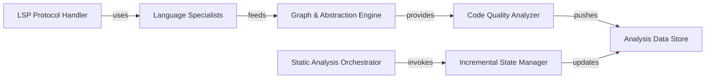

## Details

Performs deep structural and behavioral analysis of the codebase across multiple programming languages. It extracts information like call graphs, code structure, and identifies code quality issues, including unused code.

### Static Analysis Orchestrator
The central entry point that manages the lifecycle of analysis runs. It coordinates project discovery, determines the programming languages present, and triggers the incremental update logic to minimize processing time.

**Related Classes/Methods**:

- `ProjectScanner`:13-95
- `ProgrammingLanguage`:23-75

### LSP Protocol Handler
Manages low-level communication with Language Servers. It abstracts JSON-RPC messaging, document synchronization, and provides a mixin-based approach for resolving semantic references across files.

**Related Classes/Methods**:

- `LSPClient`:64-1650
- `ReferenceResolverMixin`:13-166

### Language Specialists
Concrete strategies that handle the nuances of specific languages and their build systems (e.g., Maven, Gradle, tsconfig). They provide the necessary environment bootstrapping for the LSP servers.

**Related Classes/Methods**:

- `JavaConfigScanner`:33-218
- `TSConfigScanner`

### Incremental State Manager
Optimizes performance by tracking changes in the codebase. It uses Git history to identify modified files and manages a local cache to ensure only affected components are re-analyzed.

**Related Classes/Methods**:

- `GitDiffAnalyzer`:16-224
- `AnalysisCache`:14-50

### Graph & Abstraction Engine
The "brain" of the subsystem that constructs a global Call Graph from raw symbols. It applies adaptive clustering to group low-level code elements into high-level architectural modules.

**Related Classes/Methods**:

- `CallGraphBuilder`
- `AdaptiveClustering`

### Code Quality Analyzer
A composite engine that runs diagnostic checks. It identifies structural flaws such as circular dependencies, "God Classes," and dead code, contributing to the overall health score of the project.

**Related Classes/Methods**:

- `HealthCheckRunner`
- `UnusedCodeAnalyzer`
- `CircularDependencyDetector`

### Analysis Data Store
Manages the persistence of all analysis outputs. It defines unified Data Transfer Objects (DTOs) that allow both the VS Code UI and LLM agents to query the results of the static analysis.

**Related Classes/Methods**:

- `StaticAnalysisResults`:53-269
- `HealthReport`:122-135

### [FAQ](https://github.com/CodeBoarding/GeneratedOnBoardings/tree/main?tab=readme-ov-file#faq)