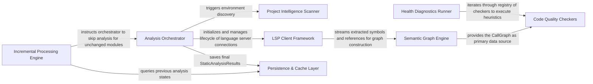

```mermaid
graph LR
    Analysis_Orchestrator["Analysis Orchestrator"]
    Project_Intelligence_Scanner["Project Intelligence Scanner"]
    LSP_Client_Framework["LSP Client Framework"]
    Semantic_Graph_Engine["Semantic Graph Engine"]
    Incremental_Processing_Engine["Incremental Processing Engine"]
    Health_Diagnostics_Runner["Health Diagnostics Runner"]
    Code_Quality_Checkers["Code Quality Checkers"]
    Persistence_Cache_Layer["Persistence & Cache Layer"]
    Analysis_Orchestrator -- "triggers environment discovery" --> Project_Intelligence_Scanner
    Analysis_Orchestrator -- "initializes and manages lifecycle of language server connections" --> LSP_Client_Framework
    LSP_Client_Framework -- "streams extracted symbols and references for graph construction" --> Semantic_Graph_Engine
    Semantic_Graph_Engine -- "provides the CallGraph as primary data source" --> Code_Quality_Checkers
    Health_Diagnostics_Runner -- "iterates through registry of checkers to execute heuristics" --> Code_Quality_Checkers
    Incremental_Processing_Engine -- "queries previous analysis states" --> Persistence_Cache_Layer
    Incremental_Processing_Engine -- "instructs orchestrator to skip analysis for unchanged modules" --> Analysis_Orchestrator
    Analysis_Orchestrator -- "saves final StaticAnalysisResults" --> Persistence_Cache_Layer
```

## Details

Performs deep structural and behavioral analysis of the codebase across multiple programming languages. It extracts information like call graphs, code structure, and identifies code quality issues, including unused code.

### Analysis Orchestrator
The central entry point that manages the lifecycle of the analysis pipeline. It coordinates the sequence of operations from initial scanning to final persistence.

**Related Classes/Methods**:

- `repos.codeboarding.static_analysis.StaticAnalyzer`
- `repos.codeboarding.static_analysis.AnalysisPipeline`

### Project Intelligence Scanner
Detects repository build systems (Maven, Gradle, npm) and identifies programming languages to configure appropriate LSP server parameters.

**Related Classes/Methods**:

- `repos.codeboarding.static_analysis.BuildSystemDetector`
- `repos.codeboarding.static_analysis.LanguageConfigurator`
- `repos.codeboarding.static_analysis.ProjectScanner`

### LSP Client Framework
Provides a unified JSON‑RPC interface to communicate with various language servers, handling symbol extraction and diagnostic retrieval.

**Related Classes/Methods**:

- `repos.codeboarding.static_analysis.LSPClient`
- `repos.codeboarding.static_analysis.JsonRpcHandler`
- `repos.codeboarding.static_analysis.SymbolExtractor`

### Semantic Graph Engine
Transforms raw symbols into a CallGraph and performs adaptive clustering to identify logical modules and functional relationships.

**Related Classes/Methods**:

- `repos.codeboarding.static_analysis.CallGraphBuilder`
- `repos.codeboarding.static_analysis.CallGraph`
- `repos.codeboarding.static_analysis.AdaptiveClustering`

### Incremental Processing Engine
Analyzes Git diffs to identify changed files, allowing the system to re‑analyze only affected code segments for performance optimization.

**Related Classes/Methods**:

- `repos.codeboarding.static_analysis.GitDiffAnalyzer`
- `repos.codeboarding.static_analysis.ImpactAnalyzer`

### Health Diagnostics Runner
Orchestrates the execution of quality checks, applying filters and aggregating findings into a unified HealthReport.

**Related Classes/Methods**:

- `repos.codeboarding.static_analysis.HealthDiagnosticsRunner`
- `repos.codeboarding.static_analysis.ReportAggregator`
- `repos.codeboarding.static_analysis.HealthReport`

### Code Quality Checkers
A suite of specialized analyzers that compute metrics such as cohesion, coupling, and inheritance depth to identify "God Classes" or unused code.

**Related Classes/Methods**:

- `repos.codeboarding.static_analysis.UnusedCodeAnalyzer`
- `repos.codeboarding.static_analysis.GodClassAnalyzer`
- `repos.codeboarding.static_analysis.CohesionMetric`

### Persistence & Cache Layer
Manages the storage and retrieval of StaticAnalysisResults to support fast restarts and incremental updates.

**Related Classes/Methods**:

- `repos.codeboarding.static_analysis.AnalysisCache`
- `repos.codeboarding.static_analysis.StaticAnalysisResults`
- `repos.codeboarding.static_analysis.PersistenceManager`

### [FAQ](https://github.com/CodeBoarding/GeneratedOnBoardings/tree/main?tab=readme-ov-file#faq)