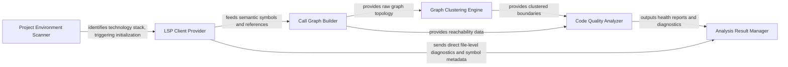

```mermaid
graph LR
    Project_Environment_Scanner["Project Environment Scanner"]
    LSP_Client_Provider["LSP Client Provider"]
    Call_Graph_Builder["Call Graph Builder"]
    Graph_Clustering_Engine["Graph Clustering Engine"]
    Code_Quality_Analyzer["Code Quality Analyzer"]
    Analysis_Result_Manager["Analysis Result Manager"]
    Project_Environment_Scanner -- "identifies technology stack, triggering initialization" --> LSP_Client_Provider
    LSP_Client_Provider -- "feeds semantic symbols and references" --> Call_Graph_Builder
    Call_Graph_Builder -- "provides raw graph topology" --> Graph_Clustering_Engine
    Graph_Clustering_Engine -- "provides clustered boundaries" --> Code_Quality_Analyzer
    Call_Graph_Builder -- "provides reachability data" --> Code_Quality_Analyzer
    Code_Quality_Analyzer -- "outputs health reports and diagnostics" --> Analysis_Result_Manager
    LSP_Client_Provider -- "sends direct file‑level diagnostics and symbol metadata" --> Analysis_Result_Manager
```

## Details

Performs deep structural and behavioral analysis of the codebase across multiple programming languages. It extracts information like call graphs, code structure, and identifies code quality issues, including unused code.

### Project Environment Scanner
Detects project structures (Maven, Gradle, TSConfig) and identifies programming languages to configure the analysis environment.

**Related Classes/Methods**:

- `java_config_scanner.ProjectEnvironmentScanner`

### LSP Client Provider
Orchestrates communication with language‑specific servers to extract semantic symbols, diagnostics, and file‑level metadata.

**Related Classes/Methods**:

- `LSPClient`:65-1750
- `JavaClient`:26-517
- `TypeScriptClient`:10-235

### Call Graph Builder
Constructs a global structural topology by linking symbols across files, identifying behavioral dependencies.

**Related Classes/Methods**:

- `static_analyzer.java_config_scanner.CallGraphBuilder`

### Graph Clustering Engine
Applies adaptive clustering algorithms to the call graph to group code into logical, high‑level functional modules.

**Related Classes/Methods**:

- `adaptive_clustering`:240-303
- `ClusterResult`:13-32

### Code Quality Analyzer
Performs deep behavioral analysis to identify dead (unused) code and structural smells such as God Classes or high coupling.

**Related Classes/Methods**:

- `UnusedCodeAnalyzer`
- `HealthCheckRunner`

### Analysis Result Manager
Serializes findings into a unified model and manages the AnalysisCache to enable incremental re‑analysis.

**Related Classes/Methods**:

- `StaticAnalysisResults`:53-269
- `ResultPersistenceManager`

### [FAQ](https://github.com/CodeBoarding/GeneratedOnBoardings/tree/main?tab=readme-ov-file#faq)