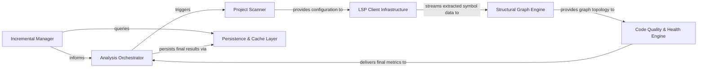

```mermaid
graph LR
    Analysis_Orchestrator["Analysis Orchestrator"]
    Project_Scanner["Project Scanner"]
    LSP_Client_Infrastructure["LSP Client Infrastructure"]
    Structural_Graph_Engine["Structural Graph Engine"]
    Incremental_Manager["Incremental Manager"]
    Code_Quality_Health_Engine["Code Quality & Health Engine"]
    Persistence_Cache_Layer["Persistence & Cache Layer"]
    Analysis_Orchestrator -- "triggers" --> Project_Scanner
    Project_Scanner -- "provides configuration to" --> LSP_Client_Infrastructure
    LSP_Client_Infrastructure -- "streams extracted symbol data to" --> Structural_Graph_Engine
    Structural_Graph_Engine -- "provides graph topology to" --> Code_Quality_Health_Engine
    Incremental_Manager -- "queries" --> Persistence_Cache_Layer
    Incremental_Manager -- "informs" --> Analysis_Orchestrator
    Code_Quality_Health_Engine -- "delivers final metrics to" --> Analysis_Orchestrator
    Analysis_Orchestrator -- "persists final results via" --> Persistence_Cache_Layer
```

## Details

Performs deep structural and behavioral analysis of the codebase across multiple programming languages. It extracts information like call graphs, code structure, and identifies code quality issues, including unused code.

### Analysis Orchestrator
The central coordinator that manages the lifecycle of an analysis job. It sequences the scanning, extraction, and metric calculation phases, ensuring that multi-language data is unified into a single result set.

**Related Classes/Methods**:

- `repos.codeboarding.static_analysis.StaticAnalyzer`
- `repos.codeboarding.static_analysis.StaticAnalysisResults`
- `repos.codeboarding.static_analysis.AnalysisJob`

### Project Scanner
Detects the project's environment, identifying build systems (Maven, Gradle, npm) and mapping file extensions to the appropriate Language Server Protocol (LSP) configurations.

**Related Classes/Methods**:

- `repos.codeboarding.static_analysis.ProjectScanner`
- `repos.codeboarding.static_analysis.LanguageConfig`
- `repos.codeboarding.static_analysis.BuildSystemDetector`

### LSP Client Infrastructure
Manages asynchronous communication with various Language Servers. It handles the complexity of the LSP lifecycle (initialize, shutdown) and extracts symbols, definitions, and diagnostics.

**Related Classes/Methods**:

- `repos.codeboarding.static_analysis.LSPClient`
- `repos.codeboarding.static_analysis.PythonLSPClient`
- `repos.codeboarding.static_analysis.JavaLSPClient`
- `repos.codeboarding.static_analysis.TypeScriptLSPClient`

### Structural Graph Engine
Constructs the global Call Graph and applies clustering algorithms (like Louvain) to identify architectural boundaries and logical modules within the code.

**Related Classes/Methods**:

- `repos.codeboarding.static_analysis.CallGraphBuilder`
- `repos.codeboarding.static_analysis.AdaptiveClustering`
- `repos.codeboarding.static_analysis.ReferenceResolver`

### Incremental Manager
Optimizes performance by using Git diffs to identify changed files. it merges new analysis fragments with existing cached data to avoid redundant full-repo processing.

**Related Classes/Methods**:

- `repos.codeboarding.static_analysis.IncrementalManager`
- `repos.codeboarding.static_analysis.GitDiffProvider`
- `repos.codeboarding.static_analysis.StateMerger`

### Code Quality & Health Engine
A suite of specialized plugins that analyze the structural graph to identify "code smells" (God Classes, Circular Dependencies) and aggregate them into a unified Health Report.

**Related Classes/Methods**:

- `repos.codeboarding.static_analysis.HealthReport`
- `repos.codeboarding.static_analysis.UnusedCodeAnalyzer`
- `repos.codeboarding.static_analysis.GodClassAnalyzer`
- `repos.codeboarding.static_analysis.CircularDependencyAnalyzer`

### Persistence & Cache Layer
Handles the serialization of Control Flow Graphs (CFGs) and analysis metadata to disk (using DuckDB or local files) to support incremental workflows.

**Related Classes/Methods**: _None_

### [FAQ](https://github.com/CodeBoarding/GeneratedOnBoardings/tree/main?tab=readme-ov-file#faq)