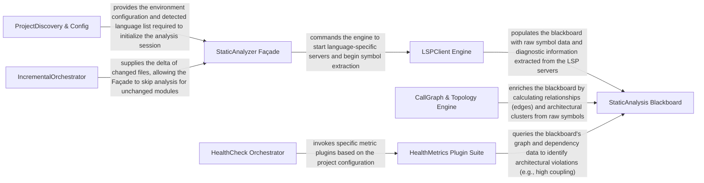

```mermaid
graph LR
    StaticAnalyzer_Façade["StaticAnalyzer Façade"]
    LSPClient_Engine["LSPClient Engine"]
    ProjectDiscovery_Config["ProjectDiscovery & Config"]
    IncrementalOrchestrator["IncrementalOrchestrator"]
    CallGraph_Topology_Engine["CallGraph & Topology Engine"]
    StaticAnalysis_Blackboard["StaticAnalysis Blackboard"]
    HealthCheck_Orchestrator["HealthCheck Orchestrator"]
    HealthMetrics_Plugin_Suite["HealthMetrics Plugin Suite"]
    ProjectDiscovery_Config -- "provides the environment configuration and detected language list required to initialize the analysis session" --> StaticAnalyzer_Façade
    IncrementalOrchestrator -- "supplies the delta of changed files, allowing the Façade to skip analysis for unchanged modules" --> StaticAnalyzer_Façade
    StaticAnalyzer_Façade -- "commands the engine to start language-specific servers and begin symbol extraction" --> LSPClient_Engine
    LSPClient_Engine -- "populates the blackboard with raw symbol data and diagnostic information extracted from the LSP servers" --> StaticAnalysis_Blackboard
    CallGraph_Topology_Engine -- "enriches the blackboard by calculating relationships (edges) and architectural clusters from raw symbols" --> StaticAnalysis_Blackboard
    HealthCheck_Orchestrator -- "invokes specific metric plugins based on the project configuration" --> HealthMetrics_Plugin_Suite
    HealthMetrics_Plugin_Suite -- "queries the blackboard's graph and dependency data to identify architectural violations (e.g., high coupling)" --> StaticAnalysis_Blackboard
```

## Details

Performs deep structural and behavioral analysis of the codebase across multiple programming languages. It extracts information like call graphs, code structure, and identifies code quality issues, including unused code.

### StaticAnalyzer Façade
The primary entry point that orchestrates the analysis lifecycle. It manages the creation of language-specific clients and merges their outputs into a unified session.

**Related Classes/Methods**:

- `repos.codeboarding.static_analysis.StaticAnalyzer`
- `repos.codeboarding.static_analysis.AnalysisSession`
- `repos.codeboarding.static_analysis.LanguageClientFactory`

### LSPClient Engine
Manages Language Server Protocol (LSP) interactions. It handles server lifecycles and translates raw LSP diagnostics and symbols into the system's internal data models.

**Related Classes/Methods**:

- `repos.codeboarding.static_analysis.LSPClient`
- `repos.codeboarding.static_analysis.JavaLSPClient`
- `repos.codeboarding.static_analysis.TypeScriptLSPClient`

### ProjectDiscovery & Config
Scans the repository to detect languages, identify build systems (Maven/Gradle), and locate necessary binaries (JDK/LSP) to bootstrap the analysis environment.

**Related Classes/Methods**:

- `repos.codeboarding.static_analysis.ProjectScanner`
- `repos.codeboarding.static_analysis.LanguageDetector`
- `repos.codeboarding.static_analysis.BuildSystemIdentifier`

### IncrementalOrchestrator
Optimizes analysis by using Git diffs to identify changed files. It merges fresh results with cached data to minimize redundant processing and LLM calls.

**Related Classes/Methods**:

- `repos.codeboarding.static_analysis.IncrementalAnalyzer`
- `repos.codeboarding.static_analysis.GitDiffProvider`
- `repos.codeboarding.static_analysis.CacheManager`

### CallGraph & Topology Engine
Constructs the mathematical representation of the codebase. It builds nodes and edges representing calls and dependencies, performing community detection to identify architectural clusters.

**Related Classes/Methods**:

- `repos.codeboarding.static_analysis.CallGraphBuilder`
- `repos.codeboarding.static_analysis.TopologyAnalyzer`
- `repos.codeboarding.static_analysis.CommunityDetector`

### StaticAnalysis Blackboard
A central data container (StaticAnalysisResults) that stores aggregated call-graphs, class hierarchies, and dependencies for consumption by AI agents.

**Related Classes/Methods**:

- `repos.codeboarding.static_analysis.StaticAnalysisResults`
- `repos.codeboarding.static_analysis.ReferenceResolver`
- `repos.codeboarding.static_analysis.DependencyMap`

### HealthCheck Orchestrator
Drives the execution of software quality checks. It loads configurations like .healthignore and aggregates findings from various plugins into a final report.

**Related Classes/Methods**:

- `repos.codeboarding.health_check.HealthCheckEngine`
- `repos.codeboarding.health_check.HealthReport`
- `repos.codeboarding.health_check.IgnoreFilter`

### HealthMetrics Plugin Suite
A collection of specialized analyzers that compute specific quality metrics such as God Classes, coupling, and unused code.

**Related Classes/Methods**:

- `repos.codeboarding.health_check.UnusedCodeAnalyzer`
- `repos.codeboarding.health_check.GodClassAnalyzer`
- `repos.codeboarding.health_check.CouplingMetric`

### [FAQ](https://github.com/CodeBoarding/GeneratedOnBoardings/tree/main?tab=readme-ov-file#faq)