```mermaid
graph LR
    Physical_Source_Mapper["Physical Source Mapper"]
    Logical_Hierarchy_Type_Inferencer["Logical Hierarchy & Type Inferencer"]
    Cross_Reference_Linkage_Resolver["Cross-Reference & Linkage Resolver"]
    Architectural_Abstraction_Engine["Architectural Abstraction Engine"]
    Physical_Source_Mapper -- "Provides AST node stream for structural analysis" --> Logical_Hierarchy_Type_Inferencer
    Logical_Hierarchy_Type_Inferencer -- "Initiates global symbol resolution and linkage" --> Cross_Reference_Linkage_Resolver
    Cross_Reference_Linkage_Resolver -- "Validates node boundaries during symbol lookup" --> Logical_Hierarchy_Type_Inferencer
    Cross_Reference_Linkage_Resolver -- "Queries entity metrics for resolution weighting" --> Architectural_Abstraction_Engine
    Cross_Reference_Linkage_Resolver -- "Requests raw source data for symbol validation" --> Physical_Source_Mapper
    Architectural_Abstraction_Engine -- "Maps synthesized components to physical code ranges" --> Physical_Source_Mapper
    click Physical_Source_Mapper href "https://github.com/CodeBoarding/CodeBoarding/blob/main/.codeboarding/Physical_Source_Mapper.md" "Details"
    click Logical_Hierarchy_Type_Inferencer href "https://github.com/CodeBoarding/CodeBoarding/blob/main/.codeboarding/Logical_Hierarchy_Type_Inferencer.md" "Details"
    click Cross_Reference_Linkage_Resolver href "https://github.com/CodeBoarding/CodeBoarding/blob/main/.codeboarding/Cross_Reference_Linkage_Resolver.md" "Details"
    click Architectural_Abstraction_Engine href "https://github.com/CodeBoarding/CodeBoarding/blob/main/.codeboarding/Architectural_Abstraction_Engine.md" "Details"
```

## Details

Analyzes the physical and logical hierarchy of the source code, calculating node sizes, determining source ranges, and inferring type hierarchies.

### Physical Source Mapper [[Expand]](./Physical_Source_Mapper.md)
Handles the low-level mapping between the file system's text and the logical AST nodes, identifying code entity boundaries.

**Related Classes/Methods**: _None_

**Source Files:**

- [`static_analyzer/engine/hierarchy_builder.py`](https://github.com/CodeBoarding/CodeBoarding/blob/main/.codeboardingstatic_analyzer/engine/hierarchy_builder.py)
  - `static_analyzer.engine.hierarchy_builder.HierarchyBuilder.__init__` ([L22-L32](https://github.com/CodeBoarding/CodeBoarding/blob/main/.codeboardingstatic_analyzer/engine/hierarchy_builder.py#L22-L32)) - Method
- [`static_analyzer/engine/source_inspector.py`](https://github.com/CodeBoarding/CodeBoarding/blob/main/.codeboardingstatic_analyzer/engine/source_inspector.py)
  - `static_analyzer.engine.source_inspector.SourceInspector._read_file_bytes` ([L154-L161](https://github.com/CodeBoarding/CodeBoarding/blob/main/.codeboardingstatic_analyzer/engine/source_inspector.py#L154-L161)) - Method
  - `static_analyzer.engine.source_inspector.SourceInspector._node_contains_point` ([L322-L331](https://github.com/CodeBoarding/CodeBoarding/blob/main/.codeboardingstatic_analyzer/engine/source_inspector.py#L322-L331)) - Method

### Logical Hierarchy & Type Inferencer [[Expand]](./Logical_Hierarchy_Type_Inferencer.md)
Analyzes relationships between code entities, focusing on inheritance, type resolution, and logical nesting of modules and classes.

**Related Classes/Methods**: _None_

**Source Files:**

- [`static_analyzer/engine/hierarchy_builder.py`](https://github.com/CodeBoarding/CodeBoarding/blob/main/.codeboardingstatic_analyzer/engine/hierarchy_builder.py)
  - `static_analyzer.engine.hierarchy_builder.HierarchyBuilder._infer_hierarchy_from_source` ([L137-L182](https://github.com/CodeBoarding/CodeBoarding/blob/main/.codeboardingstatic_analyzer/engine/hierarchy_builder.py#L137-L182)) - Method
- [`static_analyzer/engine/source_inspector.py`](https://github.com/CodeBoarding/CodeBoarding/blob/main/.codeboardingstatic_analyzer/engine/source_inspector.py)
  - `static_analyzer.engine.source_inspector.SourceInspector.get_source_line` ([L104-L109](https://github.com/CodeBoarding/CodeBoarding/blob/main/.codeboardingstatic_analyzer/engine/source_inspector.py#L104-L109)) - Method
  - `static_analyzer.engine.source_inspector.SourceInspector._node_covers_range` ([L334-L343](https://github.com/CodeBoarding/CodeBoarding/blob/main/.codeboardingstatic_analyzer/engine/source_inspector.py#L334-L343)) - Method

### Cross-Reference & Linkage Resolver [[Expand]](./Cross_Reference_Linkage_Resolver.md)
Ensures global consistency by resolving and validating references between different files and modules.

**Related Classes/Methods**: _None_

**Source Files:**

- [`static_analyzer/engine/hierarchy_builder.py`](https://github.com/CodeBoarding/CodeBoarding/blob/main/.codeboardingstatic_analyzer/engine/hierarchy_builder.py)
  - `static_analyzer.engine.hierarchy_builder.HierarchyBuilder._link_hierarchy` ([L184-L200](https://github.com/CodeBoarding/CodeBoarding/blob/main/.codeboardingstatic_analyzer/engine/hierarchy_builder.py#L184-L200)) - Method
- [`static_analyzer/engine/source_inspector.py`](https://github.com/CodeBoarding/CodeBoarding/blob/main/.codeboardingstatic_analyzer/engine/source_inspector.py)
  - `static_analyzer.engine.source_inspector.SourceInspector.get_file_lines` ([L111-L119](https://github.com/CodeBoarding/CodeBoarding/blob/main/.codeboardingstatic_analyzer/engine/source_inspector.py#L111-L119)) - Method
  - `static_analyzer.engine.source_inspector.SourceInspector._smallest_named_node_covering_range` ([L304-L319](https://github.com/CodeBoarding/CodeBoarding/blob/main/.codeboardingstatic_analyzer/engine/source_inspector.py#L304-L319)) - Method

### Architectural Abstraction Engine [[Expand]](./Architectural_Abstraction_Engine.md)
Orchestration layer that synthesizes deterministic static data into architectural components using AI-augmented logic.

**Related Classes/Methods**: _None_

**Source Files:**

- [`static_analyzer/engine/source_inspector.py`](https://github.com/CodeBoarding/CodeBoarding/blob/main/.codeboardingstatic_analyzer/engine/source_inspector.py)
  - `static_analyzer.engine.source_inspector.SourceInspector.__init__` ([L97-L102](https://github.com/CodeBoarding/CodeBoarding/blob/main/.codeboardingstatic_analyzer/engine/source_inspector.py#L97-L102)) - Method
  - `static_analyzer.engine.source_inspector.SourceInspector._smallest_named_node_ending_at` ([L291-L302](https://github.com/CodeBoarding/CodeBoarding/blob/main/.codeboardingstatic_analyzer/engine/source_inspector.py#L291-L302)) - Method
  - `static_analyzer.engine.source_inspector.SourceInspector._node_size` ([L346-L347](https://github.com/CodeBoarding/CodeBoarding/blob/main/.codeboardingstatic_analyzer/engine/source_inspector.py#L346-L347)) - Method

### [FAQ](https://github.com/CodeBoarding/GeneratedOnBoardings/tree/main?tab=readme-ov-file#faq)