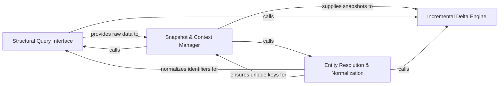

## Details

The core data access layer that retrieves Control Flow Graphs and class hierarchies, supporting incremental analysis through snapshots and deltas.

### Structural Query Interface
Acts as the primary API for retrieving deep structural data from the static analysis results, abstracting AST/LSP complexity into high-level graphs.

**Related Classes/Methods**:

- `static_analyzer.analysis_result.StaticAnalysisResults.get_cfg`:204-209
- `static_analyzer.analysis_result.StaticAnalysisResults.get_hierarchy`:211-220

**Source Files:**

- [`diagram_analysis/cluster_delta.py`](https://github.com/CodeBoarding/CodeBoarding/blob/main/.codeboardingdiagram_analysis/cluster_delta.py)
  - `diagram_analysis.cluster_delta.ClusterDelta` ([L46-L66](https://github.com/CodeBoarding/CodeBoarding/blob/main/.codeboardingdiagram_analysis/cluster_delta.py#L46-L66)) - Class
  - `diagram_analysis.cluster_delta.compute_cluster_delta` ([L69-L90](https://github.com/CodeBoarding/CodeBoarding/blob/main/.codeboardingdiagram_analysis/cluster_delta.py#L69-L90)) - Function
  - `diagram_analysis.cluster_delta._changeset_to_path_set` ([L93-L100](https://github.com/CodeBoarding/CodeBoarding/blob/main/.codeboardingdiagram_analysis/cluster_delta.py#L93-L100)) - Function
- [`diagram_analysis/cluster_snapshot.py`](https://github.com/CodeBoarding/CodeBoarding/blob/main/.codeboardingdiagram_analysis/cluster_snapshot.py)
  - `diagram_analysis.cluster_snapshot.ClusterSnapshotEntry` ([L22-L26](https://github.com/CodeBoarding/CodeBoarding/blob/main/.codeboardingdiagram_analysis/cluster_snapshot.py#L22-L26)) - Class
  - `diagram_analysis.cluster_snapshot.ClusterSnapshot` ([L30-L37](https://github.com/CodeBoarding/CodeBoarding/blob/main/.codeboardingdiagram_analysis/cluster_snapshot.py#L30-L37)) - Class
  - `diagram_analysis.cluster_snapshot.ClusterSnapshot.get_language` ([L33-L34](https://github.com/CodeBoarding/CodeBoarding/blob/main/.codeboardingdiagram_analysis/cluster_snapshot.py#L33-L34)) - Method

### Snapshot & Context Manager
Responsible for grouping methods and classes into logical clusters and capturing their state at a specific point in time for AI context windows.

**Related Classes/Methods**:

- `diagram_analysis.cluster_snapshot.snapshot_from_static_analysis`:40-59
- `diagram_analysis.cluster_snapshot.ClusterSnapshot`:30-37

**Source Files:**

- [`diagram_analysis/cluster_snapshot.py`](https://github.com/CodeBoarding/CodeBoarding/blob/main/.codeboardingdiagram_analysis/cluster_snapshot.py)
  - `diagram_analysis.cluster_snapshot.snapshot_from_static_analysis` ([L40-L59](https://github.com/CodeBoarding/CodeBoarding/blob/main/.codeboardingdiagram_analysis/cluster_snapshot.py#L40-L59)) - Function
  - `diagram_analysis.cluster_snapshot._entries_from_cfg_cache` ([L62-L83](https://github.com/CodeBoarding/CodeBoarding/blob/main/.codeboardingdiagram_analysis/cluster_snapshot.py#L62-L83)) - Function
  - `diagram_analysis.cluster_snapshot.snapshot_from_cluster_results` ([L86-L101](https://github.com/CodeBoarding/CodeBoarding/blob/main/.codeboardingdiagram_analysis/cluster_snapshot.py#L86-L101)) - Function
- [`static_analyzer/__init__.py`](https://github.com/CodeBoarding/CodeBoarding/blob/main/.codeboardingstatic_analyzer/__init__.py)
  - `static_analyzer.__init__.StaticAnalyzer._extract_language_dict` ([L641-L664](https://github.com/CodeBoarding/CodeBoarding/blob/main/.codeboardingstatic_analyzer/__init__.py#L641-L664)) - Method

### Incremental Delta Engine
Implements incremental analysis by comparing snapshots to identify structural changes and minimize computational costs.

**Related Classes/Methods**:

- `diagram_analysis.cluster_delta.compute_cluster_delta`:69-90

**Source Files:**

- [`static_analyzer/analysis_result.py`](https://github.com/CodeBoarding/CodeBoarding/blob/main/.codeboardingstatic_analyzer/analysis_result.py)
  - `static_analyzer.analysis_result.StaticAnalysisResults._get_bucket` ([L180-L182](https://github.com/CodeBoarding/CodeBoarding/blob/main/.codeboardingstatic_analyzer/analysis_result.py#L180-L182)) - Method
  - `static_analyzer.analysis_result.StaticAnalysisResults.get_cfg` ([L204-L209](https://github.com/CodeBoarding/CodeBoarding/blob/main/.codeboardingstatic_analyzer/analysis_result.py#L204-L209)) - Method
  - `static_analyzer.analysis_result.StaticAnalysisResults.get_hierarchy` ([L211-L220](https://github.com/CodeBoarding/CodeBoarding/blob/main/.codeboardingstatic_analyzer/analysis_result.py#L211-L220)) - Method

### Entity Resolution & Normalization
Ensures data integrity by resolving unique keys and fixing source code references across different analysis runs.

**Related Classes/Methods**: _None_

**Source Files:**

- [`static_analyzer/analysis_result.py`](https://github.com/CodeBoarding/CodeBoarding/blob/main/.codeboardingstatic_analyzer/analysis_result.py)
  - `static_analyzer.analysis_result.StaticAnalysisResults.get_package_dependencies` ([L222-L227](https://github.com/CodeBoarding/CodeBoarding/blob/main/.codeboardingstatic_analyzer/analysis_result.py#L222-L227)) - Method
  - `static_analyzer.analysis_result.StaticAnalysisResults.iter_reference_nodes` ([L290-L299](https://github.com/CodeBoarding/CodeBoarding/blob/main/.codeboardingstatic_analyzer/analysis_result.py#L290-L299)) - Method

### [FAQ](https://github.com/CodeBoarding/GeneratedOnBoardings/tree/main?tab=readme-ov-file#faq)