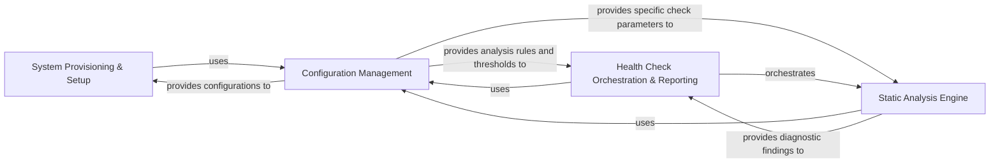

## Details

This component ensures the operational readiness and quality of the CodeBoarding system. It manages the installation and configuration of essential language server binaries and other dependencies, and performs health checks, such as identifying unused code diagnostics, to maintain code quality and system integrity.

### System Provisioning & Setup
This component is responsible for the initial setup and configuration of the CodeBoarding environment. It handles the downloading and installation of essential language server binaries and updates the configuration for static analysis tools, ensuring the system has the necessary dependencies to operate.

**Related Classes/Methods**:

- <a href="https://github.com/CodeBoarding/CodeBoarding/blob/main/.codeboardinginstall.py" target="_blank" rel="noopener noreferrer">`install.download_binaries`</a>
- <a href="https://github.com/CodeBoarding/CodeBoarding/blob/main/.codeboardinginstall.py" target="_blank" rel="noopener noreferrer">`install.update_static_analysis_config`</a>

### Configuration Management
This component centralizes the loading and provision of all configuration settings, thresholds, and exclusion patterns required by the System Provisioning & Health subsystem. It ensures consistent behavior across provisioning tasks and health checks by managing inputs from files like health_config.toml and .healthignore.

**Related Classes/Methods**:

- <a href="https://github.com/CodeBoarding/CodeBoarding/blob/main/.codeboardinghealth/config.py" target="_blank" rel="noopener noreferrer">`config.ConfigurationManager`</a>
- <a href="https://github.com/CodeBoarding/CodeBoarding/blob/main/.codeboardinghealth/config.py#L128-L172" target="_blank" rel="noopener noreferrer">`config.load_health_config`:128-172</a>
- <a href="https://github.com/CodeBoarding/CodeBoarding/blob/main/.codeboardinghealth/config.py" target="_blank" rel="noopener noreferrer">`config.load_ignore_patterns`</a>

### Health Check Orchestration & Reporting
This component orchestrates the entire health analysis workflow. It invokes individual static analysis checkers, applies exclusion patterns based on configuration, and aggregates their results into a comprehensive health report. It also defines the data structures (CodeMetricModels) for consistently representing these findings.

**Related Classes/Methods**:

- <a href="https://github.com/CodeBoarding/CodeBoarding/blob/main/.codeboardinghealth/__init__.py" target="_blank" rel="noopener noreferrer">`HealthCheckRunner`</a>
- <a href="https://github.com/CodeBoarding/CodeBoarding/blob/main/.codeboardinghealth/__init__.py" target="_blank" rel="noopener noreferrer">`CodeMetricModels`</a>

### Static Analysis Engine
This component comprises all specialized static analysis checkers that perform distinct types of code quality evaluations. It identifies issues such as unused code, "God Classes", measures cohesion/coupling, checks inheritance depth, detects circular dependencies, and analyzes function size, collecting LSP diagnostics to contribute specific findings to the overall health report.

**Related Classes/Methods**:

- <a href="https://github.com/CodeBoarding/CodeBoarding/blob/main/.codeboardinghealth/checks/unused_code_diagnostics.py" target="_blank" rel="noopener noreferrer">`health.checks.unused_code_diagnostics.LSPDiagnosticsCollector`</a>
- <a href="https://github.com/CodeBoarding/CodeBoarding/blob/main/.codeboardinghealth/checks/unused_code_diagnostics.py" target="_blank" rel="noopener noreferrer">`health.checks.unused_code_diagnostics.check_unused_code_diagnostics`</a>

### [FAQ](https://github.com/CodeBoarding/GeneratedOnBoardings/tree/main?tab=readme-ov-file#faq)
