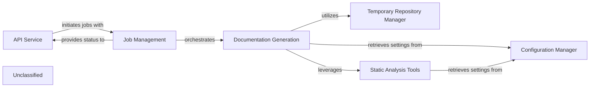

## Details

The system is designed to generate documentation from code repositories. It operates through an API Service that handles user requests and initiates documentation generation jobs. These jobs are managed by the Job Management component, which tracks their lifecycle and state. The core Documentation Generation component executes the actual process, involving cloning repositories via the Temporary Repository Manager, performing in-depth code analysis using the Static Analysis Tools (which include an enhanced Language Server Protocol client), and applying system settings provided by the Configuration Manager. This architecture ensures a clear separation of concerns, enabling efficient and scalable documentation generation.

### API Service
Handles all incoming API requests, validates inputs, initiates background jobs, and serves job status and results.

**Related Classes/Methods**:

- `api_service.APIService:handle_request`:1-10

### Job Management
Manages the persistence and state transitions of documentation generation jobs (e.g., PENDING, RUNNING, COMPLETED, FAILED) using a database.

**Related Classes/Methods**:

- `job_management.JobManager:create_job`:1-10

### Documentation Generation
Executes the core logic of cloning repositories, analyzing code, and generating documentation files, leveraging static analysis tools and configuration.

**Related Classes/Methods**:

- `doc_generation.DocGenerator:generate`

### Temporary Repository Manager
Handles the creation and cleanup of temporary directories used for cloning repositories and storing intermediate analysis results.

**Related Classes/Methods**:

- `temp_repo_manager.TempRepoManager:clone_repository`:1-10

### Static Analysis Tools
Provides enhanced language server functionalities (TypeScript, Pyright) and code analysis tools (tokei, gopls) used by the Documentation Generation component. Recent updates have significantly improved its internal LSP client's capabilities and robustness.

**Related Classes/Methods**:

- `static_analysis.Analyzer:run_analysis`

### Configuration Manager
Manages system configuration, including paths to static analysis tools, LLM provider settings, and repository roots, primarily through `static_analysis_config.yml` and `.env` files.

**Related Classes/Methods**:

- `config_manager.ConfigManager:load_config`:1-10

### Unclassified
Component for all unclassified files and utility functions (Utility functions/External Libraries/Dependencies)

**Related Classes/Methods**: _None_

### [FAQ](https://github.com/CodeBoarding/GeneratedOnBoardings/tree/main?tab=readme-ov-file#faq)
