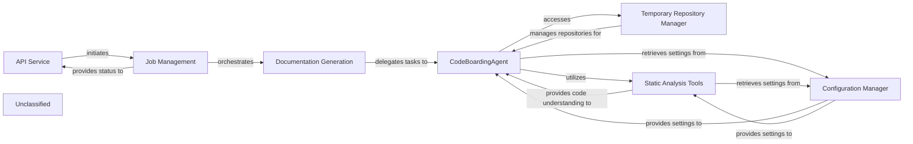

## Details

The system's core flow begins with the API Service receiving requests, which are then managed by Job Management. Job Management orchestrates the Documentation Generation process. The Documentation Generation component delegates the crucial task of understanding the codebase and generating content to the CodeBoardingAgent. The CodeBoardingAgent, acting as the central intelligence, leverages the Static Analysis Tools for deep code understanding, which has been significantly enhanced through an updated LSP client. It also uses the Temporary Repository Manager to access and manage the codebase. All components rely on the Configuration Manager for system settings. The refined internal mechanisms of CodeBoardingAgent and the enhanced Static Analysis Tools lead to more robust and accurate documentation generation.

### API Service
Acts as the external entry point for the system, initiating and monitoring documentation generation jobs.

**Related Classes/Methods**:

### Job Management
Manages the lifecycle of documentation jobs, tracking their progress, status, and orchestrating the overall generation process.

**Related Classes/Methods**:

- `job_management.JobManager`:1-10

### Documentation Generation
Orchestrates the detailed process of generating documentation content by delegating specific tasks to the CodeBoardingAgent.

**Related Classes/Methods**:

### CodeBoardingAgent
The central intelligence component, now with significantly refined internal mechanisms, responsible for deeply understanding the codebase, efficiently retrieving information, and generating robust documentation content. Its internal tools for information retrieval and response formulation have been substantially enhanced.

**Related Classes/Methods**:

- <a href="https://github.com/CodeBoarding/CodeBoarding/blob/main/.codeboardingagents/abstraction_agent.py" target="_blank" rel="noopener noreferrer">`None`</a>
- <a href="https://github.com/CodeBoarding/CodeBoarding/blob/main/.codeboardingagents/agent.py" target="_blank" rel="noopener noreferrer">`None`</a>
- <a href="https://github.com/CodeBoarding/CodeBoarding/blob/main/.codeboardingagents/agent_responses.py" target="_blank" rel="noopener noreferrer">`None`</a>
- <a href="https://github.com/CodeBoarding/CodeBoarding/blob/main/.codeboardingagents/details_agent.py" target="_blank" rel="noopener noreferrer">`None`</a>
- <a href="https://github.com/CodeBoarding/CodeBoarding/blob/main/.codeboardingagents/tools/read_docs.py" target="_blank" rel="noopener noreferrer">`None`</a>
- <a href="https://github.com/CodeBoarding/CodeBoarding/blob/main/.codeboardingagents/tools/read_file.py" target="_blank" rel="noopener noreferrer">`None`</a>
- <a href="https://github.com/CodeBoarding/CodeBoarding/blob/main/.codeboardingagents/tools/read_file_structure.py" target="_blank" rel="noopener noreferrer">`None`</a>

### Temporary Repository Manager
Supports the CodeBoardingAgent by managing the cloning of repositories and handling temporary file storage for analysis.

**Related Classes/Methods**:

- `temp_repo_manager.TemporaryRepositoryManager`

### Static Analysis Tools
Provides enhanced, in-depth code understanding capabilities to the CodeBoardingAgent through a significantly overhauled Language Server Protocol (LSP) client, improving the quality and depth of code analysis for various programming languages.

**Related Classes/Methods**:

- <a href="https://github.com/CodeBoarding/CodeBoarding/blob/main/.codeboardingstatic_analyzer/lsp_client/client.py" target="_blank" rel="noopener noreferrer">`None`</a>
- <a href="https://github.com/CodeBoarding/CodeBoarding/blob/main/.codeboardingstatic_analyzer/programming_language.py" target="_blank" rel="noopener noreferrer">`static_analyzer.programming_language`</a>

### Configuration Manager
Centralized component for providing all system settings and configurations to other components, ensuring consistent operational parameters.

**Related Classes/Methods**:

- `config_manager.ConfigurationManager`:1-10

### Unclassified
Component for all unclassified files and utility functions (Utility functions/External Libraries/Dependencies)

**Related Classes/Methods**: _None_

### [FAQ](https://github.com/CodeBoarding/GeneratedOnBoardings/tree/main?tab=readme-ov-file#faq)
