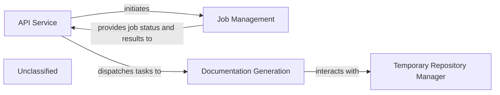

## Details

The CodeBoarding system is structured around an `API Service` that acts as the primary interface for users to generate architectural documentation and diagrams from GitHub repositories. This service, built with FastAPI, handles job creation and status retrieval, offloading the computationally intensive `Documentation Generation` process to asynchronous background tasks. A `Job Management` component is responsible for persisting job states and results, ensuring reliable tracking of each documentation request. During the `Documentation Generation` phase, a `Temporary Repository Manager` is utilized to handle the cloning and cleanup of repository data, isolating the generation process and maintaining system cleanliness. This architecture ensures a responsive user experience while efficiently managing resource-intensive analysis tasks.

### API Service
Handles all incoming API requests, validates inputs, initiates background jobs, and serves job status and results.

**Related Classes/Methods**:

- <a href="https://github.com/CodeBoarding/CodeBoarding/blob/main/.codeboardinglocal_app.py" target="_blank" rel="noopener noreferrer">`local_app.app`</a>

### Job Management
Manages the persistence and state transitions of documentation generation jobs (e.g., PENDING, RUNNING, COMPLETED, FAILED).

**Related Classes/Methods**:

- <a href="https://github.com/CodeBoarding/CodeBoarding/blob/main/.codeboardinglocal_app.py#L80-L92" target="_blank" rel="noopener noreferrer">`make_job`:80-92</a>
- <a href="https://github.com/CodeBoarding/CodeBoarding/blob/main/.codeboardingduckdb_crud.py#L49-L65" target="_blank" rel="noopener noreferrer">`insert_job`:49-65</a>
- <a href="https://github.com/CodeBoarding/CodeBoarding/blob/main/.codeboardingduckdb_crud.py#L80-L99" target="_blank" rel="noopener noreferrer">`fetch_job`:80-99</a>

### Documentation Generation
Executes the core logic of cloning repositories, analyzing code, and generating documentation files.

**Related Classes/Methods**:

- <a href="https://github.com/CodeBoarding/CodeBoarding/blob/main/.codeboardinglocal_app.py#L95-L166" target="_blank" rel="noopener noreferrer">`generate_onboarding`:95-166</a>
- <a href="https://github.com/CodeBoarding/CodeBoarding/blob/main/.codeboardinglocal_app.py#L362-L440" target="_blank" rel="noopener noreferrer">`process_docs_generation_job`:362-440</a>

### Temporary Repository Manager
Handles the creation and cleanup of temporary directories used for cloning repositories and storing intermediate analysis results.

**Related Classes/Methods**:

- `manage_temp_repo`

### Unclassified
Component for all unclassified files and utility functions (Utility functions/External Libraries/Dependencies)

**Related Classes/Methods**: _None_

### [FAQ](https://github.com/CodeBoarding/GeneratedOnBoardings/tree/main?tab=readme-ov-file#faq)
