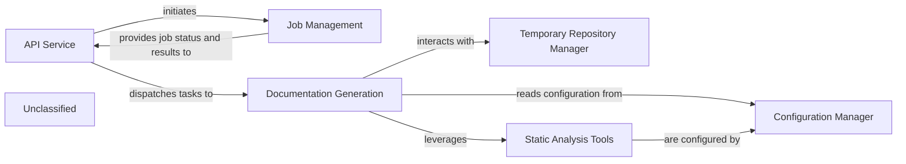

## Details

The system is centered around an API Service that handles user requests and orchestrates Job Management for documentation generation tasks. The Documentation Generation component, a core processing unit, performs code analysis and documentation creation. It relies on a Temporary Repository Manager for handling temporary files and repositories. Crucially, the Documentation Generation component now leverages a suite of Static Analysis Tools (including TypeScript Language Server, Pyright, tokei, and gopls) and is configured through a Configuration Manager that manages static_analysis_config.yml and .env files, ensuring the correct setup and operation of the analysis tools and LLM integrations.

### API Service
Handles all incoming API requests, validates inputs, initiates background jobs, and serves job status and results.

**Related Classes/Methods**:

- <a href="https://github.com/CodeBoarding/CodeBoarding/blob/main/.codeboardinglocal_app.py" target="_blank" rel="noopener noreferrer">`local_app.app`</a>

### Job Management
Manages the persistence and state transitions of documentation generation jobs (e.g., PENDING, RUNNING, COMPLETED, FAILED).

**Related Classes/Methods**:

- <a href="https://github.com/CodeBoarding/CodeBoarding/blob/main/.codeboardinglocal_app.py#L80-L92" target="_blank" rel="noopener noreferrer">`make_job`:80-92</a>
- <a href="https://github.com/CodeBoarding/CodeBoarding/blob/main/.codeboardingduckdb_crud.py#L49-L65" target="_blank" rel="noopener noreferrer">`insert_job`:49-65</a>
- <a href="https://github.com/CodeBoarding/CodeBoarding/blob/main/.codeboardingduckdb_crud.py#L80-L99" target="_blank" rel="noopener noreferrer">`fetch_job`:80-99</a>

### Documentation Generation
Executes the core logic of cloning repositories, analyzing code, and generating documentation files, leveraging static analysis tools and configuration.

**Related Classes/Methods**:

- <a href="https://github.com/CodeBoarding/CodeBoarding/blob/main/.codeboardinglocal_app.py#L95-L166" target="_blank" rel="noopener noreferrer">`generate_onboarding`:95-166</a>
- <a href="https://github.com/CodeBoarding/CodeBoarding/blob/main/.codeboardinglocal_app.py#L362-L440" target="_blank" rel="noopener noreferrer">`process_docs_generation_job`:362-440</a>

### Temporary Repository Manager
Handles the creation and cleanup of temporary directories used for cloning repositories and storing intermediate analysis results.

**Related Classes/Methods**:

- `manage_temp_repo`:1-10

### Static Analysis Tools
Provides language server functionalities (TypeScript, Pyright) and code analysis tools (tokei, gopls) used by the Documentation Generation component.

**Related Classes/Methods**:

- <a href="https://github.com/CodeBoarding/CodeBoarding/blob/main/.codeboardingsetup.py" target="_blank" rel="noopener noreferrer">`setup.py`</a>
- <a href="https://github.com/CodeBoarding/CodeBoarding/blob/main/.codeboardingstatic_analysis_config.yml" target="_blank" rel="noopener noreferrer">`static_analysis_config.yml`</a>

### Configuration Manager
Manages system configuration, including paths to static analysis tools, LLM provider settings, and repository roots, primarily through static_analysis_config.yml and .env files.

**Related Classes/Methods**:

- <a href="https://github.com/CodeBoarding/CodeBoarding/blob/main/.codeboardingsetup.py" target="_blank" rel="noopener noreferrer">`setup.py`</a>
- <a href="https://github.com/CodeBoarding/CodeBoarding/blob/main/.codeboardingstatic_analysis_config.yml" target="_blank" rel="noopener noreferrer">`static_analysis_config.yml`</a>
- `.env`

### Unclassified
Component for all unclassified files and utility functions (Utility functions/External Libraries/Dependencies)

**Related Classes/Methods**: _None_

### [FAQ](https://github.com/CodeBoarding/GeneratedOnBoardings/tree/main?tab=readme-ov-file#faq)
