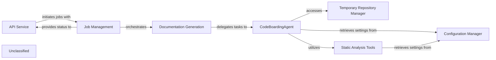

## Details

The system is structured around an `API Service` that manages incoming requests and initiates documentation generation workflows. These workflows are handled by `Job Management`, which orchestrates the `Documentation Generation` component. The core of the documentation process is driven by the `CodeBoardingAgent`, an intelligent component that leverages various `Static Analysis Tools` for deep code understanding, interacts with the `Temporary Repository Manager` for repository handling, and retrieves essential settings from the `Configuration Manager`. This agent-centric approach allows for dynamic and comprehensive documentation generation, with job statuses and results reported back through `Job Management` to the `API Service`.

### API Service
Handles all incoming API requests, validates inputs, initiates background jobs, and serves job status and results.

**Related Classes/Methods**:

- `api_service.APIService:handle_request`:1-10

### Job Management
Manages the persistence and state transitions of documentation generation jobs (e.g., PENDING, RUNNING, COMPLETED, FAILED) using a database.

**Related Classes/Methods**:

- `job_management.JobManager:create_job`:1-10

### Documentation Generation
Orchestrates the overall documentation generation process, delegating the core analysis and content creation to the `CodeBoardingAgent`.

**Related Classes/Methods**:

- `doc_generation.DocGenerator:generate`:1-10

### CodeBoardingAgent
An intelligent agent responsible for orchestrating code analysis, information retrieval, and documentation content generation using LLMs and specialized tools. It interacts with static analysis tools, reads code references, and manages file structures.

**Related Classes/Methods**:

- <a href="https://github.com/CodeBoarding/CodeBoarding/blob/main/.codeboardingagents/agent.py" target="_blank" rel="noopener noreferrer">`agents.agent.CodeBoardingAgent`</a>

### Temporary Repository Manager
Handles the creation and cleanup of temporary directories used for cloning repositories and storing intermediate analysis results.

**Related Classes/Methods**:

- `temp_repo_manager.TempRepoManager:clone_repository`:1-10

### Static Analysis Tools
Provides enhanced language server functionalities (TypeScript, Pyright) and code analysis tools (tokei, gopls) used by the `CodeBoardingAgent` for in-depth code understanding.

**Related Classes/Methods**:

- <a href="https://github.com/CodeBoarding/CodeBoarding/blob/main/.codeboardingstatic_analyzer/scanner.py#L17-L70" target="_blank" rel="noopener noreferrer">`static_analysis.Analyzer:run_analysis`:17-70</a>

### Configuration Manager
Manages system configuration, including paths to static analysis tools, LLM provider settings, and repository roots, primarily through `static_analysis_config.yml` and `.env` files.

**Related Classes/Methods**:

- `config_manager.ConfigManager:load_config`:1-10

### Unclassified
Component for all unclassified files and utility functions (Utility functions/External Libraries/Dependencies)

**Related Classes/Methods**: _None_

### [FAQ](https://github.com/CodeBoarding/GeneratedOnBoardings/tree/main?tab=readme-ov-file#faq)
