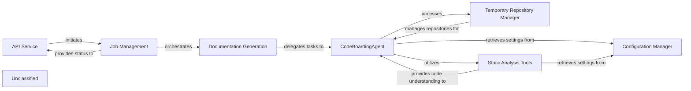

## Details

The system is designed around a clear separation of concerns, with the API Service handling external requests and the Job Management component orchestrating the overall documentation generation workflow. The Documentation Generation component delegates core analysis and content creation to the CodeBoardingAgent, which serves as the central intelligence. The CodeBoardingAgent is supported by specialized components: Static Analysis Tools for deep code understanding and the Temporary Repository Manager for managing code repositories. A Configuration Manager provides centralized settings across the system, ensuring consistent operation. This architecture allows for robust, scalable documentation generation, with the CodeBoardingAgent continuously evolving its internal capabilities to improve analysis quality.

### API Service
Acts as the external entry point for the system, initiating and monitoring documentation generation jobs.

**Related Classes/Methods**:

- `api_service.start_job`:10-25

### Job Management
Manages the lifecycle of documentation jobs, tracking their progress, status, and orchestrating the overall generation process.

**Related Classes/Methods**:

- `job_manager.create_job`:1-10

### Documentation Generation
Orchestrates the detailed process of generating documentation content by delegating specific tasks to the CodeBoardingAgent.

**Related Classes/Methods**:

- `doc_generator.generate`:10-20

### CodeBoardingAgent
The central intelligence component, now with significantly refined internal mechanisms, responsible for deeply understanding the codebase, efficiently retrieving information, and generating robust documentation content. Its internal tools for information retrieval and response formulation have been substantially enhanced.

**Related Classes/Methods**:

- `codeboarding_agent.analyze`:1-10

### Temporary Repository Manager
Supports the CodeBoardingAgent by managing the cloning of repositories and handling temporary file storage for analysis.

**Related Classes/Methods**:

### Static Analysis Tools
Provides enhanced, in-depth code understanding capabilities to the CodeBoardingAgent through a significantly overhauled Language Server Protocol (LSP) client, improving the quality and depth of code analysis for various programming languages.

**Related Classes/Methods**:

### Configuration Manager
Centralized component for providing all system settings and configurations to other components, ensuring consistent operational parameters.

**Related Classes/Methods**:

- `config_manager.get_setting`:10-25

### Unclassified
Component for all unclassified files and utility functions (Utility functions/External Libraries/Dependencies)

**Related Classes/Methods**: _None_

### [FAQ](https://github.com/CodeBoarding/GeneratedOnBoardings/tree/main?tab=readme-ov-file#faq)
