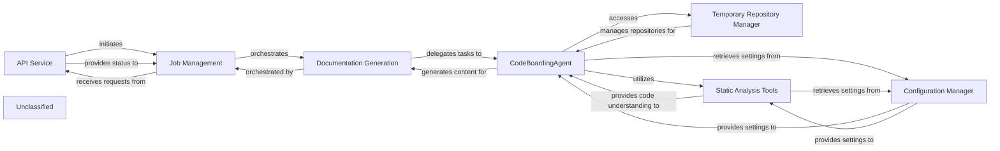

## Details

The system is designed around a robust documentation generation pipeline. The `API Service` acts as the entry point, initiating and monitoring documentation jobs managed by the `Job Management` component. The `Documentation Generation` orchestrates the overall process, delegating the core analysis and content creation to the `CodeBoardingAgent`. This intelligent agent leverages enhanced `Static Analysis Tools` for in-depth code understanding, now with expanded capabilities for handling various programming languages. It also utilizes the `Temporary Repository Manager` for managing code repositories and relies on the `Configuration Manager` for all system settings, including those for static analysis and agent behavior. This architecture ensures a clear separation of concerns, enabling efficient and scalable documentation generation.

### API Service
Acts as the entry point for the system, initiating and monitoring documentation jobs.

**Related Classes/Methods**:

### Job Management
Manages the lifecycle of documentation jobs, tracking their progress and status.

**Related Classes/Methods**:

- `job_management.JobManager`

### Documentation Generation
Orchestrates the overall process of generating documentation, delegating tasks to other components.

**Related Classes/Methods**:

- `doc_generation.DocumentationGenerator`

### CodeBoardingAgent
The central intelligence responsible for understanding the codebase, retrieving information, and generating documentation content.

**Related Classes/Methods**:

- `codeboarding_agent.CodeBoardingAgent`

### Temporary Repository Manager
Assists the CodeBoardingAgent by handling repository cloning and temporary file storage.

**Related Classes/Methods**:

- `temp_repo_manager.TemporaryRepositoryManager`:1-10

### Static Analysis Tools
Provides in-depth code understanding to the CodeBoardingAgent, with enhanced capabilities for defining and processing various programming languages.

**Related Classes/Methods**:

- <a href="https://github.com/CodeBoarding/CodeBoarding/blob/main/.codeboardingstatic_analyzer/programming_language.py" target="_blank" rel="noopener noreferrer">`static_analyzer.programming_language`</a>

### Configuration Manager
Provides all system settings and configurations to other components.

**Related Classes/Methods**:

- `config_manager.ConfigurationManager`:1-10

### Unclassified
Component for all unclassified files and utility functions (Utility functions/External Libraries/Dependencies)

**Related Classes/Methods**: _None_

### [FAQ](https://github.com/CodeBoarding/GeneratedOnBoardings/tree/main?tab=readme-ov-file#faq)
