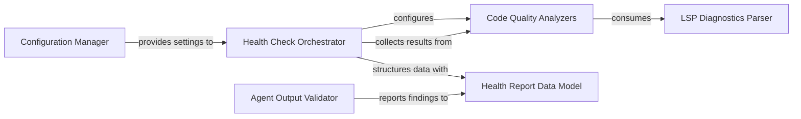

## Details

Validates the integrity and correctness of analysis results, including cluster coverage and component relationships, and performs various code health checks. This component ensures the quality and reliability of the generated analysis and documentation.

### Health Check Orchestrator
Manages the execution flow of all defined health checks, aggregates their individual results, applies global and check-specific configuration settings, and compiles a comprehensive health report for the codebase. It acts as the central coordinator for all health-related analyses.

**Related Classes/Methods**:

- <a href="https://github.com/CodeBoarding/CodeBoarding/blob/main/.codeboardinghealth/runner.py" target="_blank" rel="noopener noreferrer">`health.runner.run_all_checks`</a>

### Health Report Data Model
Defines the standardized data structures and schemas for representing health check configurations, summaries of individual checks, detailed findings (e.g., `FindingEntity`, `FindingGroup`), and the overall structured health report. This ensures consistency and facilitates automated documentation and structured reporting.

**Related Classes/Methods**:

- <a href="https://github.com/CodeBoarding/CodeBoarding/blob/main/.codeboardinghealth/models.py" target="_blank" rel="noopener noreferrer">`health.models`</a>

### Code Quality Analyzers
A collection of specialized modules, each responsible for performing a specific code quality or structural analysis. Examples include checks for unused code, "god classes," coupling, cohesion, inheritance patterns, function size, circular dependencies, and module instability. These are the analytical engines that identify specific code patterns and potential issues.

**Related Classes/Methods**:

- <a href="https://github.com/CodeBoarding/CodeBoarding/blob/main/.codeboardinghealth/checks/unused_code_diagnostics.py" target="_blank" rel="noopener noreferrer">`health.checks.unused_code_diagnostics`</a>
- <a href="https://github.com/CodeBoarding/CodeBoarding/blob/main/.codeboardinghealth/checks/god_class.py" target="_blank" rel="noopener noreferrer">`health.checks.god_class`</a>

### Configuration Manager
Responsible for loading, parsing, and managing health check configurations and exclusion patterns from project-specific files (e.g., `.healthcheckrc`). This allows developers to customize analysis behavior, set thresholds, and ignore irrelevant findings based on project requirements.

**Related Classes/Methods**:

- <a href="https://github.com/CodeBoarding/CodeBoarding/blob/main/.codeboardinghealth/config.py" target="_blank" rel="noopener noreferrer">`health.config`</a>

### LSP Diagnostics Parser
Processes and structures diagnostic messages received from Language Server Protocols (LSP). It converts raw, language-agnostic LSP data into a standardized, consumable format that can be utilized by various health checks and other analysis components within the system.

**Related Classes/Methods**:

- <a href="https://github.com/CodeBoarding/CodeBoarding/blob/main/.codeboardingstatic_analyzer/lsp_client/diagnostics.py" target="_blank" rel="noopener noreferrer">`static_analyzer.lsp_client.diagnostics.LSPDiagnosticsCollector`</a>

### Agent Output Validator
Validates the accuracy, completeness, and consistency of classifications and analyses generated by AI agents. This includes verifying proper cluster coverage, correct file assignments to components, and the logical relationships between identified components, ensuring the reliability of AI-generated insights.

**Related Classes/Methods**:

- <a href="https://github.com/CodeBoarding/CodeBoarding/blob/main/.codeboardingagents/validation.py" target="_blank" rel="noopener noreferrer">`agents.validation.validate_agent_output`</a>

### [FAQ](https://github.com/CodeBoarding/GeneratedOnBoardings/tree/main?tab=readme-ov-file#faq)
