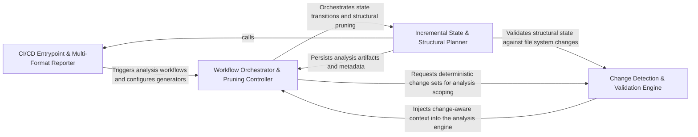

## Details

Orchestrates the end-to-end analysis pipeline, including GitHub Action integration, health checks, and the generation of final documentation artifacts in various formats.

### CI/CD Entrypoint & Multi-Format Reporter [[Expand]](./CI_CD_Entrypoint_Multi_Format_Reporter.md)
Serves as the primary interface for external automation, handling environment setup, depth-level resolution, and the generation of final documentation artifacts in Markdown, HTML, MDX, and RST formats.

**Related Classes/Methods**:

- `github_action.generate_analysis`:99-143
- `github_action.generate_markdown`:16-30
- `health_main.run_health_check_local`:29-49

**Source Files:**

- [`agents/llm_config.py`](https://github.com/CodeBoarding/CodeBoarding/blob/main/.codeboardingagents/llm_config.py)
  - `agents.llm_config.configure_models` ([L54-L80](https://github.com/CodeBoarding/CodeBoarding/blob/main/.codeboardingagents/llm_config.py#L54-L80)) - Function
  - `agents.llm_config.supports_prompt_caching` ([L485-L491](https://github.com/CodeBoarding/CodeBoarding/blob/main/.codeboardingagents/llm_config.py#L485-L491)) - Function
- [`codeboarding_cli/bootstrap.py`](https://github.com/CodeBoarding/CodeBoarding/blob/main/.codeboardingcodeboarding_cli/bootstrap.py)
  - `codeboarding_cli.bootstrap.resolve_local_run_paths` ([L17-L26](https://github.com/CodeBoarding/CodeBoarding/blob/main/.codeboardingcodeboarding_cli/bootstrap.py#L17-L26)) - Function
  - `codeboarding_cli.bootstrap.bootstrap_environment` ([L29-L44](https://github.com/CodeBoarding/CodeBoarding/blob/main/.codeboardingcodeboarding_cli/bootstrap.py#L29-L44)) - Function
- [`codeboarding_cli/commands/full_analysis.py`](https://github.com/CodeBoarding/CodeBoarding/blob/main/.codeboardingcodeboarding_cli/commands/full_analysis.py)
  - `codeboarding_cli.commands.full_analysis.add_arguments` ([L25-L55](https://github.com/CodeBoarding/CodeBoarding/blob/main/.codeboardingcodeboarding_cli/commands/full_analysis.py#L25-L55)) - Function
  - `codeboarding_cli.commands.full_analysis.validate_arguments` ([L58-L71](https://github.com/CodeBoarding/CodeBoarding/blob/main/.codeboardingcodeboarding_cli/commands/full_analysis.py#L58-L71)) - Function
  - `codeboarding_cli.commands.full_analysis.run_from_args` ([L74-L80](https://github.com/CodeBoarding/CodeBoarding/blob/main/.codeboardingcodeboarding_cli/commands/full_analysis.py#L74-L80)) - Function
  - `codeboarding_cli.commands.full_analysis._run_local` ([L83-L117](https://github.com/CodeBoarding/CodeBoarding/blob/main/.codeboardingcodeboarding_cli/commands/full_analysis.py#L83-L117)) - Function
  - `codeboarding_cli.commands.full_analysis._run_local.scope` ([L97-L105](https://github.com/CodeBoarding/CodeBoarding/blob/main/.codeboardingcodeboarding_cli/commands/full_analysis.py#L97-L105)) - Function
  - `codeboarding_cli.commands.full_analysis._run_remote` ([L120-L158](https://github.com/CodeBoarding/CodeBoarding/blob/main/.codeboardingcodeboarding_cli/commands/full_analysis.py#L120-L158)) - Function
  - `codeboarding_cli.commands.full_analysis._process_one_remote` ([L161-L207](https://github.com/CodeBoarding/CodeBoarding/blob/main/.codeboardingcodeboarding_cli/commands/full_analysis.py#L161-L207)) - Function
  - `codeboarding_cli.commands.full_analysis._process_one_remote.scope` ([L168-L201](https://github.com/CodeBoarding/CodeBoarding/blob/main/.codeboardingcodeboarding_cli/commands/full_analysis.py#L168-L201)) - Function
- [`codeboarding_cli/commands/incremental_analysis.py`](https://github.com/CodeBoarding/CodeBoarding/blob/main/.codeboardingcodeboarding_cli/commands/incremental_analysis.py)
  - `codeboarding_cli.commands.incremental_analysis.add_arguments` ([L18-L23](https://github.com/CodeBoarding/CodeBoarding/blob/main/.codeboardingcodeboarding_cli/commands/incremental_analysis.py#L18-L23)) - Function
  - `codeboarding_cli.commands.incremental_analysis.validate_arguments` ([L26-L28](https://github.com/CodeBoarding/CodeBoarding/blob/main/.codeboardingcodeboarding_cli/commands/incremental_analysis.py#L26-L28)) - Function
  - `codeboarding_cli.commands.incremental_analysis.run_from_args` ([L31-L85](https://github.com/CodeBoarding/CodeBoarding/blob/main/.codeboardingcodeboarding_cli/commands/incremental_analysis.py#L31-L85)) - Function
  - `codeboarding_cli.commands.incremental_analysis._emit_error` ([L88-L95](https://github.com/CodeBoarding/CodeBoarding/blob/main/.codeboardingcodeboarding_cli/commands/incremental_analysis.py#L88-L95)) - Function
  - `codeboarding_cli.commands.incremental_analysis._emit` ([L98-L101](https://github.com/CodeBoarding/CodeBoarding/blob/main/.codeboardingcodeboarding_cli/commands/incremental_analysis.py#L98-L101)) - Function
- [`codeboarding_cli/commands/partial_analysis.py`](https://github.com/CodeBoarding/CodeBoarding/blob/main/.codeboardingcodeboarding_cli/commands/partial_analysis.py)
  - `codeboarding_cli.commands.partial_analysis.add_arguments` ([L17-L28](https://github.com/CodeBoarding/CodeBoarding/blob/main/.codeboardingcodeboarding_cli/commands/partial_analysis.py#L17-L28)) - Function
  - `codeboarding_cli.commands.partial_analysis.validate_arguments` ([L31-L33](https://github.com/CodeBoarding/CodeBoarding/blob/main/.codeboardingcodeboarding_cli/commands/partial_analysis.py#L31-L33)) - Function
  - `codeboarding_cli.commands.partial_analysis.run_from_args` ([L36-L69](https://github.com/CodeBoarding/CodeBoarding/blob/main/.codeboardingcodeboarding_cli/commands/partial_analysis.py#L36-L69)) - Function
  - `codeboarding_cli.commands.partial_analysis.run_from_args.scope` ([L51-L56](https://github.com/CodeBoarding/CodeBoarding/blob/main/.codeboardingcodeboarding_cli/commands/partial_analysis.py#L51-L56)) - Function
- [`codeboarding_cli/view_instructions.py`](https://github.com/CodeBoarding/CodeBoarding/blob/main/.codeboardingcodeboarding_cli/view_instructions.py)
  - `codeboarding_cli.view_instructions.print_view_instructions` ([L20-L41](https://github.com/CodeBoarding/CodeBoarding/blob/main/.codeboardingcodeboarding_cli/view_instructions.py#L20-L41)) - Function
- [`codeboarding_workflows/analysis.py`](https://github.com/CodeBoarding/CodeBoarding/blob/main/.codeboardingcodeboarding_workflows/analysis.py)
  - `codeboarding_workflows.analysis.run_full` ([L49-L74](https://github.com/CodeBoarding/CodeBoarding/blob/main/.codeboardingcodeboarding_workflows/analysis.py#L49-L74)) - Function
- [`codeboarding_workflows/orchestration.py`](https://github.com/CodeBoarding/CodeBoarding/blob/main/.codeboardingcodeboarding_workflows/orchestration.py)
  - `codeboarding_workflows.orchestration.run_analysis_pipeline` ([L25-L48](https://github.com/CodeBoarding/CodeBoarding/blob/main/.codeboardingcodeboarding_workflows/orchestration.py#L25-L48)) - Function
- [`codeboarding_workflows/rendering.py`](https://github.com/CodeBoarding/CodeBoarding/blob/main/.codeboardingcodeboarding_workflows/rendering.py)
  - `codeboarding_workflows.rendering.render_docs` ([L104-L139](https://github.com/CodeBoarding/CodeBoarding/blob/main/.codeboardingcodeboarding_workflows/rendering.py#L104-L139)) - Function
- [`codeboarding_workflows/sources/local.py`](https://github.com/CodeBoarding/CodeBoarding/blob/main/.codeboardingcodeboarding_workflows/sources/local.py)
  - `codeboarding_workflows.sources.local.SourceContext` ([L8-L18](https://github.com/CodeBoarding/CodeBoarding/blob/main/.codeboardingcodeboarding_workflows/sources/local.py#L8-L18)) - Class
  - `codeboarding_workflows.sources.local.local_source` ([L22-L23](https://github.com/CodeBoarding/CodeBoarding/blob/main/.codeboardingcodeboarding_workflows/sources/local.py#L22-L23)) - Function
- [`codeboarding_workflows/sources/remote.py`](https://github.com/CodeBoarding/CodeBoarding/blob/main/.codeboardingcodeboarding_workflows/sources/remote.py)
  - `codeboarding_workflows.sources.remote.onboarding_materials_exist` ([L18-L28](https://github.com/CodeBoarding/CodeBoarding/blob/main/.codeboardingcodeboarding_workflows/sources/remote.py#L18-L28)) - Function
  - `codeboarding_workflows.sources.remote.remote_source` ([L32-L71](https://github.com/CodeBoarding/CodeBoarding/blob/main/.codeboardingcodeboarding_workflows/sources/remote.py#L32-L71)) - Function
- [`core/__init__.py`](https://github.com/CodeBoarding/CodeBoarding/blob/main/.codeboardingcore/__init__.py)
  - `core.__init__.Registries` ([L30-L38](https://github.com/CodeBoarding/CodeBoarding/blob/main/.codeboardingcore/__init__.py#L30-L38)) - Class
  - `core.__init__.Registries.__init__` ([L36-L38](https://github.com/CodeBoarding/CodeBoarding/blob/main/.codeboardingcore/__init__.py#L36-L38)) - Method
  - `core.__init__.get_registries` ([L44-L49](https://github.com/CodeBoarding/CodeBoarding/blob/main/.codeboardingcore/__init__.py#L44-L49)) - Function
  - `core.__init__.reset_registries` ([L52-L55](https://github.com/CodeBoarding/CodeBoarding/blob/main/.codeboardingcore/__init__.py#L52-L55)) - Function
  - `core.__init__.run_plugin_health_checks` ([L58-L74](https://github.com/CodeBoarding/CodeBoarding/blob/main/.codeboardingcore/__init__.py#L58-L74)) - Function
  - `core.__init__.load_plugin_tools` ([L77-L89](https://github.com/CodeBoarding/CodeBoarding/blob/main/.codeboardingcore/__init__.py#L77-L89)) - Function
- [`core/plugin_loader.py`](https://github.com/CodeBoarding/CodeBoarding/blob/main/.codeboardingcore/plugin_loader.py)
  - `core.plugin_loader.load_plugins` ([L17-L46](https://github.com/CodeBoarding/CodeBoarding/blob/main/.codeboardingcore/plugin_loader.py#L17-L46)) - Function
- [`core/registry.py`](https://github.com/CodeBoarding/CodeBoarding/blob/main/.codeboardingcore/registry.py)
  - `core.registry.DuplicateRegistrationError` ([L8-L9](https://github.com/CodeBoarding/CodeBoarding/blob/main/.codeboardingcore/registry.py#L8-L9)) - Class
  - `core.registry.Registry` ([L12-L46](https://github.com/CodeBoarding/CodeBoarding/blob/main/.codeboardingcore/registry.py#L12-L46)) - Class
  - `core.registry.Registry.__init__` ([L20-L22](https://github.com/CodeBoarding/CodeBoarding/blob/main/.codeboardingcore/registry.py#L20-L22)) - Method
  - `core.registry.Registry.register` ([L24-L29](https://github.com/CodeBoarding/CodeBoarding/blob/main/.codeboardingcore/registry.py#L24-L29)) - Method
  - `core.registry.Registry.get` ([L31-L33](https://github.com/CodeBoarding/CodeBoarding/blob/main/.codeboardingcore/registry.py#L31-L33)) - Method
  - `core.registry.Registry.all` ([L35-L37](https://github.com/CodeBoarding/CodeBoarding/blob/main/.codeboardingcore/registry.py#L35-L37)) - Method
  - `core.registry.Registry.__len__` ([L39-L40](https://github.com/CodeBoarding/CodeBoarding/blob/main/.codeboardingcore/registry.py#L39-L40)) - Method
  - `core.registry.Registry.__contains__` ([L42-L43](https://github.com/CodeBoarding/CodeBoarding/blob/main/.codeboardingcore/registry.py#L42-L43)) - Method
  - `core.registry.Registry.__repr__` ([L45-L46](https://github.com/CodeBoarding/CodeBoarding/blob/main/.codeboardingcore/registry.py#L45-L46)) - Method
- [`diagram_analysis/__init__.py`](https://github.com/CodeBoarding/CodeBoarding/blob/main/.codeboardingdiagram_analysis/__init__.py)
  - `diagram_analysis.__init__.__getattr__` ([L6-L30](https://github.com/CodeBoarding/CodeBoarding/blob/main/.codeboardingdiagram_analysis/__init__.py#L6-L30)) - Function
- [`diagram_analysis/diagram_generator.py`](https://github.com/CodeBoarding/CodeBoarding/blob/main/.codeboardingdiagram_analysis/diagram_generator.py)
  - `diagram_analysis.diagram_generator.DiagramGenerator._run_health_report` ([L727-L745](https://github.com/CodeBoarding/CodeBoarding/blob/main/.codeboardingdiagram_analysis/diagram_generator.py#L727-L745)) - Method
- [`diagram_analysis/run_context.py`](https://github.com/CodeBoarding/CodeBoarding/blob/main/.codeboardingdiagram_analysis/run_context.py)
  - `diagram_analysis.run_context.RunPaths` ([L20-L25](https://github.com/CodeBoarding/CodeBoarding/blob/main/.codeboardingdiagram_analysis/run_context.py#L20-L25)) - Class
  - `diagram_analysis.run_context.RunContext` ([L29-L56](https://github.com/CodeBoarding/CodeBoarding/blob/main/.codeboardingdiagram_analysis/run_context.py#L29-L56)) - Class
  - `diagram_analysis.run_context.RunContext.resolve` ([L37-L52](https://github.com/CodeBoarding/CodeBoarding/blob/main/.codeboardingdiagram_analysis/run_context.py#L37-L52)) - Method
  - `diagram_analysis.run_context.RunContext.finalize` ([L54-L56](https://github.com/CodeBoarding/CodeBoarding/blob/main/.codeboardingdiagram_analysis/run_context.py#L54-L56)) - Method
- [`github_action.py`](https://github.com/CodeBoarding/CodeBoarding/blob/main/.codeboardinggithub_action.py)
  - `github_action.generate_markdown` ([L16-L30](https://github.com/CodeBoarding/CodeBoarding/blob/main/.codeboardinggithub_action.py#L16-L30)) - Function
  - `github_action.generate_html` ([L33-L42](https://github.com/CodeBoarding/CodeBoarding/blob/main/.codeboardinggithub_action.py#L33-L42)) - Function
  - `github_action.generate_mdx` ([L45-L59](https://github.com/CodeBoarding/CodeBoarding/blob/main/.codeboardinggithub_action.py#L45-L59)) - Function
  - `github_action.generate_rst` ([L62-L76](https://github.com/CodeBoarding/CodeBoarding/blob/main/.codeboardinggithub_action.py#L62-L76)) - Function
  - `github_action._seed_existing_analysis` ([L79-L85](https://github.com/CodeBoarding/CodeBoarding/blob/main/.codeboardinggithub_action.py#L79-L85)) - Function
  - `github_action._resolve_depth_level` ([L88-L96](https://github.com/CodeBoarding/CodeBoarding/blob/main/.codeboardinggithub_action.py#L88-L96)) - Function
  - `github_action.generate_analysis` ([L99-L143](https://github.com/CodeBoarding/CodeBoarding/blob/main/.codeboardinggithub_action.py#L99-L143)) - Function
- [`health/config.py`](https://github.com/CodeBoarding/CodeBoarding/blob/main/.codeboardinghealth/config.py)
  - `health.config._initialize_template` ([L77-L84](https://github.com/CodeBoarding/CodeBoarding/blob/main/.codeboardinghealth/config.py#L77-L84)) - Function
  - `health.config.initialize_health_dir` ([L87-L98](https://github.com/CodeBoarding/CodeBoarding/blob/main/.codeboardinghealth/config.py#L87-L98)) - Function
  - `health.config._load_health_exclude_patterns` ([L101-L126](https://github.com/CodeBoarding/CodeBoarding/blob/main/.codeboardinghealth/config.py#L101-L126)) - Function
  - `health.config.load_health_config` ([L129-L173](https://github.com/CodeBoarding/CodeBoarding/blob/main/.codeboardinghealth/config.py#L129-L173)) - Function
- [`health/models.py`](https://github.com/CodeBoarding/CodeBoarding/blob/main/.codeboardinghealth/models.py)
  - `health.models.FileHealthSummary` ([L110-L119](https://github.com/CodeBoarding/CodeBoarding/blob/main/.codeboardinghealth/models.py#L110-L119)) - Class
  - `health.models.HealthReport` ([L122-L135](https://github.com/CodeBoarding/CodeBoarding/blob/main/.codeboardinghealth/models.py#L122-L135)) - Class
  - `health.models.HealthCheckConfig` ([L138-L186](https://github.com/CodeBoarding/CodeBoarding/blob/main/.codeboardinghealth/models.py#L138-L186)) - Class
- [`health/runner.py`](https://github.com/CodeBoarding/CodeBoarding/blob/main/.codeboardinghealth/runner.py)
  - `health.runner._relativize_path` ([L67-L69](https://github.com/CodeBoarding/CodeBoarding/blob/main/.codeboardinghealth/runner.py#L67-L69)) - Function
  - `health.runner._compute_overall_score` ([L136-L144](https://github.com/CodeBoarding/CodeBoarding/blob/main/.codeboardinghealth/runner.py#L136-L144)) - Function
  - `health.runner._aggregate_file_summaries` ([L147-L173](https://github.com/CodeBoarding/CodeBoarding/blob/main/.codeboardinghealth/runner.py#L147-L173)) - Function
  - `health.runner._relativize_report_paths` ([L176-L192](https://github.com/CodeBoarding/CodeBoarding/blob/main/.codeboardinghealth/runner.py#L176-L192)) - Function
  - `health.runner.run_health_checks` ([L195-L243](https://github.com/CodeBoarding/CodeBoarding/blob/main/.codeboardinghealth/runner.py#L195-L243)) - Function
- [`health_main.py`](https://github.com/CodeBoarding/CodeBoarding/blob/main/.codeboardinghealth_main.py)
  - `health_main.run_health_check_local` ([L29-L49](https://github.com/CodeBoarding/CodeBoarding/blob/main/.codeboardinghealth_main.py#L29-L49)) - Function
  - `health_main.run_health_check_remote` ([L52-L71](https://github.com/CodeBoarding/CodeBoarding/blob/main/.codeboardinghealth_main.py#L52-L71)) - Function
  - `health_main._run_health_checks` ([L74-L94](https://github.com/CodeBoarding/CodeBoarding/blob/main/.codeboardinghealth_main.py#L74-L94)) - Function
  - `health_main.main` ([L97-L148](https://github.com/CodeBoarding/CodeBoarding/blob/main/.codeboardinghealth_main.py#L97-L148)) - Function
- [`logging_config.py`](https://github.com/CodeBoarding/CodeBoarding/blob/main/.codeboardinglogging_config.py)
  - `logging_config.setup_logging` ([L14-L71](https://github.com/CodeBoarding/CodeBoarding/blob/main/.codeboardinglogging_config.py#L14-L71)) - Function
  - `logging_config.add_file_handler` ([L74-L95](https://github.com/CodeBoarding/CodeBoarding/blob/main/.codeboardinglogging_config.py#L74-L95)) - Function
  - `logging_config._resolve_log_path` ([L98-L120](https://github.com/CodeBoarding/CodeBoarding/blob/main/.codeboardinglogging_config.py#L98-L120)) - Function
  - `logging_config._fix_console_encoding` ([L123-L136](https://github.com/CodeBoarding/CodeBoarding/blob/main/.codeboardinglogging_config.py#L123-L136)) - Function
- [`main.py`](https://github.com/CodeBoarding/CodeBoarding/blob/main/.codeboardingmain.py)
  - `main._build_shared_parser` ([L12-L23](https://github.com/CodeBoarding/CodeBoarding/blob/main/.codeboardingmain.py#L12-L23)) - Function
  - `main.build_parser` ([L26-L61](https://github.com/CodeBoarding/CodeBoarding/blob/main/.codeboardingmain.py#L26-L61)) - Function
  - `main._inject_default_subcommand` ([L64-L77](https://github.com/CodeBoarding/CodeBoarding/blob/main/.codeboardingmain.py#L64-L77)) - Function
  - `main._dispatch` ([L80-L96](https://github.com/CodeBoarding/CodeBoarding/blob/main/.codeboardingmain.py#L80-L96)) - Function
  - `main.main` ([L99-L106](https://github.com/CodeBoarding/CodeBoarding/blob/main/.codeboardingmain.py#L99-L106)) - Function
- [`monitoring/paths.py`](https://github.com/CodeBoarding/CodeBoarding/blob/main/.codeboardingmonitoring/paths.py)
  - `monitoring.paths.get_monitoring_base_dir` ([L8-L12](https://github.com/CodeBoarding/CodeBoarding/blob/main/.codeboardingmonitoring/paths.py#L8-L12)) - Function
  - `monitoring.paths.get_monitoring_run_dir` ([L15-L22](https://github.com/CodeBoarding/CodeBoarding/blob/main/.codeboardingmonitoring/paths.py#L15-L22)) - Function
  - `monitoring.paths.generate_log_path` ([L25-L27](https://github.com/CodeBoarding/CodeBoarding/blob/main/.codeboardingmonitoring/paths.py#L25-L27)) - Function
  - `monitoring.paths.get_latest_run_dir` ([L30-L50](https://github.com/CodeBoarding/CodeBoarding/blob/main/.codeboardingmonitoring/paths.py#L30-L50)) - Function
- [`repo_utils/__init__.py`](https://github.com/CodeBoarding/CodeBoarding/blob/main/.codeboardingrepo_utils/__init__.py)
  - `repo_utils.__init__.sanitize_repo_url` ([L64-L78](https://github.com/CodeBoarding/CodeBoarding/blob/main/.codeboardingrepo_utils/__init__.py#L64-L78)) - Function
  - `repo_utils.__init__.remote_repo_exists` ([L82-L93](https://github.com/CodeBoarding/CodeBoarding/blob/main/.codeboardingrepo_utils/__init__.py#L82-L93)) - Function
  - `repo_utils.__init__.get_repo_name` ([L96-L100](https://github.com/CodeBoarding/CodeBoarding/blob/main/.codeboardingrepo_utils/__init__.py#L96-L100)) - Function
  - `repo_utils.__init__.clone_repository` ([L104-L126](https://github.com/CodeBoarding/CodeBoarding/blob/main/.codeboardingrepo_utils/__init__.py#L104-L126)) - Function
  - `repo_utils.__init__.checkout_repo` ([L130-L137](https://github.com/CodeBoarding/CodeBoarding/blob/main/.codeboardingrepo_utils/__init__.py#L130-L137)) - Function
  - `repo_utils.__init__.store_token` ([L140-L144](https://github.com/CodeBoarding/CodeBoarding/blob/main/.codeboardingrepo_utils/__init__.py#L140-L144)) - Function
  - `repo_utils.__init__.upload_onboarding_materials` ([L148-L177](https://github.com/CodeBoarding/CodeBoarding/blob/main/.codeboardingrepo_utils/__init__.py#L148-L177)) - Function
  - `repo_utils.__init__.get_branch` ([L222-L227](https://github.com/CodeBoarding/CodeBoarding/blob/main/.codeboardingrepo_utils/__init__.py#L222-L227)) - Function
- [`repo_utils/errors.py`](https://github.com/CodeBoarding/CodeBoarding/blob/main/.codeboardingrepo_utils/errors.py)
  - `repo_utils.errors.NoGithubTokenFoundError` ([L1-L2](https://github.com/CodeBoarding/CodeBoarding/blob/main/.codeboardingrepo_utils/errors.py#L1-L2)) - Class
  - `repo_utils.errors.RepoDontExistError` ([L5-L6](https://github.com/CodeBoarding/CodeBoarding/blob/main/.codeboardingrepo_utils/errors.py#L5-L6)) - Class
- [`repo_utils/git_ops.py`](https://github.com/CodeBoarding/CodeBoarding/blob/main/.codeboardingrepo_utils/git_ops.py)
  - `repo_utils.git_ops._git_argv` ([L34-L42](https://github.com/CodeBoarding/CodeBoarding/blob/main/.codeboardingrepo_utils/git_ops.py#L34-L42)) - Function
  - `repo_utils.git_ops.get_current_commit` ([L45-L62](https://github.com/CodeBoarding/CodeBoarding/blob/main/.codeboardingrepo_utils/git_ops.py#L45-L62)) - Function
  - `repo_utils.git_ops.require_current_commit` ([L65-L74](https://github.com/CodeBoarding/CodeBoarding/blob/main/.codeboardingrepo_utils/git_ops.py#L65-L74)) - Function
  - `repo_utils.git_ops.is_git_repository` ([L77-L89](https://github.com/CodeBoarding/CodeBoarding/blob/main/.codeboardingrepo_utils/git_ops.py#L77-L89)) - Function
  - `repo_utils.git_ops.has_uncommitted_changes` ([L92-L110](https://github.com/CodeBoarding/CodeBoarding/blob/main/.codeboardingrepo_utils/git_ops.py#L92-L110)) - Function
  - `repo_utils.git_ops.get_changed_files_since` ([L113-L135](https://github.com/CodeBoarding/CodeBoarding/blob/main/.codeboardingrepo_utils/git_ops.py#L113-L135)) - Function
  - `repo_utils.git_ops.approve_https_credentials` ([L138-L144](https://github.com/CodeBoarding/CodeBoarding/blob/main/.codeboardingrepo_utils/git_ops.py#L138-L144)) - Function
  - `repo_utils.git_ops._list_uncommitted_changed_files` ([L147-L170](https://github.com/CodeBoarding/CodeBoarding/blob/main/.codeboardingrepo_utils/git_ops.py#L147-L170)) - Function
  - `repo_utils.git_ops._parse_name_status_paths` ([L173-L187](https://github.com/CodeBoarding/CodeBoarding/blob/main/.codeboardingrepo_utils/git_ops.py#L173-L187)) - Function
- [`repo_utils/ignore.py`](https://github.com/CodeBoarding/CodeBoarding/blob/main/.codeboardingrepo_utils/ignore.py)
  - `repo_utils.ignore.initialize_codeboardingignore` ([L323-L336](https://github.com/CodeBoarding/CodeBoarding/blob/main/.codeboardingrepo_utils/ignore.py#L323-L336)) - Function
- [`static_analyzer/__init__.py`](https://github.com/CodeBoarding/CodeBoarding/blob/main/.codeboardingstatic_analyzer/__init__.py)
  - `static_analyzer.__init__.get_static_analysis` ([L837-L870](https://github.com/CodeBoarding/CodeBoarding/blob/main/.codeboardingstatic_analyzer/__init__.py#L837-L870)) - Function
- [`user_config.py`](https://github.com/CodeBoarding/CodeBoarding/blob/main/.codeboardinguser_config.py)
  - `user_config.ProviderUserConfig` ([L88-L105](https://github.com/CodeBoarding/CodeBoarding/blob/main/.codeboardinguser_config.py#L88-L105)) - Class
  - `user_config.LLMUserConfig` ([L109-L112](https://github.com/CodeBoarding/CodeBoarding/blob/main/.codeboardinguser_config.py#L109-L112)) - Class
  - `user_config.UserConfig` ([L116-L125](https://github.com/CodeBoarding/CodeBoarding/blob/main/.codeboardinguser_config.py#L116-L125)) - Class
  - `user_config.UserConfig.apply_to_env` ([L120-L125](https://github.com/CodeBoarding/CodeBoarding/blob/main/.codeboardinguser_config.py#L120-L125)) - Method
  - `user_config.load_user_config` ([L128-L162](https://github.com/CodeBoarding/CodeBoarding/blob/main/.codeboardinguser_config.py#L128-L162)) - Function
- [`utils.py`](https://github.com/CodeBoarding/CodeBoarding/blob/main/.codeboardingutils.py)
  - `utils.CFGGenerationError` ([L20-L21](https://github.com/CodeBoarding/CodeBoarding/blob/main/.codeboardingutils.py#L20-L21)) - Class
  - `utils.create_temp_repo_folder` ([L24-L28](https://github.com/CodeBoarding/CodeBoarding/blob/main/.codeboardingutils.py#L24-L28)) - Function
  - `utils.remove_temp_repo_folder` ([L31-L35](https://github.com/CodeBoarding/CodeBoarding/blob/main/.codeboardingutils.py#L31-L35)) - Function
  - `utils.get_project_root` ([L59-L64](https://github.com/CodeBoarding/CodeBoarding/blob/main/.codeboardingutils.py#L59-L64)) - Function
  - `utils.monitoring_enabled` ([L78-L80](https://github.com/CodeBoarding/CodeBoarding/blob/main/.codeboardingutils.py#L78-L80)) - Function
  - `utils.generate_run_id` ([L97-L98](https://github.com/CodeBoarding/CodeBoarding/blob/main/.codeboardingutils.py#L97-L98)) - Function
  - `utils.copy_files` ([L101-L107](https://github.com/CodeBoarding/CodeBoarding/blob/main/.codeboardingutils.py#L101-L107)) - Function
- [`vscode_constants.py`](https://github.com/CodeBoarding/CodeBoarding/blob/main/.codeboardingvscode_constants.py)
  - `vscode_constants.get_bin_path` ([L5-L12](https://github.com/CodeBoarding/CodeBoarding/blob/main/.codeboardingvscode_constants.py#L5-L12)) - Function
  - `vscode_constants.update_command_paths` ([L15-L62](https://github.com/CodeBoarding/CodeBoarding/blob/main/.codeboardingvscode_constants.py#L15-L62)) - Function
  - `vscode_constants.update_config` ([L72-L74](https://github.com/CodeBoarding/CodeBoarding/blob/main/.codeboardingvscode_constants.py#L72-L74)) - Function

### Incremental State & Structural Planner [[Expand]](./Incremental_State_Structural_Planner.md)
Manages the persistence and evolution of the analysis state, computing source tree hashes to detect changes and determining component expandability for the LLM planner.

**Related Classes/Methods**:

- `agents.content_hash.compute_source_tree_hash`:133-135
- `agents.planner_agent.get_expandable_components`:146-181
- `agents.incremental_agent.remove_deleted_files`:837-847
- `diagram_analysis.analysis_json.FileCoverageReport`:87-92

**Source Files:**

- [`agents/content_hash.py`](https://github.com/CodeBoarding/CodeBoarding/blob/main/.codeboardingagents/content_hash.py)
  - `agents.content_hash.tree_hash_from_file_hashes` ([L93-L103](https://github.com/CodeBoarding/CodeBoarding/blob/main/.codeboardingagents/content_hash.py#L93-L103)) - Function
  - `agents.content_hash.hash_repo_source_files` ([L106-L130](https://github.com/CodeBoarding/CodeBoarding/blob/main/.codeboardingagents/content_hash.py#L106-L130)) - Function
  - `agents.content_hash.compute_source_tree_hash` ([L133-L135](https://github.com/CodeBoarding/CodeBoarding/blob/main/.codeboardingagents/content_hash.py#L133-L135)) - Function
- [`agents/incremental_agent.py`](https://github.com/CodeBoarding/CodeBoarding/blob/main/.codeboardingagents/incremental_agent.py)
  - `agents.incremental_agent.remove_deleted_files` ([L837-L847](https://github.com/CodeBoarding/CodeBoarding/blob/main/.codeboardingagents/incremental_agent.py#L837-L847)) - Function
  - `agents.incremental_agent._scrub_one_analysis` ([L850-L868](https://github.com/CodeBoarding/CodeBoarding/blob/main/.codeboardingagents/incremental_agent.py#L850-L868)) - Function
- [`agents/incremental_results.py`](https://github.com/CodeBoarding/CodeBoarding/blob/main/.codeboardingagents/incremental_results.py)
  - `agents.incremental_results.RecursiveScopeUpdateResult` ([L28-L34](https://github.com/CodeBoarding/CodeBoarding/blob/main/.codeboardingagents/incremental_results.py#L28-L34)) - Class
- [`agents/planner_agent.py`](https://github.com/CodeBoarding/CodeBoarding/blob/main/.codeboardingagents/planner_agent.py)
  - `agents.planner_agent.leaf_load` ([L46-L49](https://github.com/CodeBoarding/CodeBoarding/blob/main/.codeboardingagents/planner_agent.py#L46-L49)) - Function
  - `agents.planner_agent.component_is_separable` ([L52-L82](https://github.com/CodeBoarding/CodeBoarding/blob/main/.codeboardingagents/planner_agent.py#L52-L82)) - Function
  - `agents.planner_agent.get_expandable_components` ([L146-L181](https://github.com/CodeBoarding/CodeBoarding/blob/main/.codeboardingagents/planner_agent.py#L146-L181)) - Function
- [`diagram_analysis/analysis_json.py`](https://github.com/CodeBoarding/CodeBoarding/blob/main/.codeboardingdiagram_analysis/analysis_json.py)
  - `diagram_analysis.analysis_json.NotAnalyzedFile` ([L73-L75](https://github.com/CodeBoarding/CodeBoarding/blob/main/.codeboardingdiagram_analysis/analysis_json.py#L73-L75)) - Class
  - `diagram_analysis.analysis_json.FileCoverageReport` ([L87-L92](https://github.com/CodeBoarding/CodeBoarding/blob/main/.codeboardingdiagram_analysis/analysis_json.py#L87-L92)) - Class
- [`diagram_analysis/cluster_delta.py`](https://github.com/CodeBoarding/CodeBoarding/blob/main/.codeboardingdiagram_analysis/cluster_delta.py)
  - `diagram_analysis.cluster_delta.ClusterDelta.cluster_results` ([L62-L63](https://github.com/CodeBoarding/CodeBoarding/blob/main/.codeboardingdiagram_analysis/cluster_delta.py#L62-L63)) - Method
  - `diagram_analysis.cluster_delta.ClusterRef` ([L67-L70](https://github.com/CodeBoarding/CodeBoarding/blob/main/.codeboardingdiagram_analysis/cluster_delta.py#L67-L70)) - Class
  - `diagram_analysis.cluster_delta.ClusterMemberDelta` ([L74-L85](https://github.com/CodeBoarding/CodeBoarding/blob/main/.codeboardingdiagram_analysis/cluster_delta.py#L74-L85)) - Class
  - `diagram_analysis.cluster_delta.ClusterReshape` ([L89-L94](https://github.com/CodeBoarding/CodeBoarding/blob/main/.codeboardingdiagram_analysis/cluster_delta.py#L89-L94)) - Class
  - `diagram_analysis.cluster_delta.LanguageStructuralDiff` ([L98-L109](https://github.com/CodeBoarding/CodeBoarding/blob/main/.codeboardingdiagram_analysis/cluster_delta.py#L98-L109)) - Class
  - `diagram_analysis.cluster_delta.LanguageStructuralDiff.has_changes` ([L108-L109](https://github.com/CodeBoarding/CodeBoarding/blob/main/.codeboardingdiagram_analysis/cluster_delta.py#L108-L109)) - Method
  - `diagram_analysis.cluster_delta.StructuralClusterDiff.has_changes` ([L117-L118](https://github.com/CodeBoarding/CodeBoarding/blob/main/.codeboardingdiagram_analysis/cluster_delta.py#L117-L118)) - Method
  - `diagram_analysis.cluster_delta._structural_diff_for_language` ([L345-L454](https://github.com/CodeBoarding/CodeBoarding/blob/main/.codeboardingdiagram_analysis/cluster_delta.py#L345-L454)) - Function
  - `diagram_analysis.cluster_delta._member_delta_has_change` ([L457-L461](https://github.com/CodeBoarding/CodeBoarding/blob/main/.codeboardingdiagram_analysis/cluster_delta.py#L457-L461)) - Function
  - `diagram_analysis.cluster_delta._dirty_signal` ([L464-L480](https://github.com/CodeBoarding/CodeBoarding/blob/main/.codeboardingdiagram_analysis/cluster_delta.py#L464-L480)) - Function
  - `diagram_analysis.cluster_delta._normalize_files` ([L483-L484](https://github.com/CodeBoarding/CodeBoarding/blob/main/.codeboardingdiagram_analysis/cluster_delta.py#L483-L484)) - Function
  - `diagram_analysis.cluster_delta._build_new_cluster_delta` ([L487-L505](https://github.com/CodeBoarding/CodeBoarding/blob/main/.codeboardingdiagram_analysis/cluster_delta.py#L487-L505)) - Function
  - `diagram_analysis.cluster_delta._build_member_delta` ([L508-L536](https://github.com/CodeBoarding/CodeBoarding/blob/main/.codeboardingdiagram_analysis/cluster_delta.py#L508-L536)) - Function
  - `diagram_analysis.cluster_delta._build_reshape` ([L539-L578](https://github.com/CodeBoarding/CodeBoarding/blob/main/.codeboardingdiagram_analysis/cluster_delta.py#L539-L578)) - Function
- [`diagram_analysis/diagram_generator.py`](https://github.com/CodeBoarding/CodeBoarding/blob/main/.codeboardingdiagram_analysis/diagram_generator.py)
  - `diagram_analysis.diagram_generator._component_depth` ([L92-L96](https://github.com/CodeBoarding/CodeBoarding/blob/main/.codeboardingdiagram_analysis/diagram_generator.py#L92-L96)) - Function
  - `diagram_analysis.diagram_generator._component_expansion_seeds` ([L99-L105](https://github.com/CodeBoarding/CodeBoarding/blob/main/.codeboardingdiagram_analysis/diagram_generator.py#L99-L105)) - Function
  - `diagram_analysis.diagram_generator._member_keys` ([L108-L112](https://github.com/CodeBoarding/CodeBoarding/blob/main/.codeboardingdiagram_analysis/diagram_generator.py#L108-L112)) - Function
  - `diagram_analysis.diagram_generator._owned_method_keys` ([L115-L117](https://github.com/CodeBoarding/CodeBoarding/blob/main/.codeboardingdiagram_analysis/diagram_generator.py#L115-L117)) - Function
  - `diagram_analysis.diagram_generator._ComponentBaseline` ([L204-L213](https://github.com/CodeBoarding/CodeBoarding/blob/main/.codeboardingdiagram_analysis/diagram_generator.py#L204-L213)) - Class
  - `diagram_analysis.diagram_generator._MembershipBaseline` ([L217-L228](https://github.com/CodeBoarding/CodeBoarding/blob/main/.codeboardingdiagram_analysis/diagram_generator.py#L217-L228)) - Class
  - `diagram_analysis.diagram_generator._iter_incremental_scopes` ([L231-L238](https://github.com/CodeBoarding/CodeBoarding/blob/main/.codeboardingdiagram_analysis/diagram_generator.py#L231-L238)) - Function
  - `diagram_analysis.diagram_generator._capture_baseline_member_keys` ([L241-L258](https://github.com/CodeBoarding/CodeBoarding/blob/main/.codeboardingdiagram_analysis/diagram_generator.py#L241-L258)) - Function
  - `diagram_analysis.diagram_generator._capture_membership_baseline` ([L261-L298](https://github.com/CodeBoarding/CodeBoarding/blob/main/.codeboardingdiagram_analysis/diagram_generator.py#L261-L298)) - Function
  - `diagram_analysis.diagram_generator._restore_unchanged_membership` ([L301-L341](https://github.com/CodeBoarding/CodeBoarding/blob/main/.codeboardingdiagram_analysis/diagram_generator.py#L301-L341)) - Function
  - `diagram_analysis.diagram_generator._restore_unchanged_metadata` ([L344-L395](https://github.com/CodeBoarding/CodeBoarding/blob/main/.codeboardingdiagram_analysis/diagram_generator.py#L344-L395)) - Function
  - `diagram_analysis.diagram_generator._fully_unchanged_component_ids` ([L398-L429](https://github.com/CodeBoarding/CodeBoarding/blob/main/.codeboardingdiagram_analysis/diagram_generator.py#L398-L429)) - Function
  - `diagram_analysis.diagram_generator._restore_unchanged_subtrees` ([L432-L468](https://github.com/CodeBoarding/CodeBoarding/blob/main/.codeboardingdiagram_analysis/diagram_generator.py#L432-L468)) - Function
  - `diagram_analysis.diagram_generator._incremental_changed_component_ids` ([L471-L526](https://github.com/CodeBoarding/CodeBoarding/blob/main/.codeboardingdiagram_analysis/diagram_generator.py#L471-L526)) - Function
  - `diagram_analysis.diagram_generator.DiagramGenerator` ([L529-L1589](https://github.com/CodeBoarding/CodeBoarding/blob/main/.codeboardingdiagram_analysis/diagram_generator.py#L529-L1589)) - Class
  - `diagram_analysis.diagram_generator.DiagramGenerator.__init__` ([L530-L603](https://github.com/CodeBoarding/CodeBoarding/blob/main/.codeboardingdiagram_analysis/diagram_generator.py#L530-L603)) - Method
  - `diagram_analysis.diagram_generator.DiagramGenerator.process_component` ([L606-L609](https://github.com/CodeBoarding/CodeBoarding/blob/main/.codeboardingdiagram_analysis/diagram_generator.py#L606-L609)) - Method
  - `diagram_analysis.diagram_generator.DiagramGenerator._component_separable` ([L611-L649](https://github.com/CodeBoarding/CodeBoarding/blob/main/.codeboardingdiagram_analysis/diagram_generator.py#L611-L649)) - Method
  - `diagram_analysis.diagram_generator.DiagramGenerator._expandable_ids_for_tree` ([L651-L698](https://github.com/CodeBoarding/CodeBoarding/blob/main/.codeboardingdiagram_analysis/diagram_generator.py#L651-L698)) - Method
  - `diagram_analysis.diagram_generator.DiagramGenerator._expandable_ids_for_tree.expandable_ids` ([L675-L690](https://github.com/CodeBoarding/CodeBoarding/blob/main/.codeboardingdiagram_analysis/diagram_generator.py#L675-L690)) - Function
  - `diagram_analysis.diagram_generator.DiagramGenerator._process_component` ([L700-L725](https://github.com/CodeBoarding/CodeBoarding/blob/main/.codeboardingdiagram_analysis/diagram_generator.py#L700-L725)) - Method
  - `diagram_analysis.diagram_generator.DiagramGenerator._strip_ignored` ([L747-L767](https://github.com/CodeBoarding/CodeBoarding/blob/main/.codeboardingdiagram_analysis/diagram_generator.py#L747-L767)) - Method
  - `diagram_analysis.diagram_generator.DiagramGenerator._write_file_coverage` ([L780-L796](https://github.com/CodeBoarding/CodeBoarding/blob/main/.codeboardingdiagram_analysis/diagram_generator.py#L780-L796)) - Method
  - `diagram_analysis.diagram_generator.DiagramGenerator._get_static_with_injected_analyzer` ([L813-L829](https://github.com/CodeBoarding/CodeBoarding/blob/main/.codeboardingdiagram_analysis/diagram_generator.py#L813-L829)) - Method
  - `diagram_analysis.diagram_generator.DiagramGenerator._get_static_with_new_analyzer` ([L831-L845](https://github.com/CodeBoarding/CodeBoarding/blob/main/.codeboardingdiagram_analysis/diagram_generator.py#L831-L845)) - Method
  - `diagram_analysis.diagram_generator.DiagramGenerator._source_tree_fingerprint_map` ([L873-L877](https://github.com/CodeBoarding/CodeBoarding/blob/main/.codeboardingdiagram_analysis/diagram_generator.py#L873-L877)) - Method
  - `diagram_analysis.diagram_generator.DiagramGenerator._source_tree_hash` ([L879-L881](https://github.com/CodeBoarding/CodeBoarding/blob/main/.codeboardingdiagram_analysis/diagram_generator.py#L879-L881)) - Method
  - `diagram_analysis.diagram_generator.DiagramGenerator._initialize_meta_agent` ([L883-L892](https://github.com/CodeBoarding/CodeBoarding/blob/main/.codeboardingdiagram_analysis/diagram_generator.py#L883-L892)) - Method
  - `diagram_analysis.diagram_generator.DiagramGenerator.pre_analysis` ([L936-L1007](https://github.com/CodeBoarding/CodeBoarding/blob/main/.codeboardingdiagram_analysis/diagram_generator.py#L936-L1007)) - Method
  - `diagram_analysis.diagram_generator.DiagramGenerator._generate_subcomponents` ([L1009-L1101](https://github.com/CodeBoarding/CodeBoarding/blob/main/.codeboardingdiagram_analysis/diagram_generator.py#L1009-L1101)) - Method
  - `diagram_analysis.diagram_generator.DiagramGenerator._generate_subcomponents.submit_component` ([L1033-L1037](https://github.com/CodeBoarding/CodeBoarding/blob/main/.codeboardingdiagram_analysis/diagram_generator.py#L1033-L1037)) - Function
  - `diagram_analysis.diagram_generator.DiagramGenerator.generate_analysis` ([L1104-L1132](https://github.com/CodeBoarding/CodeBoarding/blob/main/.codeboardingdiagram_analysis/diagram_generator.py#L1104-L1132)) - Method
  - `diagram_analysis.diagram_generator.DiagramGenerator.finalize_for_save` ([L1189-L1202](https://github.com/CodeBoarding/CodeBoarding/blob/main/.codeboardingdiagram_analysis/diagram_generator.py#L1189-L1202)) - Method
  - `diagram_analysis.diagram_generator.DiagramGenerator.finalize_and_save` ([L1204-L1253](https://github.com/CodeBoarding/CodeBoarding/blob/main/.codeboardingdiagram_analysis/diagram_generator.py#L1204-L1253)) - Method
  - `diagram_analysis.diagram_generator.DiagramGenerator._build_file_coverage_summary` ([L1255-L1264](https://github.com/CodeBoarding/CodeBoarding/blob/main/.codeboardingdiagram_analysis/diagram_generator.py#L1255-L1264)) - Method
  - `diagram_analysis.diagram_generator.DiagramGenerator._rescope_child_analyses` ([L1266-L1300](https://github.com/CodeBoarding/CodeBoarding/blob/main/.codeboardingdiagram_analysis/diagram_generator.py#L1266-L1300)) - Method
  - `diagram_analysis.diagram_generator.DiagramGenerator._apply_incremental_scope_recursively` ([L1302-L1358](https://github.com/CodeBoarding/CodeBoarding/blob/main/.codeboardingdiagram_analysis/diagram_generator.py#L1302-L1358)) - Method
  - `diagram_analysis.diagram_generator.DiagramGenerator.generate_analysis_incremental` ([L1361-L1569](https://github.com/CodeBoarding/CodeBoarding/blob/main/.codeboardingdiagram_analysis/diagram_generator.py#L1361-L1569)) - Method
  - `diagram_analysis.diagram_generator.assert_scope_containment` ([L1592-L1616](https://github.com/CodeBoarding/CodeBoarding/blob/main/.codeboardingdiagram_analysis/diagram_generator.py#L1592-L1616)) - Function
  - `diagram_analysis.diagram_generator._collect_components_by_id` ([L1619-L1634](https://github.com/CodeBoarding/CodeBoarding/blob/main/.codeboardingdiagram_analysis/diagram_generator.py#L1619-L1634)) - Function
  - `diagram_analysis.diagram_generator._drop_removed_subtree_analyses` ([L1637-L1641](https://github.com/CodeBoarding/CodeBoarding/blob/main/.codeboardingdiagram_analysis/diagram_generator.py#L1637-L1641)) - Function
  - `diagram_analysis.diagram_generator._cluster_backed_empty_component_ids` ([L1644-L1658](https://github.com/CodeBoarding/CodeBoarding/blob/main/.codeboardingdiagram_analysis/diagram_generator.py#L1644-L1658)) - Function
  - `diagram_analysis.diagram_generator._merge_sub_analyses` ([L1740-L1770](https://github.com/CodeBoarding/CodeBoarding/blob/main/.codeboardingdiagram_analysis/diagram_generator.py#L1740-L1770)) - Function
- [`diagram_analysis/exceptions.py`](https://github.com/CodeBoarding/CodeBoarding/blob/main/.codeboardingdiagram_analysis/exceptions.py)
  - `diagram_analysis.exceptions.IncrementalCacheMissingError` ([L8-L43](https://github.com/CodeBoarding/CodeBoarding/blob/main/.codeboardingdiagram_analysis/exceptions.py#L8-L43)) - Class
  - `diagram_analysis.exceptions.IncrementalCacheMissingError.__init__` ([L25-L43](https://github.com/CodeBoarding/CodeBoarding/blob/main/.codeboardingdiagram_analysis/exceptions.py#L25-L43)) - Method
  - `diagram_analysis.exceptions.ScopeContainmentError` ([L66-L78](https://github.com/CodeBoarding/CodeBoarding/blob/main/.codeboardingdiagram_analysis/exceptions.py#L66-L78)) - Class
  - `diagram_analysis.exceptions.ScopeContainmentError.__init__` ([L76-L78](https://github.com/CodeBoarding/CodeBoarding/blob/main/.codeboardingdiagram_analysis/exceptions.py#L76-L78)) - Method
- [`static_analyzer/cluster_relations.py`](https://github.com/CodeBoarding/CodeBoarding/blob/main/.codeboardingstatic_analyzer/cluster_relations.py)
  - `static_analyzer.cluster_relations.is_self_or_descendant` ([L332-L334](https://github.com/CodeBoarding/CodeBoarding/blob/main/.codeboardingstatic_analyzer/cluster_relations.py#L332-L334)) - Function
- [`telemetry/events.py`](https://github.com/CodeBoarding/CodeBoarding/blob/main/.codeboardingtelemetry/events.py)
  - `telemetry.events.track_analysis` ([L160-L222](https://github.com/CodeBoarding/CodeBoarding/blob/main/.codeboardingtelemetry/events.py#L160-L222)) - Function

### Change Detection & Validation Engine [[Expand]](./Change_Detection_Validation_Engine.md)
Provides low-level diffing logic and validation rules to identify modified code segments, normalizing paths and calculating fingerprint differences.

**Related Classes/Methods**:

- `repo_utils.change_detector.ChangeSet`:225-304
- `repo_utils.fingerprint_diff.detect_changes_from_fingerprints`:46-50
- `agents.validation.validate_file_classifications`:210-270
- `diagram_analysis.file_coverage.FileCoverage`:23-212

**Source Files:**

- [`agents/validation.py`](https://github.com/CodeBoarding/CodeBoarding/blob/main/.codeboardingagents/validation.py)
  - `agents.validation.validate_file_classifications` ([L210-L270](https://github.com/CodeBoarding/CodeBoarding/blob/main/.codeboardingagents/validation.py#L210-L270)) - Function
- [`diagram_analysis/diagram_generator.py`](https://github.com/CodeBoarding/CodeBoarding/blob/main/.codeboardingdiagram_analysis/diagram_generator.py)
  - `diagram_analysis.diagram_generator.DiagramGenerator._build_file_coverage` ([L769-L778](https://github.com/CodeBoarding/CodeBoarding/blob/main/.codeboardingdiagram_analysis/diagram_generator.py#L769-L778)) - Method
  - `diagram_analysis.diagram_generator.DiagramGenerator._changed_files_for_static_analysis` ([L798-L811](https://github.com/CodeBoarding/CodeBoarding/blob/main/.codeboardingdiagram_analysis/diagram_generator.py#L798-L811)) - Method
- [`diagram_analysis/file_coverage.py`](https://github.com/CodeBoarding/CodeBoarding/blob/main/.codeboardingdiagram_analysis/file_coverage.py)
  - `diagram_analysis.file_coverage.FileCoverage` ([L23-L212](https://github.com/CodeBoarding/CodeBoarding/blob/main/.codeboardingdiagram_analysis/file_coverage.py#L23-L212)) - Class
  - `diagram_analysis.file_coverage.FileCoverage.__init__` ([L30-L38](https://github.com/CodeBoarding/CodeBoarding/blob/main/.codeboardingdiagram_analysis/file_coverage.py#L30-L38)) - Method
  - `diagram_analysis.file_coverage.FileCoverage.build` ([L40-L75](https://github.com/CodeBoarding/CodeBoarding/blob/main/.codeboardingdiagram_analysis/file_coverage.py#L40-L75)) - Method
  - `diagram_analysis.file_coverage.FileCoverage.update` ([L77-L133](https://github.com/CodeBoarding/CodeBoarding/blob/main/.codeboardingdiagram_analysis/file_coverage.py#L77-L133)) - Method
  - `diagram_analysis.file_coverage.FileCoverage._apply_changes` ([L135-L173](https://github.com/CodeBoarding/CodeBoarding/blob/main/.codeboardingdiagram_analysis/file_coverage.py#L135-L173)) - Method
  - `diagram_analysis.file_coverage.FileCoverage.load` ([L176-L199](https://github.com/CodeBoarding/CodeBoarding/blob/main/.codeboardingdiagram_analysis/file_coverage.py#L176-L199)) - Method
  - `diagram_analysis.file_coverage.FileCoverage.save` ([L202-L212](https://github.com/CodeBoarding/CodeBoarding/blob/main/.codeboardingdiagram_analysis/file_coverage.py#L202-L212)) - Method
- [`repo_utils/__init__.py`](https://github.com/CodeBoarding/CodeBoarding/blob/main/.codeboardingrepo_utils/__init__.py)
  - `repo_utils.__init__.is_repo_dirty` ([L181-L184](https://github.com/CodeBoarding/CodeBoarding/blob/main/.codeboardingrepo_utils/__init__.py#L181-L184)) - Function
  - `repo_utils.__init__.normalize_path` ([L230-L261](https://github.com/CodeBoarding/CodeBoarding/blob/main/.codeboardingrepo_utils/__init__.py#L230-L261)) - Function
  - `repo_utils.__init__.normalize_paths` ([L264-L274](https://github.com/CodeBoarding/CodeBoarding/blob/main/.codeboardingrepo_utils/__init__.py#L264-L274)) - Function
- [`repo_utils/change_detector.py`](https://github.com/CodeBoarding/CodeBoarding/blob/main/.codeboardingrepo_utils/change_detector.py)
  - `repo_utils.change_detector.ChangeDetectionError` ([L22-L23](https://github.com/CodeBoarding/CodeBoarding/blob/main/.codeboardingrepo_utils/change_detector.py#L22-L23)) - Class
  - `repo_utils.change_detector.ChangeType` ([L26-L43](https://github.com/CodeBoarding/CodeBoarding/blob/main/.codeboardingrepo_utils/change_detector.py#L26-L43)) - Class
  - `repo_utils.change_detector.ChangeType.from_status_code` ([L39-L43](https://github.com/CodeBoarding/CodeBoarding/blob/main/.codeboardingrepo_utils/change_detector.py#L39-L43)) - Method
  - `repo_utils.change_detector.DiffHunk` ([L47-L54](https://github.com/CodeBoarding/CodeBoarding/blob/main/.codeboardingrepo_utils/change_detector.py#L47-L54)) - Class
  - `repo_utils.change_detector.ChangedLineRanges` ([L58-L68](https://github.com/CodeBoarding/CodeBoarding/blob/main/.codeboardingrepo_utils/change_detector.py#L58-L68)) - Class
  - `repo_utils.change_detector.FileChange` ([L72-L221](https://github.com/CodeBoarding/CodeBoarding/blob/main/.codeboardingrepo_utils/change_detector.py#L72-L221)) - Class
  - `repo_utils.change_detector.FileChange.change_type` ([L83-L84](https://github.com/CodeBoarding/CodeBoarding/blob/main/.codeboardingrepo_utils/change_detector.py#L83-L84)) - Method
  - `repo_utils.change_detector.FileChange.is_rename` ([L86-L87](https://github.com/CodeBoarding/CodeBoarding/blob/main/.codeboardingrepo_utils/change_detector.py#L86-L87)) - Method
  - `repo_utils.change_detector.FileChange.is_content_change` ([L89-L91](https://github.com/CodeBoarding/CodeBoarding/blob/main/.codeboardingrepo_utils/change_detector.py#L89-L91)) - Method
  - `repo_utils.change_detector.FileChange.is_structural` ([L93-L95](https://github.com/CodeBoarding/CodeBoarding/blob/main/.codeboardingrepo_utils/change_detector.py#L93-L95)) - Method
  - `repo_utils.change_detector.FileChange.changed_line_ranges` ([L97-L178](https://github.com/CodeBoarding/CodeBoarding/blob/main/.codeboardingrepo_utils/change_detector.py#L97-L178)) - Method
  - `repo_utils.change_detector.FileChange.changed_line_ranges._flush` ([L123-L150](https://github.com/CodeBoarding/CodeBoarding/blob/main/.codeboardingrepo_utils/change_detector.py#L123-L150)) - Function
  - `repo_utils.change_detector.FileChange.classify_method_statuses` ([L180-L221](https://github.com/CodeBoarding/CodeBoarding/blob/main/.codeboardingrepo_utils/change_detector.py#L180-L221)) - Method
  - `repo_utils.change_detector.ChangeSet` ([L225-L304](https://github.com/CodeBoarding/CodeBoarding/blob/main/.codeboardingrepo_utils/change_detector.py#L225-L304)) - Class
  - `repo_utils.change_detector.ChangeSet.get_file` ([L236-L240](https://github.com/CodeBoarding/CodeBoarding/blob/main/.codeboardingrepo_utils/change_detector.py#L236-L240)) - Method
  - `repo_utils.change_detector.ChangeSet.is_empty` ([L242-L243](https://github.com/CodeBoarding/CodeBoarding/blob/main/.codeboardingrepo_utils/change_detector.py#L242-L243)) - Method
  - `repo_utils.change_detector.ChangeSet.added_files` ([L246-L247](https://github.com/CodeBoarding/CodeBoarding/blob/main/.codeboardingrepo_utils/change_detector.py#L246-L247)) - Method
  - `repo_utils.change_detector.ChangeSet.modified_files` ([L250-L251](https://github.com/CodeBoarding/CodeBoarding/blob/main/.codeboardingrepo_utils/change_detector.py#L250-L251)) - Method
  - `repo_utils.change_detector.ChangeSet.deleted_files` ([L254-L255](https://github.com/CodeBoarding/CodeBoarding/blob/main/.codeboardingrepo_utils/change_detector.py#L254-L255)) - Method
  - `repo_utils.change_detector.ChangeSet.renames` ([L258-L260](https://github.com/CodeBoarding/CodeBoarding/blob/main/.codeboardingrepo_utils/change_detector.py#L258-L260)) - Method
  - `repo_utils.change_detector.ChangeSet.has_renames_or_copies` ([L262-L263](https://github.com/CodeBoarding/CodeBoarding/blob/main/.codeboardingrepo_utils/change_detector.py#L262-L263)) - Method
  - `repo_utils.change_detector.ChangeSet.file_status` ([L265-L276](https://github.com/CodeBoarding/CodeBoarding/blob/main/.codeboardingrepo_utils/change_detector.py#L265-L276)) - Method
  - `repo_utils.change_detector.ChangeSet.to_dict` ([L278-L289](https://github.com/CodeBoarding/CodeBoarding/blob/main/.codeboardingrepo_utils/change_detector.py#L278-L289)) - Method
  - `repo_utils.change_detector.ChangeSet.from_changed_files` ([L292-L304](https://github.com/CodeBoarding/CodeBoarding/blob/main/.codeboardingrepo_utils/change_detector.py#L292-L304)) - Method
  - `repo_utils.change_detector._overlaps` ([L310-L314](https://github.com/CodeBoarding/CodeBoarding/blob/main/.codeboardingrepo_utils/change_detector.py#L310-L314)) - Function
  - `repo_utils.change_detector._fully_inside` ([L317-L327](https://github.com/CodeBoarding/CodeBoarding/blob/main/.codeboardingrepo_utils/change_detector.py#L317-L327)) - Function
- [`repo_utils/fingerprint_diff.py`](https://github.com/CodeBoarding/CodeBoarding/blob/main/.codeboardingrepo_utils/fingerprint_diff.py)
  - `repo_utils.fingerprint_diff.diff_file_maps` ([L34-L43](https://github.com/CodeBoarding/CodeBoarding/blob/main/.codeboardingrepo_utils/fingerprint_diff.py#L34-L43)) - Function
  - `repo_utils.fingerprint_diff.detect_changes_from_fingerprints` ([L46-L50](https://github.com/CodeBoarding/CodeBoarding/blob/main/.codeboardingrepo_utils/fingerprint_diff.py#L46-L50)) - Function
- [`repo_utils/ignore.py`](https://github.com/CodeBoarding/CodeBoarding/blob/main/.codeboardingrepo_utils/ignore.py)
  - `repo_utils.ignore.RepoIgnoreManager.categorize_file` ([L292-L320](https://github.com/CodeBoarding/CodeBoarding/blob/main/.codeboardingrepo_utils/ignore.py#L292-L320)) - Method

### Workflow Orchestrator & Pruning Controller
Executes high-level analysis logic, builds generator instances, and prunes empty or redundant components to ensure concise documentation.

**Related Classes/Methods**:

- `codeboarding_workflows.analysis.run_incremental_workflow`:202-225
- `codeboarding_workflows.analysis.build_generator`:27-46
- `agents.incremental_agent.prune_empty_components`:871-910
- `diagram_analysis.io_utils._AnalysisFileStore`:39-295

**Source Files:**

- [`agents/agent_responses.py`](https://github.com/CodeBoarding/CodeBoarding/blob/main/.codeboardingagents/agent_responses.py)
  - `agents.agent_responses.iter_components` ([L677-L685](https://github.com/CodeBoarding/CodeBoarding/blob/main/.codeboardingagents/agent_responses.py#L677-L685)) - Function
  - `agents.agent_responses.index_components_by_id` ([L688-L697](https://github.com/CodeBoarding/CodeBoarding/blob/main/.codeboardingagents/agent_responses.py#L688-L697)) - Function
- [`agents/incremental_agent.py`](https://github.com/CodeBoarding/CodeBoarding/blob/main/.codeboardingagents/incremental_agent.py)
  - `agents.incremental_agent.prune_empty_components` ([L871-L910](https://github.com/CodeBoarding/CodeBoarding/blob/main/.codeboardingagents/incremental_agent.py#L871-L910)) - Function
  - `agents.incremental_agent.prune_empty_components.has_methods` ([L880-L885](https://github.com/CodeBoarding/CodeBoarding/blob/main/.codeboardingagents/incremental_agent.py#L880-L885)) - Function
  - `agents.incremental_agent.prune_empty_components.collect_empty` ([L887-L890](https://github.com/CodeBoarding/CodeBoarding/blob/main/.codeboardingagents/incremental_agent.py#L887-L890)) - Function
  - `agents.incremental_agent._collect_descendant_ids` ([L913-L930](https://github.com/CodeBoarding/CodeBoarding/blob/main/.codeboardingagents/incremental_agent.py#L913-L930)) - Function
  - `agents.incremental_agent._strip_relations` ([L933-L938](https://github.com/CodeBoarding/CodeBoarding/blob/main/.codeboardingagents/incremental_agent.py#L933-L938)) - Function
- [`agents/planner_agent.py`](https://github.com/CodeBoarding/CodeBoarding/blob/main/.codeboardingagents/planner_agent.py)
  - `agents.planner_agent.should_expand_component` ([L85-L143](https://github.com/CodeBoarding/CodeBoarding/blob/main/.codeboardingagents/planner_agent.py#L85-L143)) - Function
- [`codeboarding_workflows/analysis.py`](https://github.com/CodeBoarding/CodeBoarding/blob/main/.codeboardingcodeboarding_workflows/analysis.py)
  - `codeboarding_workflows.analysis.build_generator` ([L27-L46](https://github.com/CodeBoarding/CodeBoarding/blob/main/.codeboardingcodeboarding_workflows/analysis.py#L27-L46)) - Function
  - `codeboarding_workflows.analysis.run_partial` ([L77-L151](https://github.com/CodeBoarding/CodeBoarding/blob/main/.codeboardingcodeboarding_workflows/analysis.py#L77-L151)) - Function
  - `codeboarding_workflows.analysis.run_incremental` ([L154-L199](https://github.com/CodeBoarding/CodeBoarding/blob/main/.codeboardingcodeboarding_workflows/analysis.py#L154-L199)) - Function
  - `codeboarding_workflows.analysis.run_incremental_workflow` ([L202-L225](https://github.com/CodeBoarding/CodeBoarding/blob/main/.codeboardingcodeboarding_workflows/analysis.py#L202-L225)) - Function
- [`diagram_analysis/io_utils.py`](https://github.com/CodeBoarding/CodeBoarding/blob/main/.codeboardingdiagram_analysis/io_utils.py)
  - `diagram_analysis.io_utils._AnalysisFileStore` ([L39-L295](https://github.com/CodeBoarding/CodeBoarding/blob/main/.codeboardingdiagram_analysis/io_utils.py#L39-L295)) - Class
  - `diagram_analysis.io_utils._AnalysisFileStore._compute_expandable_components` ([L49-L54](https://github.com/CodeBoarding/CodeBoarding/blob/main/.codeboardingdiagram_analysis/io_utils.py#L49-L54)) - Method
  - `diagram_analysis.io_utils._AnalysisFileStore.__init__` ([L56-L62](https://github.com/CodeBoarding/CodeBoarding/blob/main/.codeboardingdiagram_analysis/io_utils.py#L56-L62)) - Method
  - `diagram_analysis.io_utils._AnalysisFileStore._repo_dir_for_source_lookup` ([L64-L71](https://github.com/CodeBoarding/CodeBoarding/blob/main/.codeboardingdiagram_analysis/io_utils.py#L64-L71)) - Method
  - `diagram_analysis.io_utils._AnalysisFileStore.read` ([L73-L91](https://github.com/CodeBoarding/CodeBoarding/blob/main/.codeboardingdiagram_analysis/io_utils.py#L73-L91)) - Method
  - `diagram_analysis.io_utils._AnalysisFileStore.read_root` ([L93-L96](https://github.com/CodeBoarding/CodeBoarding/blob/main/.codeboardingdiagram_analysis/io_utils.py#L93-L96)) - Method
  - `diagram_analysis.io_utils._AnalysisFileStore.exists` ([L98-L100](https://github.com/CodeBoarding/CodeBoarding/blob/main/.codeboardingdiagram_analysis/io_utils.py#L98-L100)) - Method
  - `diagram_analysis.io_utils._AnalysisFileStore.read_sub` ([L102-L112](https://github.com/CodeBoarding/CodeBoarding/blob/main/.codeboardingdiagram_analysis/io_utils.py#L102-L112)) - Method
  - `diagram_analysis.io_utils._AnalysisFileStore.write` ([L114-L144](https://github.com/CodeBoarding/CodeBoarding/blob/main/.codeboardingdiagram_analysis/io_utils.py#L114-L144)) - Method
  - `diagram_analysis.io_utils._AnalysisFileStore.write_sub` ([L146-L185](https://github.com/CodeBoarding/CodeBoarding/blob/main/.codeboardingdiagram_analysis/io_utils.py#L146-L185)) - Method
  - `diagram_analysis.io_utils._AnalysisFileStore.detect_expanded_components` ([L187-L194](https://github.com/CodeBoarding/CodeBoarding/blob/main/.codeboardingdiagram_analysis/io_utils.py#L187-L194)) - Method
  - `diagram_analysis.io_utils._AnalysisFileStore._write_with_lock_held` ([L196-L295](https://github.com/CodeBoarding/CodeBoarding/blob/main/.codeboardingdiagram_analysis/io_utils.py#L196-L295)) - Method
  - `diagram_analysis.io_utils._get_store` ([L305-L310](https://github.com/CodeBoarding/CodeBoarding/blob/main/.codeboardingdiagram_analysis/io_utils.py#L305-L310)) - Function
  - `diagram_analysis.io_utils.load_root_analysis` ([L318-L320](https://github.com/CodeBoarding/CodeBoarding/blob/main/.codeboardingdiagram_analysis/io_utils.py#L318-L320)) - Function
  - `diagram_analysis.io_utils.analysis_exists` ([L323-L327](https://github.com/CodeBoarding/CodeBoarding/blob/main/.codeboardingdiagram_analysis/io_utils.py#L323-L327)) - Function
  - `diagram_analysis.io_utils.load_full_analysis` ([L330-L340](https://github.com/CodeBoarding/CodeBoarding/blob/main/.codeboardingdiagram_analysis/io_utils.py#L330-L340)) - Function
  - `diagram_analysis.io_utils.load_analysis_metadata` ([L343-L348](https://github.com/CodeBoarding/CodeBoarding/blob/main/.codeboardingdiagram_analysis/io_utils.py#L343-L348)) - Function
  - `diagram_analysis.io_utils.write_text_atomic` ([L351-L362](https://github.com/CodeBoarding/CodeBoarding/blob/main/.codeboardingdiagram_analysis/io_utils.py#L351-L362)) - Function
  - `diagram_analysis.io_utils.write_fingerprint` ([L368-L373](https://github.com/CodeBoarding/CodeBoarding/blob/main/.codeboardingdiagram_analysis/io_utils.py#L368-L373)) - Function
  - `diagram_analysis.io_utils.read_fingerprint` ([L376-L385](https://github.com/CodeBoarding/CodeBoarding/blob/main/.codeboardingdiagram_analysis/io_utils.py#L376-L385)) - Function
  - `diagram_analysis.io_utils.save_analysis` ([L388-L417](https://github.com/CodeBoarding/CodeBoarding/blob/main/.codeboardingdiagram_analysis/io_utils.py#L388-L417)) - Function
  - `diagram_analysis.io_utils.load_sub_analysis` ([L420-L422](https://github.com/CodeBoarding/CodeBoarding/blob/main/.codeboardingdiagram_analysis/io_utils.py#L420-L422)) - Function
  - `diagram_analysis.io_utils.save_sub_analysis` ([L425-L432](https://github.com/CodeBoarding/CodeBoarding/blob/main/.codeboardingdiagram_analysis/io_utils.py#L425-L432)) - Function
- [`repo_utils/fingerprint_diff.py`](https://github.com/CodeBoarding/CodeBoarding/blob/main/.codeboardingrepo_utils/fingerprint_diff.py)
  - `repo_utils.fingerprint_diff.BaselineUnavailableError` ([L21-L31](https://github.com/CodeBoarding/CodeBoarding/blob/main/.codeboardingrepo_utils/fingerprint_diff.py#L21-L31)) - Class
  - `repo_utils.fingerprint_diff.detect_changes_from_fingerprint` ([L53-L71](https://github.com/CodeBoarding/CodeBoarding/blob/main/.codeboardingrepo_utils/fingerprint_diff.py#L53-L71)) - Function

### [FAQ](https://github.com/CodeBoarding/GeneratedOnBoardings/tree/main?tab=readme-ov-file#faq)