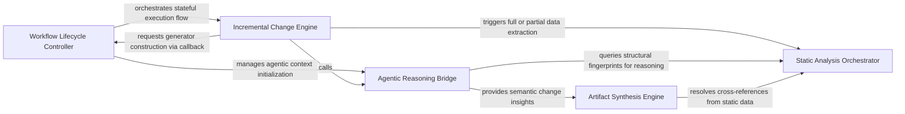

## Details

Primary controller for the analysis lifecycle, implementing incremental processing logic and sequencing analysis generators.

### Workflow Lifecycle Controller
Manages the high-level sequencing and execution state of the analysis process, initializing the environment and coordinating pipeline stages.

**Related Classes/Methods**:

- `codeboarding_workflows.analysis.build_generator`:27-46

**Source Files:**

- [`codeboarding_cli/commands/partial_analysis.py`](https://github.com/CodeBoarding/CodeBoarding/blob/main/.codeboardingcodeboarding_cli/commands/partial_analysis.py)
  - `codeboarding_cli.commands.partial_analysis.run_from_args.scope` ([L51-L56](https://github.com/CodeBoarding/CodeBoarding/blob/main/.codeboardingcodeboarding_cli/commands/partial_analysis.py#L51-L56)) - Function
- [`codeboarding_workflows/analysis.py`](https://github.com/CodeBoarding/CodeBoarding/blob/main/.codeboardingcodeboarding_workflows/analysis.py)
  - `codeboarding_workflows.analysis.build_generator` ([L27-L46](https://github.com/CodeBoarding/CodeBoarding/blob/main/.codeboardingcodeboarding_workflows/analysis.py#L27-L46)) - Function
  - `codeboarding_workflows.analysis.run_incremental` ([L154-L199](https://github.com/CodeBoarding/CodeBoarding/blob/main/.codeboardingcodeboarding_workflows/analysis.py#L154-L199)) - Function

### Incremental Change Engine
Handles project state persistence and delta calculation by tracking file system changes to identify modules requiring re-processing.

**Related Classes/Methods**: _None_

**Source Files:**

- [`codeboarding_workflows/analysis.py`](https://github.com/CodeBoarding/CodeBoarding/blob/main/.codeboardingcodeboarding_workflows/analysis.py)
  - `codeboarding_workflows.analysis.run_partial` ([L77-L151](https://github.com/CodeBoarding/CodeBoarding/blob/main/.codeboardingcodeboarding_workflows/analysis.py#L77-L151)) - Function
  - `codeboarding_workflows.analysis.run_incremental_workflow` ([L202-L225](https://github.com/CodeBoarding/CodeBoarding/blob/main/.codeboardingcodeboarding_workflows/analysis.py#L202-L225)) - Function
- [`diagram_analysis/io_utils.py`](https://github.com/CodeBoarding/CodeBoarding/blob/main/.codeboardingdiagram_analysis/io_utils.py)
  - `diagram_analysis.io_utils.load_analysis_metadata` ([L335-L340](https://github.com/CodeBoarding/CodeBoarding/blob/main/.codeboardingdiagram_analysis/io_utils.py#L335-L340)) - Function

### Static Analysis Orchestrator
Coordinates the execution of specialized data generators using a registry-based approach to transform raw outputs into structured data models.

**Related Classes/Methods**: _None_

**Source Files:**

- [`diagram_analysis/io_utils.py`](https://github.com/CodeBoarding/CodeBoarding/blob/main/.codeboardingdiagram_analysis/io_utils.py)
  - `diagram_analysis.io_utils.load_full_analysis` ([L322-L332](https://github.com/CodeBoarding/CodeBoarding/blob/main/.codeboardingdiagram_analysis/io_utils.py#L322-L332)) - Function
  - `diagram_analysis.io_utils.read_fingerprint` ([L368-L377](https://github.com/CodeBoarding/CodeBoarding/blob/main/.codeboardingdiagram_analysis/io_utils.py#L368-L377)) - Function
- [`repo_utils/change_detector.py`](https://github.com/CodeBoarding/CodeBoarding/blob/main/.codeboardingrepo_utils/change_detector.py)
  - `repo_utils.change_detector.ChangeDetectionError` ([L22-L23](https://github.com/CodeBoarding/CodeBoarding/blob/main/.codeboardingrepo_utils/change_detector.py#L22-L23)) - Class
  - `repo_utils.change_detector.ChangeType` ([L26-L43](https://github.com/CodeBoarding/CodeBoarding/blob/main/.codeboardingrepo_utils/change_detector.py#L26-L43)) - Class
  - `repo_utils.change_detector.DiffHunk` ([L47-L54](https://github.com/CodeBoarding/CodeBoarding/blob/main/.codeboardingrepo_utils/change_detector.py#L47-L54)) - Class
  - `repo_utils.change_detector.FileChange` ([L72-L221](https://github.com/CodeBoarding/CodeBoarding/blob/main/.codeboardingrepo_utils/change_detector.py#L72-L221)) - Class
  - `repo_utils.change_detector.ChangeSet` ([L225-L304](https://github.com/CodeBoarding/CodeBoarding/blob/main/.codeboardingrepo_utils/change_detector.py#L225-L304)) - Class
  - `repo_utils.change_detector.ChangeSet.from_changed_files` ([L292-L304](https://github.com/CodeBoarding/CodeBoarding/blob/main/.codeboardingrepo_utils/change_detector.py#L292-L304)) - Method

### Agentic Reasoning Bridge
Integrates AI agents by preparing architectural context, managing LLM invocations, and processing structural insights into the system model.

**Related Classes/Methods**: _None_

**Source Files:**

- [`repo_utils/change_detector.py`](https://github.com/CodeBoarding/CodeBoarding/blob/main/.codeboardingrepo_utils/change_detector.py)
  - `repo_utils.change_detector.ChangeSet.is_empty` ([L242-L243](https://github.com/CodeBoarding/CodeBoarding/blob/main/.codeboardingrepo_utils/change_detector.py#L242-L243)) - Method
  - `repo_utils.change_detector.ChangeSet.to_dict` ([L278-L289](https://github.com/CodeBoarding/CodeBoarding/blob/main/.codeboardingrepo_utils/change_detector.py#L278-L289)) - Method
- [`repo_utils/fingerprint_diff.py`](https://github.com/CodeBoarding/CodeBoarding/blob/main/.codeboardingrepo_utils/fingerprint_diff.py)
  - `repo_utils.fingerprint_diff.BaselineUnavailableError` ([L21-L31](https://github.com/CodeBoarding/CodeBoarding/blob/main/.codeboardingrepo_utils/fingerprint_diff.py#L21-L31)) - Class
  - `repo_utils.fingerprint_diff.detect_changes_from_fingerprint` ([L53-L71](https://github.com/CodeBoarding/CodeBoarding/blob/main/.codeboardingrepo_utils/fingerprint_diff.py#L53-L71)) - Function

### Artifact Synthesis Engine
Unifies deterministic static data with agent-derived abstractions to resolve cross-references and render final architectural documentation.

**Related Classes/Methods**: _None_

**Source Files:**

- [`repo_utils/fingerprint_diff.py`](https://github.com/CodeBoarding/CodeBoarding/blob/main/.codeboardingrepo_utils/fingerprint_diff.py)
  - `repo_utils.fingerprint_diff.diff_file_maps` ([L34-L43](https://github.com/CodeBoarding/CodeBoarding/blob/main/.codeboardingrepo_utils/fingerprint_diff.py#L34-L43)) - Function
  - `repo_utils.fingerprint_diff.detect_changes_from_fingerprints` ([L46-L50](https://github.com/CodeBoarding/CodeBoarding/blob/main/.codeboardingrepo_utils/fingerprint_diff.py#L46-L50)) - Function

### [FAQ](https://github.com/CodeBoarding/GeneratedOnBoardings/tree/main?tab=readme-ov-file#faq)